# Profit Pulse Ally CRM — Database & UI Reference

> **Single source of truth** for schema, APIs, permissions, UI structure, and shipped feature status.  
> Prefer this document over chat notes, old handoffs, or divergent markdown. User-facing PDFs (`USER_MANUAL_*.pdf`) and one-off migration guides under `docs/` are **supplements**, not replacements.

**Last updated:** July 16, 2026 (Currency-free money display via `lib/formatMoney`; Strategy Planner Timeline Economics; Client Strategy Overview; Projection Journey; Important Dates + calendar; deal participants; Lead Command Center)  
**Repository:** [CRM_PPA](https://github.com/prisken/CRM_PPA)  
**Deployment branch:** `deploy`  
**Last deployed commit:** `40c5518`  
**Production URL:** `https://crm-ppa-nine.vercel.app`  
**Local dev server:** `http://localhost:3000` (run `npm run dev` — runs `prisma generate` first; add `PERF_LOGGING_ENABLED=true` for route timing logs)  
**User manuals (PDF):** `docs/USER_MANUAL_STANDARD_USER.pdf`, `docs/USER_MANUAL_SUPER_ADMIN.pdf` (regenerate: `npm run manuals:pdf`)

This document describes the PostgreSQL database schema, API surface, and frontend UI structure for handoff to developers, designers, and stakeholders.

### Shipped features (current)

| Area | Status |
|------|--------|
| Standard & super admin dashboards | ✅ KPIs, funnel, revenue, leaderboards, master pipeline |
| Recent Activity feed (grouped, unread, mark-read) | ✅ Standard + super admin dashboards |
| Branding (logo, favicon) | ✅ Login, signup, dashboards, Client 360 |
| Client 360 workspace | ✅ Strategy, tasks, interactions, documents, multi-deal, team |
| Client details expansion | ✅ Role in company, employee count, expectations, important dates (date + optional time) |
| **Multi email / phone contacts** | ✅ `ClientContact` table; `emails`/`phones` arrays on create + details; Client 360 multi-entry UI; search/dupes/ingest/match any contact |
| **Important Dates CRUD + time** | ✅ `ClientImportantDate` table; UTC wall-clock date/time; Client 360 panel + lead preview; activity log on create/update/delete |
| **Important Dates Calendar** | ✅ `ImportantDatesCalendarWidget` on `/dashboard` and `/admin` Schedule sections; CLIENT/LEAD filters; SUPER_ADMIN sees all |
| **Client Strategy Builder / Strategy Planner** | ✅ Plans/steps/connections/expenses + **Timeline Economics** (invest/income/expense years, capital returned) + **Projection Journey** milestones (source selection + suggested values) + **Client Strategy Overview** read-only report. Client 360 workspace tab **Strategy Planner** (not right rail). Board / List / Projection (`crm-client-strategy-planner-view`); overview `/clients/[id]/strategy-plans/[planId]/overview`. Outcome Summary MONTHLY + YEARLY÷12. Tests: `npm run test:client-strategy`, `npm run test:strategy-projection`, `npm run test:strategy-timeline`, `npm run test:strategy-report` |
| Company hierarchy | ✅ Colleagues by company, add employee as lead |
| Role-based pipeline advances | ✅ Standard users; super admin full control |
| Standard user lead creation | ✅ Add Lead on dashboard with auto-assignment |
| RELATIONSHIP client details edit | ✅ API + Edit button on Client 360 |
| Mobile-responsive UI | ✅ Dashboards, Client 360, pipeline, modals, workspace tabs |
| **Money display (no currency label)** | ✅ Shared `lib/formatMoney.ts` — amounts show as plain locale numbers (e.g. `12,000.00`); no `$` / `US$` / `USD` in UI or PDF report text |
| Auth UX | ✅ Stale-session sign-out; deactivated-account block on login + API |
| Commission engine | ✅ Participant-backed splits (`DealParticipant`); legacy assignment-pool fallback; `totalCommission`, secured commission |
| Team occupancy limits | ✅ Max 1 Relationship, 1 Follow-up per client; legacy max 2 Doctors (no new doctor client assignments) |
| Multi-deal system | ✅ CRUD per client; committed/potential value aggregation |
| Commission returnables | ✅ Doctor liabilities on WON deals; multi-role credit sum; statements + reconciliation |
| Assignment-triggered returnable recalculation | ✅ Durable `BackgroundJob` enqueue (+ best-effort in-process process); sync `POST /api/tasks/recalculate-returnables` kept for compat |
| Role-based dashboard widgets | ✅ Secured commission + returnables by assignment role (all users) |
| Performance — standard dashboard | ✅ Per-widget API endpoints; shared `loadStandardDashboardContext` for legacy monolith; SQL deal aggregates; skeleton loaders |
| Performance — dashboard pass 2 | ✅ `lib/standardDashboardContext.ts` + `lib/dashboardDealAggregates.ts`; fewer duplicate DB round-trips; open tasks `clientId IN` filter |
| Performance — Client 360 | ✅ Server `Promise.all` for core + deals + hierarchy; lazy workspace tabs only |
| Performance — admin analytics cache | ✅ `unstable_cache` (600s) for org-wide aggregates after `requireSuperAdminFromRequest`; routes `force-dynamic` |
| Performance — frontend render | ✅ `memo`/`useMemo`/`useCallback`; `next/dynamic` for charts, pipeline, modals |
| Performance — route timing logs | ✅ Opt-in `[perf]` logs via `PERF_LOGGING_ENABLED=true` (`lib/performance.ts`) |
| DB performance indexes (phase 2) | ✅ `20260624084311_add_performance_indexes_phase_2` — assignments, tasks, deals, returnables |
| DB performance indexes (phase 3) | ✅ `20260721020000_add_performance_indexes_phase_3` — Client/assignment/deal/notification/task indexes + `pg_trgm` search; occupancy uniques deferred |
| Query optimizations | ✅ Activity feed SQL `UNION ALL`; conditional deal aggregation SQL; narrower Prisma selects |
| DB performance indexes (phase 1) | ✅ `20260617003208_add_performance_indexes` — deals, interactions, activity logs, read status |
| Unified lead ingestion | ✅ `lib/leadIngestion.ts` — shared `ingestExternalLead()` for webhooks; match by source+externalId → email → phone; safe merge on update |
| Client source records | ✅ `client_source_records` table — raw webhook payloads per ingest; `@@unique([source, externalId])` dedupes repeat submissions |
| Google Forms lead webhook | ✅ `POST /api/integrations/google-forms/leads` — uses `ingestExternalLead`; `201` created / `200` updated; optional RELATIONSHIP assign on create only |
| Profit Pulse Ally member webhook | ✅ `POST /api/integrations/profit-pulse-ally/members` — uses `ingestExternalLead`; upsert by email or `memberId` as externalId |
| Client 360 source records widget | ✅ `ClientSourceRecordsWidget` — collapsible payload history; `GET /api/clients/[id]/source-records` |
| Duplicate client scan | ✅ `npm run find:duplicate-clients` — `scripts/find-duplicate-clients.ts` |
| Lead ingestion integration test | ✅ `npx tsx scripts/test-lead-ingestion.ts` — direct `ingestExternalLead` tests (no webhooks/secrets) |
| Client lifecycle management | ✅ Super admin archive (soft) + permanent delete with password confirmation |
| User management | ✅ Super admin deactivate + permanent delete; `/admin/users` UI |
| Enhanced lead creation | ✅ Full client-detail fields at create time (`AddLeadModal`, `AddClientModal`) |
| Account settings | ✅ `/dashboard/settings` — edit display name; link in dashboard headers |
| Safari/iPad autofill fix | ✅ Global `-webkit-autofill` override in `globals.css` |
| Vercel deploy | ✅ `prisma generate` + `migrate deploy` on build |
| **Lead Command Center** | ✅ `/admin/leads` — compact inbox, attention scoring, collapsible filters, preview drawer, bulk actions |
| **Lead duplicates panel** | ✅ Email/phone duplicate groups; `GET /api/admin/leads/duplicates`; `npm run find:duplicate-clients` |
| **Manual client merge (pairwise)** | ✅ `mergeClients()` + `POST /api/admin/leads/merge` + `MergeClientsModal` (`pairwise`); writes `LeadMergeAudit`; archives duplicate |
| **Manual selected-lead merge (LCC)** | ✅ Bulk **Merge selected** (2–10 rows) → `MergeClientsModal` (`manual-multi`) → `POST /api/admin/leads/merge-multiple` |
| **Multi-record merge** | ✅ Up to 10 clients per operation (1 canonical + up to 9 duplicates); `mergeMultipleClients()`; also from Client 360 via `ClientMergePickerModal` |
| **Custom final merge field values** | ✅ `fieldOverrides` on merge APIs; UI wizard supports pick-from-record, blank, or custom text per field |
| **CRM compact interface cleanup** | ✅ `DisplayDensityProvider` (Comfortable/Compact); `CompactPill`, `StatusPill`, `LimitedInlineList`, `EmptyMuted`, density-aware `SectionCard`; reduced clutter on LCC, Client 360 widgets, dashboards |
| **Client tags** | ✅ `Tag` + `ClientTag` models; bulk add via LCC; filter by tag; `GET/POST /api/admin/tags` |
| **Follow-up fields** | ✅ `priority`, `nextAction`, `nextFollowUpAt` on Client; LCC preview drawer; attention scoring |
| **Global client search** | ✅ `GET /api/search/clients?q=` — super admin: all clients; standard user: assigned only |
| **Command palette** | ✅ `⌘K` / `Ctrl+K` — `CommandPalette.tsx` on dashboard/admin/clients/my-statements |
| **Lead source badges** | ✅ `LeadSourceBadges` on LCC, Client 360 header/details, source records widget |
| **Auth token sync on login** | ✅ `POST /api/auth/token` issues JWT after Supabase sign-in; stale Bearer falls back to session |
| **Lead Command Center smoke test** | ✅ `npx tsx scripts/test-lead-command-center.ts` |
| **Merge custom-fields test** | ✅ `npm run test:merge-custom-fields` (`scripts/test-merge-custom-fields.ts`) |
| **User manuals** | ✅ `docs/USER_MANUAL_STANDARD_USER.md/.pdf`, `docs/USER_MANUAL_SUPER_ADMIN.md/.pdf` |
| **Deal-level participant commission model** | ✅ `DealParticipant` rows per deal; explicit commission % and amounts |
| **Deal types & commission templates** | ✅ `DealType` (`MARKETING`, `INVESTMENT`, `MEDICAL`, `CUSTOM`); templates in `lib/dealCommissionTemplates.ts`; safe apply in `DealEditModal` |
| **Doctors assigned per deal** | ✅ Doctor participants on each deal; client-level `DOCTOR` assignment blocked for new operations |
| **Client team limited to relationship/follow-up** | ✅ `AssignedTeamWidget` assigns Relationship + Follow-up only; legacy doctors shown collapsed |
| **Participant-based secured commission & company earnings** | ✅ `calculateUserSecuredCommissionFromDealParticipants`, `calculateCompanyEarningsFromDealParticipants` (legacy fallback when no participants) |
| **Participant-based returnables** | ✅ Explicit doctor returnable fields on `DealParticipant`; `generateCommissionReturnablesForDealParticipants()` |
| **Deal participant backfill & tests** | ✅ `npm run audit:legacy-commission`, `backfill:deal-participants` / `:dry`, `verify:deal-participants`, `test:deal-participants`, `test:deal-participant-api` |
| **Deal participant migration guide** | ✅ `docs/deal-participant-migration.md` |

---

## Table of Contents

1. [Technology Stack](#1-technology-stack)
2. [Authentication & Authorization](#2-authentication--authorization)
3. [Database Overview](#3-database-overview)
4. [Enums](#4-enums)
5. [Tables & Models](#5-tables--models)
6. [Entity Relationship Diagram](#6-entity-relationship-diagram)
7. [Migration History](#7-migration-history)
8. [Business Rules](#8-business-rules)
9. [API Reference](#9-api-reference)
10. [UI Structure](#10-ui-structure)
11. [Component Inventory](#11-component-inventory)
12. [Key User Flows](#12-key-user-flows)
13. [Environment Variables](#13-environment-variables)
14. [Local Development](#14-local-development)
15. [Mobile & Responsive Design](#15-mobile--responsive-design)
16. [Auth Helper Reference](#16-auth-helper-reference)

---

## 1. Technology Stack

| Layer | Technology |
|-------|------------|
| Framework | Next.js 16 (App Router) |
| Language | TypeScript |
| Styling | Tailwind CSS 4 |
| ORM | Prisma 6 |
| Database | PostgreSQL (Supabase) |
| Auth | Supabase Auth + JWT (`jose`) for API Bearer tokens |
| UI primitives | Headless UI, Lucide icons, Recharts, TanStack Table |
| File storage | Supabase Storage (client documents) |
| Hosting | Vercel |

**Project layout (high level):**

```
prisma/           # Schema + migrations
lib/              # Server helpers (auth, dashboards, client360, activity feed, integrations)
src/app/          # Next.js routes (pages + API, incl. api/integrations/* webhooks)
src/components/   # React UI components
public/assets/    # Logo, favicon
docs/             # Documentation (this file, user manuals, google-forms-integration.md)
```

**Performance architecture:**

- **Standard dashboard** — each widget has its own API route; the page fetches in parallel and shows dimension-matched skeleton loaders. The **legacy** `GET /api/dashboard/standard` loads shared context once (`loadStandardDashboardContext`) then builds all widgets in parallel (no duplicate assignment/deal queries per widget).
- **Client 360** — server component loads core client data, deals, and company hierarchy in parallel via `loadClient360PageData()`; workspace tabs still lazy-load on demand. Mutations call `router.refresh()` to re-fetch server data.
- **Admin analytics** — super-admin org-wide aggregates (funnel, KPIs, revenue tracker, leaderboards) use `unstable_cache` with 600s revalidation in `lib/adminAnalyticsCache.ts`. Auth (`requireSuperAdminFromRequest`) runs on every request before cache lookup. Routes export `dynamic = 'force-dynamic'` so session-scoped responses are not globally cached. User-specific dashboard, Client 360, and `/api/me/*` routes are also `force-dynamic`.
- **Activity feed** — single PostgreSQL query via `UNION ALL` (Interactions + activity logs), sorted and limited in the database.
- **Route timing** — set `PERF_LOGGING_ENABLED=true` to emit structured `[perf]` lines in the dev server terminal (`lib/performance.ts`). Includes method, route/op, status, durationMs, optional payloadBytes / cache, and payload size warnings by surface. Prisma logs queries ≥200ms in development or when `PERF_LOGGING_ENABLED=true` (SQL only — no bound params). See [Route performance timings](#route-performance-timings) below.

### Route performance timings

Measured locally (June 24, 2026) against Supabase PostgreSQL with `PERF_LOGGING_ENABLED=true`. Times are **server handler** durations from `[perf]` logs unless noted. Cold starts and pool warmup can add latency on first request.

**How to reproduce:**

```bash
# Enable structured route + payload + slow Prisma logs
PERF_LOGGING_ENABLED=true npm run dev
npx tsx scripts/profile-api-routes.ts   # client round-trip summary
```

**Example `[perf]` lines:**

```text
[perf] method=GET route=/api/admin/leads status=ok durationMs=412 payloadBytes=182340 payloadCategory=lead-command-center leadCount=17
[perf:warn] payloadBytes=62000 threshold=51200 category=dashboard-widget route=/api/dashboard/widgets/open-tasks
[perf] method=- op=cache:admin-dashboard-kpis status=ok durationMs=241 cache=miss
[perf] method=- op=prisma:query status=slow durationMs=240 query="SELECT ..."
```

**Payload warn thresholds:** dashboard widgets 50KB · Client 360 core 100KB · deals 150KB · Strategy Planner 200KB · Lead Command Center 250KB · Admin master pipeline 150KB.
**Typical server timings (after performance pass 2, warm runs):**

| Route / operation | Server time | Notes |
|-------------------|------------|-------|
| `GET /api/dashboard/standard` | **~540–880 ms** | Legacy monolith; shared context + parallel widgets. Live UI uses per-widget routes instead. |
| `widget:buildPerformanceMetricsWidget` | **~1 ms** (with context) / **~250–670 ms** (standalone) | Secured commission via shared deal aggregates + role occupancy |
| `widget:buildAssignedClientsWidget` | **~1 ms** (with context) / **~500–600 ms** (standalone) | Single SQL aggregate per client deal values |
| `GET /api/admin/pipeline` | **~410–450 ms** | All clients + assignments (live; not cached) |
| `widget:buildActivityFeedWidget` | **~246–470 ms** | Includes `activityFeed:fetchRawActivities` ~207–260 ms |
| `widget:buildOpenTasksWidget` | **~222–515 ms** | `assigneeId` + `clientId IN` assigned clients |
| `GET /api/dashboard/superadmin` | **~234–297 ms** | All-client activity feed (`limit=100`) |
| `GET /api/admin/all-commission-returnable` | **~220–250 ms** | Full reconciliation list |
| `GET /api/admin/users` | **~220–253 ms** | All users |

**Admin analytics cache (org-wide, 600s TTL):**

| Route | Cache miss (DB) | Cache hit (handler) |
|-------|-----------------|---------------------|
| `GET /api/admin/dashboard-kpis` | ~241 ms | **~0 ms** |
| `GET /api/admin/funnel-data` | ~233 ms | **~0 ms** |
| `GET /api/admin/revenue-tracker` | ~226 ms | **~0 ms** |
| `GET /api/admin/leaderboards` | ~240 ms | **~0 ms** |

Client round-trip on cache hit is still ~220 ms (auth + network); server DB work is skipped.

**Instrumented `[perf]` prefixes / fields:**

| Prefix / field | Location |
|----------------|----------|
| `method=` + `route=` | API route handlers (`timeRouteHandler`) |
| `op=` | Builders / loaders (`timeAsync`) |
| `payloadBytes=` / `payloadCategory=` | Optional JSON size + warn category |
| `cache=hit\|miss` | Caller-provided (admin analytics loaders log `miss`) |
| `op=prisma:query status=slow` | Prisma queries ≥200ms (dev or `PERF_LOGGING_ENABLED`) |
| `cache:admin-*` | Admin analytics cache loaders on miss |
| `widget:build*` | Standard dashboard widget builders |
| `dashboard:loadContext` / `dashboard:buildStandard` | Shared dashboard context + legacy monolith compose |
| `activityFeed:*` | Activity feed SQL + grouping |
| `builder:buildSuperAdminDashboard` | Super admin activity feed builder |
| `client360:*` | Client 360 server loaders |

**Not instrumented (still dynamic):** Client 360 page server render (RSC), static assets, auth middleware edge time.

---

## 2. Authentication & Authorization

### Auth flow

1. **Sign up** — `POST /api/auth/register` creates a Supabase Auth user + `User` row in Postgres (`STANDARD_USER`, `status: ACTIVE` by default). Returns a JWT stored in `localStorage` as `token`.
2. **Sign in** — Supabase `signInWithPassword` sets session cookies. After sign-in, the app queries `User.status` from Supabase; **`DEACTIVATED` users are signed out immediately** with an error message. On success, the client calls `POST /api/auth/token` to refresh the JWT in `localStorage` (keeps Bearer in sync with the live session).
3. **API access** — Session cookies (server) or `Authorization: Bearer <token>` (client fetch). If a Bearer token is present but invalid/expired, `getAuthenticatedUserFromRequest` **falls back to the Supabase session cookie** instead of rejecting immediately. `authenticatedFetch` clears `localStorage.token` on `401`. All authenticated API helpers reject users with `status !== ACTIVE` (`403 Account deactivated`).
4. **Middleware** (`src/middleware.ts`) protects routes at the edge (session check only; **no role check** on `/admin` — role enforced client-side and via API 403s).

### Route protection (middleware)

| Path | Unauthenticated | Authenticated |
|------|-----------------|---------------|
| `/` | → `/login` | → `/dashboard` |
| `/dashboard`, `/dashboard/*`, `/my-statements`, `/admin/*`, `/clients/*` | → `/login` | Allowed |
| `/login`, `/signup` | Allowed | → `/dashboard` |

### User roles

| Role | Enum value | Access |
|------|------------|--------|
| Super Admin | `SUPER_ADMIN` | Full system: admin dashboard, user management, all clients, assignments, unrestricted pipeline stage changes |
| Standard User | `STANDARD_USER` | Own dashboard, assigned clients, create leads (auto-assigned as Relationship), role-based pipeline advances |

### User account status

| Status | Enum value | Behavior |
|--------|------------|----------|
| Active | `ACTIVE` | Default; can sign in and use all APIs |
| Deactivated | `DEACTIVATED` | Cannot sign in; existing sessions rejected by API; data retained in database |

Super Admins manage user lifecycle at `/admin/users` (deactivate or permanently delete). Self-deactivation/deletion is blocked.

### Assignment roles (per client)

| Role | Enum value | Primary responsibilities |
|------|------------|--------------------------|
| Relationship | `RELATIONSHIP` | Client details, interactions, early pipeline stages, lead creation, deal create/view (transitional) |
| Doctor (legacy) | `DOCTOR` | **No longer assigned at client level for new operations.** Legacy rows retained for audit. Doctors are assigned per deal via `DealParticipant`. |
| Account Service | `ACCOUNT_SERVICE` | Follow-up officer; interactions, active-client pipeline stage, deal create/view (transitional) |

Super Admins bypass assignment checks on most Client 360 APIs.

### Deal access (transitional — `getDealAccessForClient` in `lib/authHelpers.ts`)

| Capability | Super admin | Relationship assignee | Follow-up assignee | Legacy `DOCTOR` assignee | Deal-level `DOCTOR` participant |
|------------|-------------|----------------------|--------------------|--------------------------|--------------------------------|
| View deals | ✅ | ✅ | ✅ | ✅ | ✅ (deals they participate in) |
| Create deals | ✅ | ✅ | ✅ | ✅ | ❌ (unless also relationship/follow-up) |
| Manage all deals on client | ✅ | ❌ | ❌ | ✅ | ❌ |
| Manage specific deal | ✅ | ❌ | ❌ | ✅ (all on client) | ✅ (deals where user is `DOCTOR` participant) |

### Per-role Client 360 permissions

| Action | Super Admin | RELATIONSHIP | DOCTOR | ACCOUNT_SERVICE |
|--------|-------------|--------------|--------|-----------------|
| Edit client details (`PUT .../details`) | ✅ | ✅ | ❌ | ❌ |
| Edit follow-up (`PATCH .../follow-up`) | ✅ | ✅ | ❌ | ❌ |
| Manage deals (`/deals` CRUD) | ✅ | Create/view; manage per `getDealAccessForClient` | Create/view; manage per deal access | Create/view; manage all on client **or** per-deal if `DOCTOR` participant | ❌ (unless relationship/follow-up/legacy doctor) |
| Edit strategy / create tasks | ✅ | ❌ | ✅ | ❌ |
| Post interactions (notes, calls, etc.) | ✅ | ✅ (if assigned) | ✅ | ✅ |
| Edit/delete own interactions | ✅ | ✅ (author) | ✅ (author) | ✅ (author) |
| Upload documents | ✅ | ✅ (if assigned) | ✅ | ✅ |
| Delete documents | ✅ | ❌ | ❌ | ❌ |
| Advance pipeline stage | ✅ (any stage) | Early stages | Strategy session | Active client |
| Manage team assignments | ✅ | ❌ | ❌ | ❌ |
| View company hierarchy | ✅ | ✅ | ✅ | ✅ |
| Add employee lead | ✅ | ✅ | ✅ | ✅ |

### Client details edit authorization (`PUT /api/clients/[id]/details`)

Handled by `authorizeClientDetailsEdit(request, clientId)` in `lib/authHelpers.ts`:

1. Authenticate via session cookie or `Authorization: Bearer <token>`
2. **`SUPER_ADMIN`** → allowed
3. **`STANDARD_USER`** with `RELATIONSHIP` assignment on the client → allowed
4. All other cases → `403 Forbidden`

UI: `ClientDetailsWidget` shows **Edit** when `isSuperAdmin || isRelationshipSpecialist`.

### Pipeline stage change authorization (`PATCH /api/clients/[id]`)

| User | Can update |
|------|------------|
| `SUPER_ADMIN` | Any field including `status` (full dropdown in UI) |
| `STANDARD_USER` | **`status` only**, and only when assignment role matches **current** stage |

| Assignment role | Allowed current statuses before advancing |
|-----------------|------------------------------------------|
| `RELATIONSHIP` | `NEW_LEAD`, `CONTACTED`, `NURTURING` |
| `DOCTOR` | `STRATEGY_SESSION` |
| `ACCOUNT_SERVICE` | `ACTIVE_CLIENT` |

Standard users advance one stage at a time via **Move to Next Stage** + confirmation modal. Logic is shared between API (`lib/authHelpers.ts` → `authorizePipelineStatusChange`) and UI (`lib/pipelinePermissions.ts`).

### Lead creation auto-assignment (`POST /api/clients`)

| User | Behavior |
|------|----------|
| `SUPER_ADMIN` | Creates client only |
| `STANDARD_USER` | Creates client **and** a `ClientAssignment` linking themselves with `RELATIONSHIP` role |

### API authentication modes

| Mode | How it works | Used by |
|------|--------------|---------|
| Session cookie | Supabase session via `getAuthenticatedUser()` | Legacy call sites without a `Request`; prefer request-based helpers |
| Bearer or session | JWT in `Authorization` header **or** session via `getAuthenticatedUserFromRequest()`. Invalid Bearer falls back to session cookie. | Dashboard APIs, Client 360 core + workspace/interactions/docs/tasks/deals/assignments, strategy plans, Lead Command Center, notifications, commission returnables, `POST /api/clients`, etc. |

**Note:** Client-side fetches that only send Bearer tokens will fail on session-only routes unless cookies are also sent (`credentials: 'same-origin'`).

---

## 3. Database Overview

- **Provider:** PostgreSQL via Supabase connection pooler (`DATABASE_URL`) + direct URL for migrations (`DIRECT_URL`).
- **Migrations:** 20 applied (`prisma/migrations/`).
- **IDs:** CUID strings (`@default(cuid())`).
- **Naming:** Prisma models use PascalCase; several tables map to snake_case via `@@map`.

### Core domain areas

1. **Users & access** — `User`, `ClientAssignment`
2. **Clients & pipeline** — `Client`, `Deal`, `DealParticipant`, `Tag`, `ClientTag`
3. **Lead ingestion & merge** — `ClientSourceRecord`, `LeadMergeAudit` (written by manual merge)
4. **Client 360 workspace** — `Task`, `ClientDocument`, `Strategy`, `Interaction`, `ClientActivityLog`, `ClientImportantDate`, `ClientContact`
5. **Strategy Builder** — `ClientStrategyPlan`, `ClientStrategyStep`, `ClientStrategyConnection`, `ClientStrategyExpense`
6. **Activity & notifications** — `ActivityReadStatus`, `Notification`
7. **Commission & liabilities** — `CommissionReturnable`, `DealParticipant` (per-deal splits + doctor returnable config)
8. **Legacy strategy docs** — `Strategy`, `Document` (strategy-linked; free-text `Client.strategyText` still on Strategy & Tasks tab)

---

## 4. Enums

| Enum | Values | Used by |
|------|--------|---------|
| `UserRole` | `SUPER_ADMIN`, `STANDARD_USER` | `User.role` |
| `UserStatus` | `ACTIVE`, `DEACTIVATED` | `User.status` (account lifecycle) |
| `AssignmentRole` | `RELATIONSHIP`, `DOCTOR`, `ACCOUNT_SERVICE` | `ClientAssignment.role` |
| `ClientStatus` | `NEW_LEAD`, `CONTACTED`, `NURTURING`, `STRATEGY_SESSION`, `ACTIVE_CLIENT`, `ARCHIVED` | `Client.status` (pipeline stages) |
| `InteractionType` | `CALL`, `EMAIL`, `MEETING`, `NOTE` | `Interaction.type` |
| `DealStatus` | `PROPOSED`, `WON`, `LOST`, `ON_HOLD` | `Deal.status` |
| `DealType` | `MARKETING`, `INVESTMENT`, `MEDICAL`, `CUSTOM` | `Deal.dealType`; commission templates in `lib/dealCommissionTemplates.ts` |
| `DealParticipantRole` | `RELATIONSHIP`, `FOLLOW_UP`, `DOCTOR`, `COMPANY`, `EXTERNAL_PARTNER` | `DealParticipant.role` |
| `StrategyStatus` | `DRAFT`, `READY_FOR_REVIEW`, `APPROVED`, `NEEDS_REVISION` | Legacy `Strategy.status` |
| `ClientContactKind` | `EMAIL`, `PHONE` | `ClientContact.kind` |
| `StrategyPlanStatus` | `DRAFT`, `ACTIVE`, `COMPLETED`, `ARCHIVED` | `ClientStrategyPlan.status` |
| `StrategyStepType` | `EXISTING_DEAL`, `PLANNED_DEAL`, `MANUAL` | `ClientStrategyStep.stepType` |
| `StrategyConnectionType` | `FUNDING_SOURCE`, `INTEREST_REDIRECT`, `INCOME_REDIRECT`, `CAPITAL_GROWTH`, `PROTECTION_SUPPORT`, `TAX_PLANNING`, `RISK_MANAGEMENT`, `MANUAL` | `ClientStrategyConnection.connectionType` |
| `StrategyIncomeFrequency` | `MONTHLY`, `YEARLY`, `ONE_TIME`, `CUSTOM` | `ClientStrategyStep.expectedIncomeFrequency` |
| `StrategyExpenseFrequency` | `MONTHLY`, `YEARLY`, `ONE_TIME`, `CUSTOM` | `ClientStrategyExpense.frequency` |
| `StrategyExpenseCategory` | `HOUSING`, `EDUCATION`, `HEALTHCARE`, `INSURANCE`, `RETIREMENT`, `LIFESTYLE`, `BUSINESS`, `DEBT`, `FAMILY_SUPPORT`, `EMERGENCY`, `OTHER` | `ClientStrategyExpense.category` |
| `StrategyExpensePriority` | `LOW`, `MEDIUM`, `HIGH`, `CRITICAL` | `ClientStrategyExpense.priority` |
| `StrategyProjectionMilestoneType` | `INITIAL_INVESTMENT`, `INCOME_CHECKPOINT`, `EXIT_SCENARIO`, `MATURITY_SCENARIO`, `CUSTOM` | `ClientStrategyProjectionMilestone.type` |
| `TaskStatus` | `PENDING`, `IN_PROGRESS`, `COMPLETED`, `CANCELLED` | `Task.status` |
| `ActivityLogType` | `NOTE`, `CALL`, `EMAIL`, `MEETING`, `SYSTEM` | `ClientActivityLog.type` |
| `LeadSourceType` | `GOOGLE_FORMS`, `PROFIT_PULSE_ALLY`, `MANUAL`, `OTHER` | `ClientSourceRecord.source` |

### Pipeline stage labels (UI)

| DB value | Display label |
|----------|---------------|
| `NEW_LEAD` | New Lead |
| `CONTACTED` | Contacted |
| `NURTURING` | Nurturing |
| `STRATEGY_SESSION` | Strategy Session |
| `ACTIVE_CLIENT` | Active Client |
| `ARCHIVED` | Archived |

---

## 5. Tables & Models

### `User` (table: `User`)

| Column | Type | Notes |
|--------|------|-------|
| `id` | TEXT PK | Matches Supabase Auth user ID |
| `name` | TEXT | Optional display name |
| `email` | TEXT UNIQUE | Login email |
| `password_hash` | TEXT | Bcrypt hash (registration backup; Supabase holds primary credentials) |
| `role` | UserRole | `SUPER_ADMIN` or `STANDARD_USER` |
| `status` | UserStatus | `ACTIVE` (default) or `DEACTIVATED` |
| `createdAt`, `updatedAt` | TIMESTAMP | Audit |

**Relations:** assignments, interactions, tasks (assignee), activity logs, read statuses, notifications (sent/received), strategies (author), **commission returnables**, **deal participants** (`DealParticipant.userId`).

---

### `CommissionReturnable` (table: `CommissionReturnable`)

Doctor liability records generated when a deal transitions to `WON`.

| Column | Type | Notes |
|--------|------|-------|
| `id` | TEXT PK | |
| `amount` | DECIMAL(10,2) | Returnable amount owed by the doctor |
| `status` | TEXT | `"UNPAID"` (default) or `"PAID"` |
| `period` | TIMESTAMP | First day of the month the liability was generated |
| `userId` | TEXT FK → User | Doctor who owes the returnable |
| `dealId` | TEXT FK → Deal | Source WON deal |
| `createdAt`, `updatedAt` | TIMESTAMP | |

**Generation trigger:** When a deal's status changes to `WON` (via `PUT .../deals/[dealId]`) or is created as `WON` (via `POST .../deals`):

- **Participant-backed deals:** `generateCommissionReturnablesForDealParticipants()` uses explicit `DealParticipant` returnable fields (one row per qualifying doctor).
- **Legacy deals (no participants):** one record per client `DOCTOR` assignment using `calculateDoctorCommissionReturnableAmount()`.

Participant-backed generation is idempotent and updates unpaid rows when deal/participant returnable config changes. Paid rows are preserved.

**Amount formula (legacy deals only):** See [Commission returnables](#commission-returnables) below. Uses `calculateDoctorCommissionReturnableAmount()` — sums all RELATIONSHIP and ACCOUNT_SERVICE credits for the doctor via `calculateIndividualRoleShare()`.

**Amount formula (participant-backed deals):** Explicit per doctor — fixed `returnableAmount` wins over `returnablePercent` of that doctor's commission.

---

### `Client` (table: `Client`)

| Column | Type | Notes |
|--------|------|-------|
| `id` | TEXT PK | |
| `name` | TEXT | Primary display name |
| `company` | TEXT | Optional |
| `contactInfo` | TEXT | Legacy / general contact |
| `email`, `phone` | TEXT | **Primary** contact mirrors (first/primary `ClientContact`). Prefer `client_contacts` for full lists; **not unique** — dedupe is app-level |
| `lead_source` | TEXT | e.g. referral, website |
| `deal_value` | DECIMAL(12,2) | Legacy client-level deal value (Client 360 uses aggregated deals) |
| `equity` | DECIMAL(12,2) | Equity stake |
| `strategy_text` | TEXT | Free-form strategy on Client 360 |
| `role_in_company` | TEXT | Contact's role/title at their company |
| `employee_count` | INTEGER | Reported company headcount |
| `expectations` | TEXT | Client expectations for the engagement |
| `important_dates` | JSONB | **Legacy dual-write mirror** of `ClientImportantDate` rows as `{ label, date }` (time not stored in JSON). Prefer table rows. Default `[]` |
| `status` | ClientStatus | Pipeline stage |
| `pendingNotifications` | BOOLEAN | Flag for notification workflows |
| `priority` | TEXT | Follow-up priority: `LOW`, `MEDIUM`, or `HIGH` (LCC + Client 360) |
| `next_action` | TEXT | Free-text next step for follow-up |
| `next_follow_up_at` | TIMESTAMP | Scheduled follow-up date; indexed (`@@index([nextFollowUpAt])`) |
| `createdAt`, `lastModified` | TIMESTAMP | |

**Relations:** assignments, interactions, deals, strategies, documents, tasks, activity logs, notifications, **source records**, **tags** (`ClientTag`), **important dates** (`ClientImportantDate`), **strategy plans** (`ClientStrategyPlan`), **contacts** (`ClientContact` emails/phones).

---

### `client_contacts` (`ClientContact`)

Multiple emails and phone numbers per client/lead. `Client.email` / `Client.phone` remain **primary mirrors** (first / `isPrimary`) for LCC columns, merge scalars, and older UI.

| Column | Type | Notes |
|--------|------|-------|
| `id` | TEXT PK | |
| `client_id` | TEXT FK → Client | CASCADE |
| `kind` | ClientContactKind | `EMAIL` or `PHONE` |
| `value` | TEXT | Display as entered |
| `normalized_value` | TEXT | Email lowercased; phone digits (+ optional leading `+`) for match/dedupe |
| `label` | TEXT | Optional (unused in v1 UI) |
| `is_primary` | BOOLEAN | First of each kind is primary |
| `sort_order` | INT | Display order within kind |

**Unique:** `(client_id, kind, normalized_value)`. **Indexes:** `(client_id, kind, sort_order)`, `(kind, normalized_value)`.

**APIs:** `emails` / `phones` string arrays on create (`POST /api/clients`) and details (`PUT .../details`); responses also return `email`/`phone` primaries. Max 10 per kind. Search, duplicates, and lead ingestion match **any** contact row (with scalar fallback).

**UI:** `MultiValueTextField` on Client Details edit, Add Lead, Add Client; Client 360 / Lead preview list all values.

---

### `client_important_dates` (`ClientImportantDate`)

Canonical important dates for clients/leads (shared `Client` model). See [Important Dates (canonical)](#important-dates-canonical).

| Column | Type | Notes |
|--------|------|-------|
| `id` | TEXT PK | |
| `label` | TEXT | Title |
| `scheduled_at` | TIMESTAMP | UTC wall-clock; date-only → midnight UTC that day |
| `has_time` | BOOLEAN | `false` = all-day; `true` = display HH:mm from UTC |
| `notes` | TEXT | Optional |
| `client_id` | TEXT FK → Client | CASCADE delete |
| `created_by_user_id` / `updated_by_user_id` | TEXT FK → User | Optional; SET NULL on user delete |
| `created_at` / `updated_at` | TIMESTAMP | |

**Indexes:** `scheduled_at`; `(client_id, scheduled_at)`.

---

### Client Strategy Builder

Structured strategy plans (`ClientStrategyPlan` + nested steps/connections/expenses/projection milestones). **UI:** Client 360 left/main **Workspace** tab **Strategy Planner** (`WorkspacePanel` → `ClientStrategyBuilderWidget`). Not shown in the right-side at-a-glance rail. Permissions: view = core read; manage/delete = SUPER_ADMIN, legacy client `DOCTOR`, or deal-level `DOCTOR` participant. Tests: `npm run test:client-strategy`, `npm run test:strategy-projection`, `npm run test:strategy-timeline`, `npm run test:strategy-report`.

**Board / List / Projection:** Plan detail defaults to Board; toggle persists in `localStorage` key `crm-client-strategy-planner-view` (`board` | `list` | `projection`). List keeps vertical CRUD sections. Board (`StrategyPlannerBoard`) and Projection (`StrategyProjectionJourneyView`) load via `next/dynamic` with skeletons; `StrategyPlanDetailView` and `ClientStrategyBuilderWidget` are also dynamically imported so Client 360 / plan-list first paint does not pay for those chunks until needed. Board maps the plan as a canvas and shows compact timeline economics on step/expense cards. Projection is a third mode for manually selected journey milestones (yearly cashflow + contributing sources).

| Board element | Mapping |
|---------------|---------|
| Steps | Primary nodes ordered by `sortOrder`, then `createdAt` |
| Adjacent connections | Lane between neighboring steps (`\|Δindex\| === 1`) |
| Skip-step connections | Cross links / cross-plan lane |
| Expenses with `coveredByStepId` | Under the matching step |
| Uncovered expenses | Plan-level expenses lane |
| Projection badges (optional) | Up to 3 compact chips when milestones link via `stepId` (projected income, Exit Scenario year, Total Asset Position) |
| Step card economics | Invest, Income, Timeline, Total income, Capital back, Illustrative position (dashes when missing) |
| Expense card economics | Amount/frequency, Timeline years, Total expense, Covered by (when linked) |

**Board chrome / affordances:** compact collapsible legend (Step, Connection, Cross link, Step-linked expense, Plan-level expense). Manage-only: inline add connection between adjacent steps (prefills `fromStepId`/`toStepId`); add expense on a step (prefills `coveredByStepId`); step Move left/right (`lg+`) or up/down (mobile) via existing `PUT …/steps/reorder`. Confirm deletes can be cancelled (abort in-flight request).

**Linked deals:** Step payload includes nested `linkedDeal` (name, value, status, …) from existing plan APIs. Board/List show a compact deal chip when linked; **View deal** scrolls to Deal Info (`#deal-info` / `#deal-{id}`) when that widget is present. No extra deal fetch.

**Outcome Summary** (Board + List): recurring monthly coverage view. Includes `MONTHLY` amounts as-is and `YEARLY` as amount÷12 for both step income and expenses. `ONE_TIME` / `CUSTOM` excluded. Planning aid only — not a projection. Label: “Monthly coverage (MONTHLY + YEARLY÷12)”.

#### Strategy Planner Timeline Economics

**A. Purpose**

Timeline Economics lets advisors enter **planning arithmetic** on strategy items (steps) and expenses: what the client invests, what income is expected and when, what expenses/premiums run over which years, and when capital may be returned. Projection milestones can select contributing items/expenses and optionally apply **suggested** yearly figures.

Values are **illustrative** and based on **advisor-entered assumptions**. There is **no** growth, compounding, IRR, ROI, yield, or guaranteed-return math.

**B. Strategy item (step) fields**

Additive timeline fields on `ClientStrategyStep` (legacy `plannedAmount` / `expectedIncome*` retained):

| Field | Notes |
|--------|------|
| `investmentAmount` | Planned invest amount |
| `startYear` / `endYear` | Inclusive investment timeline years |
| `incomeAmount` / `incomeFrequency` | Income amount and frequency |
| `incomeStartYear` / `incomeEndYear` | Inclusive income window |
| `capitalReturned` / `capitalReturnYear` | Capital expected back and the year it applies |

UI labels (Board/List/modals): Invest, Income, Timeline, Total income, Capital back, Illustrative position.

**C. Expense timeline fields**

On `ClientStrategyExpense` (legacy timeline labels retained):

| Field | Notes |
|--------|------|
| `amount` / `frequency` | Expense amount and frequency |
| `startYear` / `endYear` | Inclusive expense window |
| Helper total | `getStrategyExpenseTotal` — total over the inclusive range when amount/frequency/years are computable |

UI labels: Amount, Timeline, Total expense, Covered by (when linked to a strategy item).

**D. Projection milestone source selection**

When creating/editing a projection milestone (`StrategyProjectionMilestoneEditModal`):

1. Choose year, title, and milestone type.
2. Select contributing **strategy items** (`selectedStepIds` → join `ClientStrategyProjectionMilestoneStep`).
3. Select contributing **expenses** (`selectedExpenseIds` → join `ClientStrategyProjectionMilestoneExpense`).
4. Review suggested calculations from `buildProjectionMilestoneSuggestionFromSources`.
5. Click **Use suggested values** to copy suggestions into editable fields (not auto-applied while typing or when sources change).

Persisted milestone money fields (advisor-entered unless suggestions are applied): `incomeThisPeriod`, `expensesThisYear`, `netCashflowThisYear`, `cumulativeIncome`, `cumulativeExpenses`, `capitalReturnedThisYear`, `capitalReturnedToDate`, `totalAssetPosition`, plus existing capital/income fields.

**E. Helper calculation rules** (`lib/clientStrategyTimelineCalculations.ts`)

| Rule | Behavior |
|------|----------|
| `MONTHLY` | Amount × 12 for a calendar year |
| `YEARLY` | Amount as-is for a calendar year |
| `ONE_TIME` | Amount applies in the start year (caller/year range rules) |
| `CUSTOM` | Not auto-totalled (returns null) |
| Year ranges | **Inclusive** start/end years |
| Missing inputs | Helpers return null (UI shows —); out-of-range known windows return 0 where defined |

Illustrative total position (step helper): total income over income window + capital returned when both are computable — **not** a forecast or guaranteed outcome.

**F. Compliance**

- Illustrative only; advisor-entered assumptions.
- No growth, compounding, IRR, ROI, or yield.
- No guaranteed returns / guarantee language.
- Suggestions are helpers only; backend does **not** recompute or overwrite saved values on save.
- Advisor must click **Use suggested values** to apply suggestions.

**G. Tests**

| Script | Coverage |
|--------|----------|
| `npm run test:strategy-timeline` | `scripts/test-client-strategy-timeline-calculations.ts` |
| `npm run test:strategy-projection` | Projection Journey helpers / reorder / badges |
| `npm run test:strategy-report` | Client Strategy Overview report helpers (economics + source chips) |
| `npm run test:client-strategy` | Strategy Builder API integration (incl. timeline fields / sources) |

#### Projection Journey (manual milestones)

**A. Purpose**

Projection Journey lets advisors **manually create selected projection milestones** for a strategy plan — presentational checkpoints such as:

- Initial investment (`INITIAL_INVESTMENT`)
- Income checkpoint (`INCOME_CHECKPOINT`)
- Exit scenario (`EXIT_SCENARIO`)
- Maturity scenario (`MATURITY_SCENARIO`)
- Custom milestone (`CUSTOM`)

It is **not** an automatic yearly forecast, multi-year generator, or investment calculator (no growth, compounding, IRR, ROI, or yield).

**B. Usage note (user-facing)**

> Projection Journey is designed for manually selected milestone years and scenarios. It does not generate a full year-by-year projection. Use it to present important points in the client's investment journey, such as the initial investment, income checkpoints, exit scenarios, and total asset position. Helper calculations are available for convenience, but saved values remain manually controlled by the advisor.

**C. UI location**

Third Strategy Planner mode alongside **Board** and **List**: toggle persists in `localStorage` key `crm-client-strategy-planner-view` (`board` | `list` | `projection`). Rendered by `StrategyProjectionJourneyView` inside `StrategyPlanDetailView`. Cards/table prioritize yearly earning/spending/net, cumulatives, capital returned, illustrative total position, and contributing source chips. Optional board badges when a milestone links to a step (`stepId`). Outcome Summary remains Board/List only.

**D. Manual milestone behavior**

- Projection Journey **only shows manually created** milestones.
- It does **not** automatically generate every year.
- Advisors control which years/scenarios appear.
- **Saved values are advisor-entered** (stored exactly as submitted).
- Advisors may select contributing strategy items and expenses for each milestone.

**E. Helper math behavior**

Two layers of optional UI suggestions:

1. **Legacy month×months helpers** in `lib/clientStrategyProjectionHelpers.ts` (e.g. `monthlyIncome × monthsOfIncome`).
2. **Timeline source suggestions** via `buildProjectionMilestoneSuggestionFromSources` (`lib/clientStrategyTimelineCalculations.ts`) from selected steps/expenses for the milestone year (income/expenses/net/cumulatives/capital returned/illustrative position).

Rules:

- Suggestions are **optional**.
- Users must click **Use suggested values** (or legacy **Use suggestion**) to apply them (click-only; no auto-fill while typing).
- The **backend does not force or recompute** these values on create/update.
- Manually entered values take priority; changing sources after edits does not overwrite fields until Apply is clicked.
- Compliance cue: suggestions are based on selected plans and expenses; values are illustrative and advisor-controlled.

**F. Compliance / disclaimer (UI copy)**

Shown on the Projection tab:

> Projection milestones are illustrative. Figures are advisor-entered or applied from suggestions based on selected plans and expenses—they are not guarantees. Actual results may vary. This view is for planning and presentation purposes only.

**G. Milestone types (`StrategyProjectionMilestoneType`)**

`INITIAL_INVESTMENT` | `INCOME_CHECKPOINT` | `EXIT_SCENARIO` | `MATURITY_SCENARIO` | `CUSTOM`

**H. Database model — `ClientStrategyProjectionMilestone`**

Prisma model / table for plan-scoped milestones. FK column is `strategyPlanId` (route param `[planId]`).

| Field | Type | Notes |
|--------|------|-------|
| `id` | TEXT PK | cuid |
| `strategyPlanId` | TEXT FK → ClientStrategyPlan | CASCADE (plan id in APIs) |
| `stepId` | TEXT FK → ClientStrategyStep | Optional SET NULL (legacy primary link) |
| `year` | INT | Calendar year (~1900–2200) |
| `title` | TEXT | |
| `type` | StrategyProjectionMilestoneType | Default `CUSTOM` |
| `monthlyIncome` | DECIMAL(12,2) | Optional |
| `monthsOfIncome` | INT | Optional |
| `annualIncome` | DECIMAL(12,2) | Optional |
| `capitalInvested` | DECIMAL(12,2) | Optional |
| `capitalRemaining` | DECIMAL(12,2) | Optional |
| `incomeThisPeriod` | DECIMAL(12,2) | Optional — earning this year |
| `cumulativeIncome` | DECIMAL(12,2) | Optional; advisor-entered |
| `totalAssetPosition` | DECIMAL(12,2) | Optional; illustrative total position |
| `expensesThisYear` | DECIMAL(12,2) | Optional — spending this year |
| `cumulativeExpenses` | DECIMAL(12,2) | Optional |
| `netCashflowThisYear` | DECIMAL(12,2) | Optional |
| `capitalReturnedThisYear` | DECIMAL(12,2) | Optional |
| `capitalReturnedToDate` | DECIMAL(12,2) | Optional |
| `notes` | TEXT | Optional |
| `sortOrder` | INT | Default 0; same-year reorder |
| `createdAt` / `updatedAt` | TIMESTAMP | |

**Join tables (source selection):**

| Model | Links | Notes |
|--------|-------|-------|
| `ClientStrategyProjectionMilestoneStep` | milestone ↔ step | Selected contributing strategy items (`selectedStepIds`) |
| `ClientStrategyProjectionMilestoneExpense` | milestone ↔ expense | Selected contributing expenses (`selectedExpenseIds`) |

**I. API routes**

Base: `/api/clients/[id]/strategy-plans/[planId]/projection-milestones`

| Method | Path | Auth | Description |
|--------|------|------|-------------|
| GET | `…/projection-milestones` | View (core read) | List milestones for the plan (includes selected sources when present) |
| POST | `…/projection-milestones` | Manage | Create milestone (optional `selectedStepIds` / `selectedExpenseIds`; no helper overwrite) |
| PUT/PATCH | `…/projection-milestones/[milestoneId]` | Manage | Update milestone + source links |
| DELETE | `…/projection-milestones/[milestoneId]` | Manage | Delete milestone |
| PUT | `…/projection-milestones/reorder` | Manage | Body `{ orderedIds }` — same-year Move up/down |

Plan `GET` includes `projectionMilestones` with nested selected sources. Permissions match other strategy nested resources (`lib/clientStrategyPermissions.ts`).

**J. Known limitations**

- No automatic year generation / multi-year generator / year-by-year forecast (unless built separately later).
- No investment growth, compounding, IRR, ROI, or yield calculations.
- Suggestions are helper calculations only; advisor must click **Use suggested values** to apply.
- No commission/deal injection into milestones.
- Reorder is only within the same calendar year.
- No dedicated browser E2E yet.
- No deep link to the Projection sub-view; no seed/demo journey data.

#### Client Strategy Overview / Strategy Map (read-only report)

**A. Purpose**

Client-facing, **read-only** visual overview of a strategy plan — separate from advisor management views (Board / List / Projection). Helps clients understand the plan, perks, manually selected milestones, timeline economics, and illustrative journey at a glance. **Not** an automatic year-by-year forecast or investment calculator.

**B. UI location**

| Entry | Detail |
|-------|--------|
| Link | **View client overview** on `StrategyPlanDetailView` (plan detail header, beside Board/List/Projection toggle) |
| Route | `/clients/[id]/strategy-plans/[planId]/overview` |
| Page | `src/app/clients/[id]/strategy-plans/[planId]/overview/page.tsx` → `ClientStrategyOverviewPageShell` → `ClientStrategyOverviewReport` |
| Return | **← Back to Strategy Planner** → `/clients/[id]#strategy-planner` (re-opens workspace tab; does not deep-link the same plan yet) |
| Print | Browser **Print** button (`window.print()`); no server PDF |

Does **not** add a fourth Board/List/Projection management mode.

**C. Data sources**

Loaded server-side via existing `loadStrategyPlanDetail` + `formatStrategyPlanDetail` (no new tables beyond timeline economics already on plan detail). Mapped with `toClientStrategyReportPlanInput` (`lib/clientStrategyReportHelpers.ts`):

| Source | Used for |
|--------|----------|
| `ClientStrategyPlan` | Title, `clientGoal`, `expectedOutcome`, `description`, `status` |
| `ClientStrategyStep` | Step count; investment/income/capital fields; linked / selected strategy-item chips |
| `ClientStrategyExpense` | Expense totals and selected expense chips |
| `ClientStrategyProjectionMilestone` | Map nodes, summary cards, perks — **persisted values preferred** |
| Client name | `getClient360CoreData` for snapshot header |

No backend recomputation, growth/compounding, or forced helper values on the report. Timeline helpers may support display totals only when clearly derived from entered step/expense fields; they never override saved milestone values.

**D. Client Strategy Map (node behavior)**

Generated by `buildClientStrategyMapNodes` — CSS layout only (no canvas, graph library, drag/drop, stored coordinates, or manual node positioning):

| Node | Source |
|------|--------|
| Goal | `clientGoal` (fallback: plan title) |
| Milestones | Sorted `year` ASC → `sortOrder` ASC → `createdAt` ASC → `id` |
| Outcome | `expectedOutcome` |

Per milestone node (concise): year; spending/earning/net this year; cumulative income/expenses; capital returned; illustrative total position; compliance-safe benefit text; compact chips for selected strategy items and expenses; truncated notes preview. Missing values → `—`.

**E. At-a-glance summary cards**

From `buildClientStrategyReportSummary` (missing → `—`):

- Total planned investment
- Income this year / Target income (monthly)
- Total projected income
- Total planned expenses
- Capital expected back
- Illustrative total position
- Timeline (first/latest milestone year)
- Milestones / items count

**F. Plan perks / benefits**

From `buildClientStrategyPerks` — deterministic list from data presence (roadmap, income visibility, expense/premium visibility, capital position, advisor-guided contributions, exit/maturity, manually controlled assumptions). Compliance-safe copy; does **not** imply guaranteed outcomes.

**G. Assumptions / disclaimer (UI copy)**

> Values are illustrative and based on advisor-entered assumptions.

Also stated on the report:

- Values shown are manually entered by the advisor.
- Helper suggestions (if used when editing milestones) are optional and never forced into this report.
- This report does not automatically generate year-by-year projections.
- No backend recomputation or forced values.

**H. Permissions**

| Action | Permission |
|--------|------------|
| View overview page | `canViewClientStrategy` / `requireStrategyViewAccess` (same as Strategy Planner view) |
| Edit plan / milestones | Strategy Planner manage paths only (Board / List / Projection) |

**I. Helpers & tests**

| Module / script | Role |
|-----------------|------|
| `lib/clientStrategyTimelineCalculations.ts` | Timeline economics helpers (step/expense totals; milestone source suggestions) |
| `lib/clientStrategyReportHelpers.ts` | `buildClientStrategyReportSummary`, `buildClientStrategyMapNodes`, `buildClientStrategyPerks`, `toClientStrategyReportPlanInput` |
| `npm run test:strategy-report` | `scripts/test-client-strategy-report-helpers.ts` |
| `npm run test:strategy-timeline` | `scripts/test-client-strategy-timeline-calculations.ts` |

**J. Known limitations**

- No PDF generation beyond browser print.
- No shareable client/anonymous link.
- No report versioning or approval workflow.
- No dedicated browser E2E yet.
- No custom node positioning or coordinate storage.
- Back link does not re-open the same plan in plan detail (no plan deep-link).
- Still no compounding/growth/IRR/ROI/yield; no automatic year-by-year forecast generator.

#### `ClientStrategyPlan`

| Column | Type | Notes |
|--------|------|-------|
| `id` | TEXT PK | |
| `clientId` | TEXT FK → Client | CASCADE |
| `title` | TEXT | |
| `description` / `clientGoal` / `expectedOutcome` | TEXT | Optional |
| `status` | StrategyPlanStatus | Default `DRAFT` |
| `ownerUserId` | TEXT FK → User | Optional |
| `createdByUserId` | TEXT FK → User | Required |
| `createdAt` / `updatedAt` | TIMESTAMP | |

#### `ClientStrategyStep`

| Column | Type | Notes |
|--------|------|-------|
| `id` | TEXT PK | |
| `strategyPlanId` | TEXT FK | CASCADE |
| `linkedDealId` | TEXT FK → Deal | Optional SET NULL |
| `title` | TEXT | |
| `stepType` | StrategyStepType | Default `MANUAL` |
| `plannedAmount` | DECIMAL(12,2) | Optional (legacy) |
| `amountDescription` / `purpose` / `expectedAchievement` / `timelineLabel` | TEXT | Optional |
| `expectedIncomeAmount` | DECIMAL(12,2) | Optional (legacy) |
| `expectedIncomeFrequency` | StrategyIncomeFrequency | Optional (`MONTHLY` / `YEARLY` feed Outcome Summary) |
| `startYear` / `endYear` | INT | Optional inclusive investment timeline |
| `investmentAmount` | DECIMAL(12,2) | Optional planned invest |
| `incomeAmount` / `incomeFrequency` | DECIMAL / enum | Optional timeline income |
| `incomeStartYear` / `incomeEndYear` | INT | Optional inclusive income window |
| `capitalReturned` / `capitalReturnYear` | DECIMAL / INT | Optional capital back |
| `sortOrder` | INT | Default 0 |

#### `ClientStrategyConnection`

Links two steps in a plan (`fromStepId` → `toStepId`) with `connectionType` and optional purpose/outcome/timing.

#### `ClientStrategyExpense`

Plan expenses with `category`, `frequency` (`MONTHLY` / `YEARLY` included in Outcome Summary; `ONE_TIME` / `CUSTOM` not), optional `coveredByStepId`, priority, amounts, legacy timeline labels, and inclusive `startYear` / `endYear` for timeline economics.

**APIs (plans + nested):** under `/api/clients/[id]/strategy-plans` (list/create plan; nested `steps`, `connections`, `expenses`, `projection-milestones` — see Projection Journey and Timeline Economics sections above).

---

### `client_source_records` (`ClientSourceRecord`)

Immutable audit of each external lead ingest. One row per unique `(source, externalId)` when `externalId` is set; multiple rows with `NULL` externalId are allowed (Postgres unique constraint).

| Column | Type | Notes |
|--------|------|-------|
| `id` | TEXT PK | |
| `client_id` | TEXT FK → Client | CASCADE delete |
| `source` | LeadSourceType | `GOOGLE_FORMS`, `PROFIT_PULSE_ALLY`, etc. |
| `external_id` | TEXT | Optional — e.g. Google `submissionId`, PPA `memberId` |
| `normalized_email` | TEXT | Lowercased trimmed email at ingest time |
| `normalized_phone` | TEXT | Normalized phone at ingest time |
| `payload` | JSONB | Raw webhook body |
| `received_at` | TIMESTAMP | When the ingest occurred |
| `created_at` | TIMESTAMP | Row creation |

**Unique:** `@@unique([source, externalId])` — repeat ingests with the same source + externalId skip creating a duplicate row (`skipSourceRecordCreate` in `ingestExternalLead`).

---

### `lead_merge_audits` (`LeadMergeAudit`)

Audit trail for manual duplicate merges. Written by `mergeClients()` in `lib/clientMerge.ts` (not by webhook ingestion).

| Column | Type | Notes |
|--------|------|-------|
| `id` | TEXT PK | |
| `canonical_client_id` | TEXT | Surviving client |
| `merged_client_id` | TEXT | Merged-away client (archived to `ARCHIVED` status) |
| `merged_by_user_id` | TEXT | Super admin who performed the merge |
| `merge_type` | TEXT | `MANUAL_DUPLICATE_MERGE` for UI merges |
| `reason` | TEXT | Optional operator note |
| `field_changes` | JSONB | Per-field winner (`canonical` vs `duplicate`) and resolved values |
| `conflicts` | JSONB | Assignment occupancy conflicts, duplicate `source+externalId` collisions |
| `created_at` | TIMESTAMP | |

---

### `Tag` (table: `Tag`)

Global tag definitions for lead/client organization (Lead Command Center).

| Column | Type | Notes |
|--------|------|-------|
| `id` | TEXT PK | |
| `name` | TEXT UNIQUE | Display name |
| `color` | TEXT | Optional hex/color token for UI badges |
| `createdAt`, `updatedAt` | TIMESTAMP | |

**Relations:** `clients` via `ClientTag`.

---

### `ClientTag` (table: `ClientTag`)

Join table linking clients to tags.

| Column | Type | Notes |
|--------|------|-------|
| `id` | TEXT PK | |
| `clientId` | TEXT FK → Client | CASCADE delete |
| `tagId` | TEXT FK → Tag | CASCADE delete |
| `createdAt` | TIMESTAMP | |

**Unique:** `@@unique([clientId, tagId])` — a client cannot have the same tag twice.

---

### `client_assignments`

Join table: which users work on which clients, and in what role.

| Column | Type | Notes |
|--------|------|-------|
| `assignment_id` | TEXT PK | |
| `client_id` | TEXT FK → Client | CASCADE delete |
| `user_id` | TEXT FK → User | CASCADE delete |
| `role` | AssignmentRole | `RELATIONSHIP`, `ACCOUNT_SERVICE` (follow-up), or legacy `DOCTOR` |

A user may have multiple assignments across clients; a client may have multiple assigned users.

**Current operations:** `POST /api/clients/[id]/assignments` accepts only `RELATIONSHIP` and `ACCOUNT_SERVICE`. New `DOCTOR` client assignments are rejected (`400`). Legacy `DOCTOR` rows may remain for audit and legacy commission/returnable fallback.

---

### `Interaction`

Manual activity logged by users (notes, calls, emails, meetings).

| Column | Type | Notes |
|--------|------|-------|
| `id` | TEXT PK | Also used as `activityId` in activity feed |
| `type` | InteractionType | |
| `content` | TEXT | Body / description |
| `date` | TIMESTAMP | When the interaction occurred |
| `clientId` | TEXT FK → Client | |
| `userId` | TEXT FK → User | Who logged it |

---

### `Deal`

Financial deal records linked to a client.

| Column | Type | Notes |
|--------|------|-------|
| `id` | TEXT PK | |
| `name` | TEXT | Deal name |
| `dealValue` | DECIMAL(12,2) | |
| `totalCommission` | DECIMAL(12,2) | Used for commission calculations |
| `dealType` | DealType | Default `CUSTOM`. Drives commission templates (Marketing, Investment, Medical, Custom) |
| `status` | DealStatus | |
| `clientId` | TEXT FK → Client | |
| `createdAt`, `updatedAt` | TIMESTAMP | |

**Relations:** client, **commission returnables**, **participants** (`DealParticipant[]`, ordered by `createdAt`).

---

### `DealParticipant`

Per-deal commission split rows (replaces client-level assignment inference for commission on participant-backed deals).

| Column | Type | Notes |
|--------|------|-------|
| `id` | TEXT PK | |
| `dealId` | TEXT FK → Deal | |
| `userId` | TEXT FK → User (optional) | Internal participant |
| `externalName` | TEXT (optional) | External participant label |
| `role` | DealParticipantRole | `COMPANY`, `RELATIONSHIP`, `FOLLOW_UP`, `DOCTOR`, `EXTERNAL_PARTNER` |
| `commissionPercent` | DECIMAL(5,2) | Share of deal commission pool |
| `commissionAmount` | DECIMAL(12,2) (optional) | Fixed commission amount; otherwise derived from percent |
| `isCommissionable` | BOOLEAN | Default `true` |
| `returnablePercent` | DECIMAL(5,2) (optional) | Doctor returnable as % of this doctor's commission |
| `returnableAmount` | DECIMAL(12,2) (optional) | Fixed doctor returnable; **overrides** `returnablePercent` when set |
| `isReturnableRequired` | BOOLEAN | Default `false`. When `true` on a DOCTOR row, generates `CommissionReturnable` on WON |
| `notes` | TEXT (optional) | |
| `createdAt`, `updatedAt` | TIMESTAMP | |

**Returnable rules (participant-backed deals):**

- Only `DOCTOR` participants with `userId`, `isCommissionable = true`, and `isReturnableRequired = true` generate returnables
- Amount = `returnableAmount` if set, else `doctorCommission × returnablePercent / 100`
- Backfill does **not** infer returnables — configure per deal in Deal Edit modal
- Deals **without** participants still use legacy client-assignment formula (`calculateDoctorCommissionReturnableAmount`)

---

### `Strategy` + `Document`

Legacy/alternate strategy model (separate from `Client.strategyText`).

- **Strategy** — named strategy with description, status, optional `client_id`, required `authorId`.
- **Document** — file URL attached to a strategy.

Client 360 primarily uses `Client.strategyText`; strategies table remains for historical/reporting data.

---

### `client_documents`

Files uploaded for a client (Supabase Storage URLs).

| Column | Type | Notes |
|--------|------|-------|
| `id` | TEXT PK | |
| `file_name` | TEXT | |
| `url` | TEXT | Download URL |
| `uploaded_at` | TIMESTAMP | |
| `client_id` | TEXT FK → Client | |

---

### `tasks`

| Column | Type | Notes |
|--------|------|-------|
| `id` | TEXT PK | |
| `title` | TEXT | |
| `description` | TEXT | Optional |
| `status` | TaskStatus | Default `PENDING` |
| `due_date` | TIMESTAMP | Optional |
| `client_id` | TEXT FK → Client | |
| `assignee_id` | TEXT FK → User | Optional; SET NULL on user delete |
| `created_at`, `updated_at` | TIMESTAMP | |

---

### `client_activity_logs`

System-generated events (status changes, assignments, etc.) and structured log entries.

| Column | Type | Notes |
|--------|------|-------|
| `id` | TEXT PK | Also used as `activityId` in activity feed |
| `type` | ActivityLogType | Often `SYSTEM` for automated events |
| `content` | TEXT | Human-readable message |
| `created_at` | TIMESTAMP | |
| `client_id` | TEXT FK → Client | |
| `user_id` | TEXT FK → User | Optional (actor) |

---

### `activity_read_status`

Per-user read tracking for dashboard activity feed. **Not a foreign key** to a single activity table — `activity_log_id` stores IDs from either `Interaction` or `ClientActivityLog`.

| Column | Type | Notes |
|--------|------|-------|
| `activity_log_id` | TEXT | Part of composite PK |
| `user_id` | TEXT FK → User | Part of composite PK; CASCADE delete |
| `created_at` | TIMESTAMP | When marked read |

---

### `notifications`

| Column | Type | Notes |
|--------|------|-------|
| `notification_id` | TEXT PK | |
| `recipient_user_id` | TEXT FK → User | |
| `sender_user_id` | TEXT FK → User | |
| `message` | TEXT | |
| `linked_client_id` | TEXT FK → Client | Optional |
| `is_read` | BOOLEAN | Default false |
| `timestamp` | TIMESTAMP | |

---

## 6. Entity Relationship Diagram

```mermaid
erDiagram
    User ||--o{ ClientAssignment : "assigned to"
    Client ||--o{ ClientAssignment : "has"
    Client ||--o{ Interaction : "has"
    Client ||--o{ Deal : "has"
    Client ||--o{ Task : "has"
    Client ||--o{ ClientDocument : "has"
    Client ||--o{ ClientActivityLog : "has"
    Client ||--o{ Strategy : "has"
    Client ||--o{ ClientSourceRecord : "has"
    Client ||--o{ ClientTag : "tagged"
    Client ||--o{ ClientImportantDate : "has"
    Client ||--o{ ClientContact : "has"
    Client ||--o{ ClientStrategyPlan : "has"
    Tag ||--o{ ClientTag : "applied to"
    Client ||--o{ Notification : "linked"
    User ||--o{ Interaction : "logs"
    User ||--o{ Task : "assigned"
    User ||--o{ ClientActivityLog : "authors"
    User ||--o{ ActivityReadStatus : "reads"
    User ||--o{ Notification : "sends/receives"
    User ||--o{ CommissionReturnable : "owes"
    Deal ||--o{ CommissionReturnable : "generates"
    Deal ||--o{ DealParticipant : "has"
    User ||--o{ DealParticipant : "participant on"
    ClientStrategyPlan ||--o{ ClientStrategyStep : "has"
    ClientStrategyPlan ||--o{ ClientStrategyConnection : "has"
    ClientStrategyPlan ||--o{ ClientStrategyExpense : "has"
    Strategy ||--o{ Document : "has"
    User ||--o{ Strategy : "authors"
```



---

## 7. Migration History

| Migration | Description |
|-----------|-------------|
| `20260614181212_initial_setup` | Core tables: User, Client, Interaction, Deal, Strategy, Document |
| `20260615030000_refactor_client_assignments` | Replaced per-role FK columns on Client with `client_assignments` join table; updated UserRole enum |
| `20260615040000_add_notifications` | `notifications` table |
| `20260615050000_client_360_fields` | Client contact/deal fields, `tasks`, `client_documents`, `client_activity_logs`, `strategyText` |
| `20260615060000_add_user_password_hash` | `password_hash` on User |
| `20260615070000_add_activity_read_status` | `activity_read_status` for dashboard unread tracking |
| `20260615024217_add_client_360_fields` | `role_in_company`, `employee_count`, `expectations`, `important_dates` JSONB on Client (legacy) |
| `20260615120000_rename_gross_profit_to_total_commission` | Renamed `Deal.grossProfit` → `Deal.totalCommission` |
| `20260616004617_add_commission_returnable_model` | `CommissionReturnable` table + relations on User and Deal |
| `20260617003208_add_performance_indexes` | Composite indexes: `Deal(clientId, status)`, `Interaction(clientId, date)`, `client_activity_logs(client_id, created_at)`, `activity_read_status(user_id)` |
| `20260617120000_add_user_status` | `UserStatus` enum + `status` column on `User` (default `ACTIVE`) |
| `20260624084311_add_performance_indexes_phase_2` | Non-destructive indexes: `client_assignments(userId)`, `tasks(assigneeId, status, dueDate)`, `Deal(status, updatedAt)`, `CommissionReturnable(userId, status, period)` |
| `20260721020000_add_performance_indexes_phase_3` | Additive B-tree indexes (Client status/lastModified/company/createdAt, assignments by clientId, Deal/participant composites, tasks/documents/returnables/notifications/source records); `pg_trgm` + GIN on Client name/company/email/phone and `client_contacts.value`. **Deferred:** partial unique occupancy indexes for RELATIONSHIP/ACCOUNT_SERVICE (data may violate) |
| `20260721030000_add_background_jobs` | `BackgroundJobStatus` enum; `background_jobs` table for durable async work (returnable recalculation first) |
| `20260624184022_add_lead_source_records` | `LeadSourceType` enum; `client_source_records` (payload JSONB, unique `source+externalId`); `lead_merge_audits` |
| `20260702034945_add_client_tags` | `Tag` + `ClientTag` tables; `@@unique([clientId, tagId])` |
| `20260702035607_add_client_follow_up_fields` | `priority`, `next_action`, `next_follow_up_at` on `Client`; index on `next_follow_up_at` |
| `20260702090904_add_deal_participants` | `DealType` enum; `Deal.dealType` (default `CUSTOM`); `DealParticipantRole` enum; `DealParticipant` table |
| `20260702094324_add_deal_participant_returnables` | `isReturnableRequired`, `returnablePercent`, `returnableAmount` on `DealParticipant` |
| `20260715181000_add_client_strategy_builder` | Client Strategy Builder tables (plans, steps, connections, expenses) |
| `20260716010000_add_strategy_projection_milestones` | `StrategyProjectionMilestoneType` enum; `ClientStrategyProjectionMilestone` table |
| `20260716120000_add_strategy_timeline_economics` | Step/expense timeline fields; milestone cashflow fields; `ClientStrategyProjectionMilestoneStep` / `…Expense` join tables |
| `20260715184000_add_client_important_dates` | `client_important_dates` table + backfill from legacy JSON; dual-write retained |
| `20260715211000_add_client_contacts` | `ClientContactKind` enum; `client_contacts` multi email/phone + backfill from `Client.email`/`phone` |

**Deploy note:** `package.json` runs `prisma generate` on `postinstall` and `prisma generate && prisma migrate deploy && next build` on production build so Vercel applies migrations and has an up-to-date Prisma client. Local `npm run dev` also runs `prisma generate` before `next dev`.

---

## 8. Business Rules

### Client-level team roles (`client_assignments`)

| Role | Max per client | New assignments |
|------|----------------|-----------------|
| `RELATIONSHIP` | 1 | ✅ Via `AssignedTeamWidget` / `POST .../assignments` |
| `ACCOUNT_SERVICE` (Follow-up) | 1 | ✅ |
| `DOCTOR` (legacy) | 2 (historical limit) | ❌ Rejected by API; legacy rows kept for audit |

Enforced in `AssignedTeamWidget` (UI) and `POST /api/clients/[id]/assignments` (API). Error message format: *"Error: A client can have a maximum of N {role label}."*

Client-level relationship/follow-up users **seed** deal templates but do not own commission splits — those live on `DealParticipant` rows.

### Deal-level participant roles (`DealParticipant`)

Each deal has zero or more participant rows. Prefer **participant-backed** deals (`commissionModel: PARTICIPANT`).

**Validation (`validateDealParticipantsForStatus` in `lib/dealParticipants.ts`):**

| Rule | WON | PROPOSED / ON_HOLD |
|------|-----|--------------------|
| Participant `%` total 100% | Error if not | Warning (save allowed) |
| Effective commission amounts sum `>` `totalCommission` | Error (`400`) | Error (`400`) |
| Effective amounts sum `<` `totalCommission` | Warning (COMPANY presence noted) | Warning |
| Doctor `isReturnableRequired` without `userId` / positive returnable % or amount | Error | Warning |
| `returnablePercent` not in 0–100 | Error | Error |
| `returnableAmount` `>` doctor's effective commission | Error | Error |
| Returnable on non-commissionable doctor | Error | Error |

API create/update with invalid participants returns `{ error: "Validation failed", details: string[] }` (`400`).

`DealEditModal` shows percent total, effective commission, unallocated/overallocated amounts, and live validation warnings/errors before save.

| Role | Identity | Notes |
|------|----------|-------|
| `RELATIONSHIP` | `userId` | Relationship officer share |
| `FOLLOW_UP` | `userId` | Follow-up officer share |
| `DOCTOR` | `userId` | One row per doctor; pool split evenly when applying template |
| `COMPANY` | `externalName` (default *Profit Pulse Ally*) | PPA / company share — drives admin company earnings |
| `EXTERNAL_PARTNER` | `externalName` | Marketing/vendor partner (e.g. 80% on Marketing deals) |

**Deal types & templates** (`lib/dealCommissionTemplates.ts`):

| `DealType` | Default split (%) |
|------------|-------------------|
| `MARKETING` | PPA 15 · Relationship 5 · External partner 80 |
| `INVESTMENT` | PPA 20 · Relationship 10 · Follow-up 10 · Doctors 60 (even split) |
| `MEDICAL` | PPA 20 · Relationship 10 · Follow-up 10 · Doctor 60 |
| `CUSTOM` | Same as Investment/Medical until edited |

`DealEditModal` applies templates on explicit user action (does not silently overwrite when `dealType` changes). Confirmation required when replacing existing participant rows.

Helpers: `buildDefaultParticipantsForDeal()` (`lib/dealParticipants.ts`), `splitDoctorPoolEvenly` in UI.

### Commission pools — legacy reference (`lib/constants.ts`)

Historical client-assignment pool rates (still used for **legacy fallback** when deals have no participants):

| Assignment role | Pool rate (`COMMISSION_RATE_POOLS`) |
|-----------------|-------------------------------------|
| Doctor (`DOCTOR`) | 60% |
| Relationship (`RELATIONSHIP`) | 10% |
| Account Service (`ACCOUNT_SERVICE`) | 10% |

Company overhead fallback: 20% (`COMPANY_OVERHEAD_RATE`) when no `COMPANY` participant row exists.

### Commission calculation — participant-backed (preferred)

**Per-participant amount** (`calculateDealParticipantAmount` in `lib/dealParticipantCalculations.ts`):

```
commissionAmount = deal.totalCommission × commissionPercent / 100
(or fixed commissionAmount when set on the row)
```

**User secured commission** (dashboard `mySecuredCommission`):

```
Σ participant commissionAmount on WON deals
  where participant.userId = current user
  and participant.isCommissionable = true
```

Implementation: `calculateUserSecuredCommissionFromDealParticipants()` with legacy fallback via `calculateMySecuredCommissionWithLegacyFallback()` for deals without participants.

**Company earnings** (admin KPI `companyOverheadEarnings`):

```
Σ COMPANY participant commissionAmount on WON deals
(legacy: deal.totalCommission × COMPANY_OVERHEAD_RATE when no participant rows)
```

Implementation: `calculateCompanyEarningsFromDealParticipants()`.

**Leaderboards:** `calculateLeaderboardsFromDealParticipants()` / `calculateAdminLeaderboardsWithLegacyFallback()`.

### Shared-role commission calculation — legacy (`lib/commissionCalculations.ts`)

When deals have **no** `DealParticipant` rows, secured commission still uses client assignments:

```
individualShare = COMMISSION_RATE_POOLS[role] / roleOccupancy
```

**Secured commission** (dashboard metric `mySecuredCommission`):

```
For each ClientAssignment the user holds:
  For each WON deal on that client:
    earnings += deal.totalCommission × individualShare
```

**Client 360 secured commission preview** (displayed on `DealInfoWidget`):

For participant-backed deals, sums the current user's participant `commissionAmount` rows on each deal. Legacy deals without participants fall back to client-assignment pool share (formula above).

### Team occupancy limits (`ROLE_OCCUPANCY_LIMITS`) — client assignments only

| Role | Max per client |
|------|----------------|
| `DOCTOR` | 2 (legacy; no new assignments) |
| `RELATIONSHIP` | 1 |
| `ACCOUNT_SERVICE` | 1 |

### Commission returnables

When a deal becomes `WON`, each doctor with an explicit returnable obligation receives a liability.

**Participant-backed deals (preferred):**

- Configure per doctor in **Deal Edit** (`DealEditModal`): checkbox **Returnable required**, then **Returnable % of commission** and/or **Fixed returnable amount** (fixed wins if both set).
- Generation: `generateCommissionReturnablesForDealParticipants()` in `lib/commissionReturnables.ts` — one `CommissionReturnable` per qualifying `DOCTOR` `DealParticipant` with `userId`.
- Skips doctors where `isReturnableRequired` is false.
- Backfill does **not** infer returnables; configure per deal after `npm run backfill:deal-participants`.

**Legacy deals (no `DealParticipant` rows):**

```
baseLiability = (deal.totalCommission / doctorCount) × (1 - COMMISSION_RATE_POOLS.DOCTOR)
userCredit    = Σ (deal.totalCommission × calculateIndividualRoleShare(role, occupancy))
                for each RELATIONSHIP / ACCOUNT_SERVICE assignment held by the same doctor on this client
returnableAmount = max(0, baseLiability - userCredit)
```

- Doctors who also hold `RELATIONSHIP` or `ACCOUNT_SERVICE` on the client receive a **credit** against their returnable (multi-role occupancy)
- **Implementation:** `calculateDoctorCommissionReturnableAmount()` in `lib/commissionReturnables.ts` filters the doctor's non-doctor assignments and **sums** credits via `.reduce()` — a doctor with both Relationship and Account Service gets credit for **both** pools
- `period` = first day of the current month at generation time
- `status` starts as `UNPAID`; doctors mark as `PAID` via statements page
- Creation is idempotent (no duplicates per deal)

**Worked examples** (sole doctor on client, `totalCommission = 100`):

| Doctor also holds | userCredit | returnableAmount |
|-------------------|------------|------------------|
| Relationship only | 10 (10% pool) | 30 (40% base − 10%) |
| Relationship + Account Service | 20 (10% + 10%) | 20 (40% base − 20%) |
| Neither | 0 | 40 (40% base) |

**Recalculate (bulk):** Run `npm run test:deal-returnables` for unit tests; `npx tsx scripts/recalculate-commission-returnables.ts` recalculates all WON deals (participant explicit fields or legacy fallback per deal).

**Recalculate (per user/client):** `recalculateReturnablesForUserOnClient(userId, clientId)` updates existing `CommissionReturnable` rows for all WON deals on that client. Triggered when assignments change:

1. `POST` / `DELETE` `/api/clients/[id]/assignments` (and bulk relationship assign) call `scheduleReturnableRecalculation(userId, clientId)` (fire-and-forget, no `await`)
2. That helper **enqueues** a durable `BackgroundJob` (`RECALCULATE_RETURNABLES_FOR_USER_CLIENT`, payload `{ userId, clientId }`), deduping while `PENDING`, then best-effort runs `processBackgroundJobs` in-process
3. If the process dies before running, the row stays `PENDING` until `npm run jobs:process` or `POST /api/tasks/process-background-jobs`
4. Sync compat: `POST /api/tasks/recalculate-returnables` still runs recalculation immediately (super admin)

If the user is no longer a doctor on the client, existing returnables for that user are set to **0** (record retained for audit). Assignment APIs respond immediately without waiting for recalculation.

### Deal value aggregation (`lib/dealCalculations.ts`)

| Metric | Calculation |
|--------|-------------|
| **Committed Value** | Sum of `dealValue` where `status = WON` |
| **Potential Value** | Sum of `dealValue` where `status = PROPOSED` |

Client 360 displays `committedValue` and `potentialValue` on `DealInfoWidget`.

### Company overhead earnings (admin KPI)

**Participant-backed:**

```
companyOverheadEarnings = Σ COMPANY participant commission on WON deals
```

**Legacy fallback** (deals with no participants):

```
companyOverheadEarnings += deal.totalCommission × COMPANY_OVERHEAD_RATE
```

Returned by `GET /api/admin/dashboard-kpis` and displayed in `CompanyEarningsWidget`. See `calculateCompanyEarningsFromDealParticipants()`.

### Activity feed

Merges two sources via a **single raw SQL query** (`prisma.$queryRaw`) using `UNION ALL` on `Interaction` and `client_activity_logs`, with `ORDER BY` date and `LIMIT` applied in PostgreSQL (`lib/activityFeed.ts`).

- **Manual:** `Interaction` rows — formatted as user actions (notes, calls, etc.)
- **System:** `ClientActivityLog` rows — displayed as-is

Grouped by client for dashboard widgets. `isUnread` = no row in `activity_read_status` for `(activityId, userId)`.

**Feed limits:** Standard dashboard widget — 15 recent items; super admin dashboard — ~100 items.

### Activity ID note

`activity_log_id` in `activity_read_status` is polymorphic — it may reference either an `Interaction.id` or `ClientActivityLog.id`.

### Company hierarchy

Clients sharing the same `company` name are treated as colleagues. The **Company Hierarchy** widget (`CompanyHierarchyWidget`) displays:

- Current client's `employeeCount`
- Other clients with matching `company` (excluding self)
- A form to add an **employee as a new lead** via `POST /api/clients/[id]/employees`

The employees endpoint copies the employer's `company`, sets `status` to `NEW_LEAD`, and auto-assigns the creator as `RELATIONSHIP`.

### Important Dates (canonical)

**Roles:** This CRM has only `SUPER_ADMIN` and `STANDARD_USER` (`UserRole`). There is **no** separate `ADMIN` role — treat “admin” in product language as `SUPER_ADMIN`.

**Canonical store:** `client_important_dates` (`ClientImportantDate`), linked by `client_id`.  
Leads and clients share the `Client` model (there is no separate Lead table). Lead-facing APIs use the same rows and expose the owner id as `leadId`.

| Column | Meaning |
|--------|---------|
| `scheduled_at` | UTC wall-clock timestamp. Date-only rows use `00:00:00.000Z` on that calendar day. |
| `has_time` | `false` = all-day (ignore clock for display); `true` = show HH:mm from UTC clock fields |
| `label` | Title |
| `notes` | Optional details |
| `client_id` | Owner Client id (also used as `leadId` in lead APIs) |
| `created_by_user_id` / `updated_by_user_id` | Optional audit users |
| `created_at` / `updated_at` | Timestamps |

**Timezone rule (do not change lightly):** User-entered `YYYY-MM-DD` + optional `HH:mm` are stored as **UTC wall-clock components** (`Date.UTC`), not converted from the browser’s local zone. Display helpers format with `timeZone: 'UTC'` so date-only midnight never shifts to the previous local day. Calendar month cells map by the stored `date` string (`YYYY-MM-DD`).

API / Client 360 DTO shape:

```json
[
  {
    "id": "…",
    "label": "Contract renewal",
    "date": "2026-12-01",
    "time": null,
    "notes": null,
    "scheduledAt": "2026-12-01T00:00:00.000Z",
    "hasTime": false
  },
  {
    "id": "…",
    "label": "Kickoff call",
    "date": "2026-06-17",
    "time": "14:30",
    "notes": "Bring onboarding checklist",
    "scheduledAt": "2026-06-17T14:30:00.000Z",
    "hasTime": true
  }
]
```

**Legacy JSON:** `Client.important_dates` JSONB is retained and **dual-written** on edit for rollback. Readers **prefer table rows** when any exist; fall back to JSON only when a client has **zero** table rows. Migration `20260715184000_add_client_important_dates` backfilled JSON into the table (invalid dates skipped).

**Limitation:** The calendar widget reads **table rows only**. Owners with legacy JSON and no table rows appear in list APIs via fallback but not on the calendar until backfilled / edited (which dual-writes).

**CRUD APIs** (same rows for client and lead; lead routes are aliases):

| Method | Path | Auth |
|--------|------|------|
| GET | `/api/clients/[id]/important-dates` | Core read (SUPER_ADMIN, any assignment, or deal participant) |
| POST | `/api/clients/[id]/important-dates` | SUPER_ADMIN or `RELATIONSHIP` |
| PUT/PATCH | `/api/clients/[id]/important-dates/[dateId]` | SUPER_ADMIN or `RELATIONSHIP` |
| DELETE | `/api/clients/[id]/important-dates/[dateId]` | SUPER_ADMIN or `RELATIONSHIP` |
| GET/POST/PUT/PATCH/DELETE | `/api/leads/[id]/important-dates…` | Same rules; responses use `leadId` |

Also editable as a full replace via `PUT /api/clients/[id]/details` (`importantDates` array). UI: `ImportantDatesPanel` on `ClientDetailsWidget` (Lead Details when status ≠ `ACTIVE_CLIENT`) and `LeadPreviewDrawer`.

**Activity log:** Create / update / delete write `ClientActivityLog` `SYSTEM` entries via `lib/importantDateActivity.ts` → `logClientSystemEvent` (includes `userId`, owner id, `importantDateId`, label, schedule, action). Details replace logs deleted previous rows + created new rows.

**Permissions (`lib/importantDatePermissions.ts`):**

| Helper | Behavior |
|--------|----------|
| `canViewAllImportantDates(user)` | `true` for `SUPER_ADMIN` only |
| `getAccessibleOwnerIdsForImportantDates(user)` | `null` = all; else Client ids from any `ClientAssignment` **or** `DealParticipant` |
| `canViewImportantDate` | Same as `canReadClientCore` |
| `canManageImportantDate` | SUPER_ADMIN or `RELATIONSHIP` |

**Calendar widget (`ImportantDatesCalendarWidget`):**

- Mounted on **Schedule** sections of `/dashboard` (`StandardUserDashboardPage`) and `/admin` (`SuperAdminDashboardPage`)
- Data: `GET /api/dashboard/widgets/important-dates-calendar` (`lib/importantDatesCalendar.ts`)
- Query: required `startDate`/`endDate` (YYYY-MM-DD); optional `recordType=CLIENT|LEAD|ALL`, `search`, `assignedUserId` (**SUPER_ADMIN only**)
- Visibility: SUPER_ADMIN = all in range; others = assigned / deal-participant owners only (enforced server-side)
- Event chips: label + time; detail modal: label, date, time (or “No time set”), record name, CLIENT/LEAD type, notes, edit/delete when `canManage`
- Add from calendar: `AddImportantDateFromCalendarModal` (SUPER_ADMIN search; RELATIONSHIP select from assignments)
- Indexes: `scheduled_at`, `(client_id, scheduled_at)` — sufficient for month-range queries
- Caps: max ~366-day range; max 1000 events per response

**Tests** (see Local Development §14 for unit / integration / HTTP splits):

| Script | Needs |
|--------|--------|
| `npm run test:unit` | No DB server beyond local Node (pure helper math) |
| `npm run test:integration` | `DATABASE_URL` / Prisma (no Next.js `dev` server) |
| `npm run test:http` | Running app (`npm run dev`, default `http://localhost:3000`; override with `TEST_BASE_URL`) |
| `npm run test:all` | Unit + integration only (includes strategy-timeline; **does not** require `npm run dev`) |
| `npm run test:all:with-http` | `test:all` then `test:http` (requires running server) |

Important Dates: `npm run test:important-dates`, `npm run test:important-dates-calendar` (both in `test:integration` / `test:all`).

### External lead ingestion (`lib/leadIngestion.ts`)

Shared by Google Forms and Profit Pulse Ally webhooks. Entry point: `ingestExternalLead(input)`.

**Match order** (first hit wins):

1. Existing `ClientSourceRecord` with same `source` + `externalId` (when `externalId` provided)
2. Client with matching normalized **email** (case-insensitive)
3. Client with matching normalized **phone**

**On create:** New `Client` with `status: NEW_LEAD`, one `ClientSourceRecord`, and a SYSTEM activity log (*"Lead created from …"*).

**On update (safe merge):**

- Does **not** downgrade `status` (e.g. will not move `ACTIVE_CLIENT` → `NEW_LEAD`)
- Does **not** overwrite non-empty fields with differing values (empty fields may be filled)
- Creates a new `ClientSourceRecord` unless the same `source+externalId` already exists
- Writes SYSTEM activity log (*"Lead information received from … matched by …"*)

**Webhook response shape** (both integration routes):

```json
{ "ok": true, "action": "created" | "updated", "clientId": "...", "matchedBy": "none" | "email" | "phone" | "source_external_id" }
```

Google Forms returns `201` on create, `200` on update. Optional `GOOGLE_FORMS_DEFAULT_RELATIONSHIP_USER_ID` auto-assigns RELATIONSHIP **only when action is `created`**.

**Normalization** (`lib/leadNormalization.ts`): `normalizeEmail`, `normalizePhone`, `normalizeName`, `normalizeCompany`, `compactString`.

### Lead Command Center (`lib/leadCommandCenter.ts`)

Super-admin inbox at `/admin/leads`. Entry point: `fetchLeadCommandCenterRows(filters)`.

**Row payload (`LeadCommandCenterRow`):** slim inbox fields for table/cards — identity, status, assignments, `sourceLabels` (+ capped source sample for scoring), duplicate warnings, follow-up fields (`priority`, `nextAction`, `nextFollowUpAt`), `attentionScore`, `attentionReasons`, `dataQualityWarnings`. Does **not** include full source history, activity summary, tags, `expectations` / `roleInCompany` / `employeeCount`.

**Preview payload (`LeadCommandCenterPreview`):** fetched via `GET /api/admin/leads/[id]/preview` when the drawer opens (or when loading Merge selected candidates). Extends the row with full `sources[]`, `tags`, `lastActivityAt` / `lastActivitySummary`, `firstSourceLabel` / `latestSourceLabel`, `roleInCompany`, `employeeCount`, `expectations`.

**Attention scoring** (higher = more urgent): overdue follow-up (+30), due today (+20), no next action on active lead (+15), unassigned (+25), missing email/phone (+10 each), duplicate email/phone (+20/+30), high priority (+30), recent ingest with no contact (+15–30), no relationship assignee (+10), etc. Attention badges are always computed for the returned page.

**Sort modes:**
- **DB-paginated path** (`meta.dbPaginated=true`): Prisma `orderBy lastModified desc, id desc` + `skip`/`take`. Used when only Prisma-native filters are active (no dup / needsAttention / latest-source date filters) and a positive `limit` is set. Disable with `LCC_SQL_PAGINATION=false`.
- **Fallback path** (`meta.dbPaginated=false`): load matching clients, hydrate, apply in-memory post-filters, sort by `attentionScore` desc → `latestSourceReceivedAt` → `lastModified`, then slice. `meta.fallbackReason` explains why.

**Filters** (query params on `GET /api/admin/leads`): `search`, `status`, `source`, `assignedUserId`, `missingEmail`, `missingPhone`, `unassigned`, `duplicateEmail`, `duplicatePhone`, `needsAttention`, `overdueFollowUp`, `dueToday`, `noNextAction`, `createdFrom`/`createdTo`, `latestSourceFrom`/`latestSourceTo`, `tagIds`, `tagNames`, `limit` (default **50**, max 500), `offset`.

**Prisma-native filters** (always in `where`): status (default exclude ARCHIVED), assignedUserId, unassigned, missingEmail/Phone (scalar), sources, tagIds/tagNames, overdueFollowUp, dueToday, noNextAction, createdFrom/To, search.

**In-memory post-filters** (force fallback path): `duplicateEmail`, `duplicatePhone`, `needsAttention`, `latestSourceFrom`/`latestSourceTo`.

**Pagination meta** (`{ leads, meta }`): `count`, `limit`, `offset`, `total`, `hasMore`, plus `dbPaginated`, optional `fallbackReason`, and `sortMode` (`lastModified` | `attention`). Offset pagination only — cursor deferred until attention/dup can run in SQL.

**Inbox UI:** 300ms debounce on filter/search query string; `AbortController` cancels stale list requests; soft refresh keeps existing rows visible; **Load more** appends the next offset page.

**Global search** (`searchClients()`): used by `GET /api/search/clients?q=` — name/company/`Client.email`/`Client.phone`/`client_contacts.value` (+ normalized contact values) via `ILIKE` / trigram GINs; ranked exact contact → name prefix → company prefix → contains; super admin searches all clients; standard users scoped to assignments; max 10 results; slim select (no full duplicate/activity scan).

### Duplicate detection (`lib/leadDuplicates.ts` + LCC inbox)

`fetchLeadDuplicateGroups()` (`lib/leadDuplicates.ts`) groups clients by normalized email or phone (excluding empty values). Used by `GET /api/admin/leads/duplicates` and `npm run find:duplicate-clients` — **full/exact** grouping for the Duplicates panel.

**LCC inbox / preview flags** (`duplicateWarnings` on list + preview): candidate-based peer lookup from the filtered inbox client set (or the single preview client) — scalar email/phone + `ClientContact` keys, then bounded queries for peers with those keys. Same warning strings (`Duplicate email` / `Duplicate phone`). Does **not** full-table-scan all clients. May miss a scalar-only peer with differently formatted phone and no contact row; use the duplicates endpoint for exact review. Name/company are **not** duplicate keys.

### Manual client merge (`lib/clientMerge.ts`)

Two functions:

| Function | Use case | Max clients |
|----------|----------|-------------|
| `mergeClients()` | Pairwise merge (Duplicates tab, legacy API) | 2 (canonical + 1 duplicate) |
| `mergeMultipleClients()` | LCC bulk merge, Client 360 multi-picker | 10 total (1 canonical + up to 9 duplicates) |

**Field resolution:** Each merge accepts optional `fieldChoices` (pick canonical vs duplicate per scalar field) and/or `fieldOverrides` (explicit final values — including custom-entered text or blank). If both are present for a field, `fieldOverrides` wins. **`name` is required** on the surviving client; API rejects blank `fieldOverrides.name`.

**Multi-merge transaction** (`mergeMultipleClients`): runs pairwise merges for each duplicate into the canonical **without** `fieldOverrides`, then applies `fieldOverrides` once at the end so later duplicates cannot overwrite custom final values.

Each archived duplicate gets its own `LeadMergeAudit` row. When `fieldOverrides` are used in a multi-merge, those final field changes are also merged into the **last** audit row's `fieldChanges` JSON (see [Known limitations](#known-limitations-future-work)).

Per merge (pairwise step or full `mergeClients` call), in a **single Prisma transaction**:

1. Resolves scalar fields per `fieldChoices` / `fieldOverrides` (default `fieldChoices`: keep canonical when both differ)
2. Moves related records (interactions, deals, tasks, documents, activity logs, source records, tags, assignments) from duplicate → canonical
3. Handles assignment occupancy limits (`ROLE_OCCUPANCY_LIMITS`) — skips conflicting roles, records in audit `conflicts`
4. Merges `important_dates` JSON arrays
5. Archives each non-canonical client (`status: ARCHIVED`)
6. Writes `LeadMergeAudit` (+ SYSTEM activity log on canonical) per merged-away record
7. Recalculates commission returnables for affected doctor assignments

**APIs:**

- `POST /api/admin/leads/merge` — body: `canonicalClientId`, `duplicateClientId`, optional `fieldChoices`, `fieldOverrides`, `reason`
- `POST /api/admin/leads/merge-multiple` — body: `canonicalClientId`, `duplicateClientIds` (1–9 ids), optional `fieldChoicesByDuplicateId`, `fieldOverrides`, `reason`. Returns `{ ok: true, result }` with `mergedClientIds`, `auditIds`, `conflicts`, `fieldChanges`

---

## 9. API Reference

### Auth

| Method | Path | Auth | Description |
|--------|------|------|-------------|
| POST | `/api/auth/register` | Public | Create user (name, email, password) |
| POST | `/api/auth/token` | Session or Bearer | Issue fresh JWT for `localStorage` after Supabase sign-in. Returns `{ token }` |
| PATCH | `/api/user/profile` | Bearer or session | Update authenticated user's `name`. Body: `{ name }`. Returns `id`, `name`, `email`, `role`, `status`, timestamps |
| * | `/api/auth/[...nextauth]` | — | Legacy/auxiliary; **not used** by live app (Supabase is primary auth) |

### Dashboards

| Method | Path | Auth | Description |
|--------|------|------|-------------|
| GET | `/api/dashboard/standard` | Any authenticated user (Bearer or session) | **Legacy** monolithic payload — loads shared context once, then all widget builders in parallel (tests/backward compatibility). Live UI uses per-widget routes |
| GET | `/api/dashboard/widgets/assigned-clients` | Bearer or session | Assigned clients table data |
| GET | `/api/dashboard/widgets/open-tasks` | Bearer or session | Open tasks for current user on assigned clients |
| GET | `/api/dashboard/widgets/activity-feed` | Bearer or session | Grouped recent activity (~15 items) on assigned clients |
| GET | `/api/dashboard/widgets/performance-metrics` | Bearer or session | `hasAnyAssignment`, `performanceMetrics` (incl. `mySecuredCommission` with role-pool splits) |
| GET | `/api/dashboard/widgets/deal-participation` | Bearer or session | Deals where current user is a participant |
| GET | `/api/dashboard/widgets/important-dates-calendar` | Bearer or session | Important Dates month/range events (see Important Dates section) |
| GET | `/api/dashboard/superadmin` | Super admin (Bearer or session) | System-wide grouped recent activity (last ~100 items) |
| GET | `/api/me/assignments` | Any authenticated user (Bearer or session) | User's client assignments. Returns `roles`, `hasAnyAssignment`, `hasDoctorRole`, `hasRelationshipRole`, and per-assignment `clientStatus` (for calendar create picker) |
| POST | `/api/activity/mark-read` | Bearer or session | Body: `{ activityLogIds: string[] }` — upsert read status |

### Global search

| Method | Path | Auth | Description |
|--------|------|------|-------------|
| GET | `/api/search/clients` | Any authenticated user (Bearer or session) | Command palette search (`?q=`). Super admin: all; standard: assigned only. Contacts + scalar email/phone; ranked matches; max 10; slim select |

### Commission returnables

| Method | Path | Auth | Description |
|--------|------|------|-------------|
| GET | `/api/me/commission-returnable` | Any authenticated user (Bearer or session) | User's returnables. Query: `?status=UNPAID\|PAID`, `?period=YYYY-MM` |
| PATCH | `/api/commission-returnable/[id]` | Owner only (Bearer or session) | Mark returnable as `PAID` |
| GET | `/api/admin/all-commission-returnable` | Super admin (session or Bearer) | All returnables with user + deal + client data. Same query filters |

### Tasks

| Method | Path | Auth | Description |
|--------|------|------|-------------|
| PUT | `/api/tasks/[taskId]/complete` | Session | Mark task completed; assignee, super admin, or **any** client assignment |

### Clients (Client 360 & leads)

| Method | Path | Auth | Description |
|--------|------|------|-------------|
| POST | `/api/clients` | Bearer or session | Create lead/client. Standard users auto-assigned `RELATIONSHIP`. Body: `name` (required), `company`, `email`, `phone`, `lead_source`, `role_in_company`, `employee_count`, `expectations`, `status`, `contactInfo` (legacy). Returns created client including new detail fields |
| GET | `/api/clients/[id]` | Bearer or session — super admin, any client assignment, or any deal participant on the client | **Core** Client 360 payload — client details, team, documents, strategy text. **No** deals, tasks, or activity log |
| GET | `/api/clients/[id]/workspace` | Super admin or any client assignment (Bearer or session) | Lazy tab data. Query: `?tab=strategy-tasks` or `?tab=activity-notes` (alias: `activity`) |
| PATCH | `/api/clients/[id]` | Bearer or session | Super admin: any field; standard user: `status` only (role-based). Returns core payload. Stage changes log system activity |
| PUT | `/api/clients/[id]/details` | Super admin or `RELATIONSHIP` assignee (Bearer or session) | Name, company, email, phone, lead source, `roleInCompany`, `employeeCount`, `expectations`, `importantDates` (full replace; date + optional time) |
| GET | `/api/clients/[id]/important-dates` | Core read — super admin, any assignment, or deal participant (Bearer or session) | List important dates for client/lead. `{ client_id, importantDates }` |
| POST | `/api/clients/[id]/important-dates` | Super admin or `RELATIONSHIP` (Bearer or session) | Create one date. Body: `label`/`title`, `date`, optional `time`, optional `notes`/`details`, optional matching `clientId`/`leadId` |
| PUT/PATCH | `/api/clients/[id]/important-dates/[dateId]` | Super admin or `RELATIONSHIP` (Bearer or session) | Update label/date/time/notes. `time: null` clears to all-day |
| DELETE | `/api/clients/[id]/important-dates/[dateId]` | Super admin or `RELATIONSHIP` (Bearer or session) | Delete one important date |
| GET | `/api/dashboard/widgets/important-dates-calendar` | Bearer or session | Calendar events for clients + leads. Query: `startDate`, `endDate` (YYYY-MM-DD required), optional `recordType=CLIENT\|LEAD\|ALL`, optional `assignedUserId` (SUPER_ADMIN only), optional `search`. Visibility: SUPER_ADMIN = all; others = assigned / deal-participant owners only. Response: `{ startDate, endDate, recordType, events[] }` with `canManage` |
| GET | `/api/leads/[id]/important-dates` | Same core read as client | Lead alias — same rows; response `{ leadId, recordType, importantDates }` |
| POST | `/api/leads/[id]/important-dates` | Super admin or `RELATIONSHIP` | Create lead important date (`leadId` in body optional, must match route) |
| PUT/PATCH | `/api/leads/[id]/important-dates/[dateId]` | Super admin or `RELATIONSHIP` | Update lead important date |
| DELETE | `/api/leads/[id]/important-dates/[dateId]` | Super admin or `RELATIONSHIP` | Delete lead important date |
| GET | `/api/clients/[id]/strategy-plans` | Core read (Bearer or session) | List strategy plans for client |
| POST | `/api/clients/[id]/strategy-plans` | SUPER_ADMIN, legacy client `DOCTOR`, or deal `DOCTOR` participant | Create plan |
| GET/PUT/PATCH/DELETE | `/api/clients/[id]/strategy-plans/[planId]` | View = core read; mutate = manage (above) | Plan detail / update / delete |
| POST/PUT/PATCH/DELETE | `.../steps`, `.../connections`, `.../expenses` (+ reorder) | Manage | Nested Strategy Builder resources — see `lib/clientStrategyPermissions.ts` |
| GET | `/api/clients/[id]/strategy-plans/[planId]/projection-milestones` | View = core read | List Projection Journey milestones for the plan |
| POST | `/api/clients/[id]/strategy-plans/[planId]/projection-milestones` | Manage | Create milestone (manual values only; backend does not recompute helpers) |
| PUT/PATCH | `/api/clients/[id]/strategy-plans/[planId]/projection-milestones/[milestoneId]` | Manage | Update milestone |
| DELETE | `/api/clients/[id]/strategy-plans/[planId]/projection-milestones/[milestoneId]` | Manage | Delete milestone |
| PUT | `/api/clients/[id]/strategy-plans/[planId]/projection-milestones/reorder` | Manage | Body `{ orderedIds }` — same-year Move up/down only |
| GET | `/api/clients/[id]/deals` | Deal view access (Bearer or session) — super admin, relationship/follow-up assignee, legacy doctor, or deal-level doctor participant | List deals. Response: `{ client_id, deals: DealResponse[] }` each with `participants` array |
| POST | `/api/clients/[id]/deals` | Deal create access (Bearer or session) | Create deal. Body: `name`, `dealValue`, `totalCommission`, `status`, optional `dealType`, optional `participants[]`. Without `participants`, builds defaults from client assignments + `dealType`. Creates returnables if `WON` |
| PUT | `/api/clients/[id]/deals/[dealId]` | Deal manage access (Bearer or session) | Update deal. Body may include `dealType`, `participants[]` (replaces all rows). Participant-backed WON deals require 100% split + amount/returnable validation (`Validation failed` + `details`). Triggers returnable generation on transition to `WON` |
| DELETE | `/api/clients/[id]/deals/[dealId]` | Deal manage access (Bearer or session) | Delete deal |
| GET | `/api/clients/[id]/deals/participant-users` | Deal picker access (session) | Active users for participant user picker (`{ users: [{ user_id, userName, email }] }`). Not super-admin-only |
| PUT | `/api/clients/[id]/strategy` | Super admin or `DOCTOR` assignment (Bearer or session) | `strategyText` |
| POST | `/api/clients/[id]/tasks` | Super admin or `DOCTOR` assignment (Bearer or session) | Create task |
| PUT | `/api/clients/[id]/tasks/[taskId]` | Super admin or `DOCTOR` assignment (Bearer or session) | Update task |
| DELETE | `/api/clients/[id]/tasks/[taskId]` | Super admin or `DOCTOR` assignment (Bearer or session) | Delete task |
| POST | `/api/clients/[id]/interactions` | Super admin or any assignment (Bearer or session) | Add interaction (note, call, email, meeting). Body: `content`, `type` |
| PUT | `/api/clients/[id]/interactions/[interactionId]` | Author or super admin (Bearer or session) | Edit interaction |
| DELETE | `/api/clients/[id]/interactions/[interactionId]` | Author or super admin (Bearer or session) | Delete interaction |
| GET | `/api/clients/[id]/employees` | Bearer or session — super admin or any client assignment (not deal-only participants) | Company hierarchy: `employeeCount`, colleagues with same `company` |
| GET | `/api/clients/[id]/source-records` | Super admin or any client assignment (Bearer or session) | Lead source history — newest `receivedAt` first; includes raw `payload` JSON |
| POST | `/api/clients/[id]/employees` | Bearer or session — super admin or any client assignment (not deal-only participants) | Create employee as new lead. Body: `fullName`, `roleInCompany`. Auto-assigns creator as `RELATIONSHIP` |
| POST | `/api/clients/[id]/assignments` | Super admin (Bearer or session) | Assign user to client. **`DOCTOR` rejected.** Enforces `ROLE_OCCUPANCY_LIMITS` for relationship/follow-up. Schedules background returnable recalculation via `scheduleReturnableRecalculation()` |
| DELETE | `/api/clients/[id]/assignments/[assignmentId]` | Super admin (Bearer or session) | Remove assignment. Schedules background returnable recalculation via `scheduleReturnableRecalculation()` |
| POST | `/api/clients/[id]/documents` | Super admin or any assignment (session) | Upload document (Supabase Storage, 10MB, MIME whitelist) |
| DELETE | `/api/clients/[id]/documents/[documentId]` | Super admin (session) | Delete document |
| POST | `/api/clients/[id]/archive` | Super admin (Bearer or session) | Soft delete: sets `status` to `ARCHIVED`. Body: `{ confirmName }` (must match client name) |
| DELETE | `/api/clients/[id]` | Super admin (Bearer or session) | Permanent delete. Body: `{ confirmName, password }` — verifies admin password via Supabase Auth, deletes commission returnables for client's deals, then `prisma.client.delete()` |
| PATCH | `/api/clients/[id]/follow-up` | Super admin or `RELATIONSHIP` assignee (Bearer or session) | Update `priority` (`LOW`/`MEDIUM`/`HIGH`/null), `nextAction`, `nextFollowUpAt` (ISO or null). Logs SYSTEM activity on change |
| POST | `/api/clients/[id]/quick-note` | Super admin or any assignment (Bearer or session) | Add quick note. Body: `content`, optional `type` (interaction type), `mode` (`interaction` default or `system`) |
| DELETE | `/api/clients/[id]/tags/[tagId]` | Super admin (Bearer or session) | Remove tag from client |

### User management

| Method | Path | Auth | Description |
|--------|------|------|-------------|
| GET | `/api/admin/users` | Super admin (Bearer or session) | All users: `user_id`, `userName`, `email`, `role`, `status`, `createdAt` |
| POST | `/api/users/[id]/deactivate` | Super admin (Bearer or session) | Sets `status` to `DEACTIVATED`. Body: `{ confirmName }` (must match user's display name). Cannot deactivate self |
| DELETE | `/api/users/[id]` | Super admin (Bearer or session) | Permanent delete. Body: `{ confirmName, password }` — verifies admin password, deletes Supabase Auth user, removes commission returnables + authored strategies, then `prisma.user.delete()`. Cannot delete self |

**Display name for confirmation:** `user.name` if set, otherwise `user.email`.

### Admin analytics

| Method | Path | Auth | Description |
|--------|------|------|-------------|
| GET | `/api/admin/dashboard-kpis` | Super admin (Bearer or session) | KPI summary incl. `companyOverheadEarnings`. **Cached:** org-wide `unstable_cache` 600s |
| GET | `/api/admin/all-commission-returnable` | Super admin (Bearer or session) | All commission returnables (see above) |
| GET | `/api/admin/funnel-data` | Super admin (Bearer or session) | Conversion funnel chart data. **Cached:** org-wide `unstable_cache` 600s (auth every request) |
| GET | `/api/admin/revenue-tracker` | Super admin (Bearer or session) | Revenue over time; requires `?groupBy=month\|quarter\|year`. **Cached:** org-wide `unstable_cache` 600s |
| GET | `/api/admin/leaderboards` | Super admin (Bearer or session) | Commission & deals leaderboards. **Cached:** org-wide `unstable_cache` 600s |
| GET | `/api/admin/pipeline` | Super admin (Bearer or session) | All clients for master pipeline. Slim card DTO via `lib/adminPipeline.ts` (`client_id`, `name`, `company`, `status`, `assignedUsers[{ user_id, userName }]`). Payload category `admin-pipeline` (150KB warn). |

### Lead Command Center (super admin)

| Method | Path | Auth | Description |
|--------|------|------|-------------|
| GET | `/api/admin/leads` | Super admin (Bearer or session) | Slim inbox rows with attention scoring. Rich query filters (see [Lead Command Center](#lead-command-center-libleadcommandcenterts)). Default `limit=50`, max 500. Returns `{ leads, meta: { count, limit, offset, total, hasMore, dbPaginated, fallbackReason?, sortMode } }` |
| GET | `/api/admin/leads/[id]/preview` | Super admin (Bearer or session) | Full lead preview detail for the drawer / merge mapping. Returns `{ lead }` (`LeadCommandCenterPreview`) or 404 |
| GET | `/api/admin/leads/duplicates` | Super admin (Bearer or session) | Duplicate groups by email/phone. Query: `?type=email\|phone\|all` |
| POST | `/api/admin/leads/merge` | Super admin (Bearer or session) | Pairwise manual merge via `mergeClients()`. Body: `canonicalClientId`, `duplicateClientId`, optional `fieldChoices`, `fieldOverrides`, `reason` |
| POST | `/api/admin/leads/merge-multiple` | Super admin (Bearer or session) | Multi merge via `mergeMultipleClients()`. Body: `canonicalClientId`, `duplicateClientIds` (1–9), optional `fieldChoicesByDuplicateId`, `fieldOverrides`, `reason`. Max 10 clients total. Returns `{ ok: true, result }` |
| POST | `/api/admin/leads/bulk-note` | Super admin (Bearer or session) | Add note to multiple clients. Body: `clientIds`, `content`, optional `type` |
| POST | `/api/admin/leads/bulk-status` | Super admin (Bearer or session) | Bulk pipeline status change. Body: `clientIds`, `status` |
| POST | `/api/admin/leads/bulk-tags` | Super admin (Bearer or session) | Bulk add tags. Body: `clientIds`, `tagIds` or `tagNames` (creates tags if missing) |
| POST | `/api/admin/leads/bulk-assign-relationship` | Super admin (Bearer or session) | Bulk RELATIONSHIP assignment. Body: `clientIds`, `userId` |
| GET | `/api/admin/tags` | Super admin (Bearer or session) | List all tags |
| POST | `/api/admin/tags` | Super admin (Bearer or session) | Create tag. Body: `name`, optional `color` |

### External integrations (webhooks)

No CRM login required. All webhook routes validate header `x-webhook-secret` against a dedicated env var (timing-safe compare). Missing server env → `500`; missing/invalid secret → `401`.

| Method | Path | Secret env var | Description |
|--------|------|----------------|-------------|
| POST | `/api/integrations/google-forms/leads` | `GOOGLE_FORMS_WEBHOOK_SECRET` | Ingest via `ingestExternalLead`. `name` required. Default `lead_source`: `"Google Form"`. `externalId` from `submissionId` / `responseId` / `rowId` / `timestamp`. Optional auto-assign via `GOOGLE_FORMS_DEFAULT_RELATIONSHIP_USER_ID` (create only). Returns `{ ok, action, clientId, matchedBy }` — `201` created / `200` updated. See `docs/google-forms-integration.md` |
| GET | `/api/integrations/google-forms/health` | — | `{ ok: true, route: "google-forms-health" }` — deployment check |
| POST | `/api/integrations/profit-pulse-ally/members` | `PROFIT_PULSE_ALLY_WEBHOOK_SECRET` | Ingest via `ingestExternalLead`. `email` required. `externalId` = `memberId`. Default source: `"Profit Pulse Ally Member Signup"`. Extra fields (`memberId`, `signedUpAt`, `provider`) in payload and `contactInfo`. Returns `{ ok, action, clientId, matchedBy }` — `201` created / `200` updated |
| GET | `/api/integrations/profit-pulse-ally/members` | — | `{ ok: true, route: "profit-pulse-ally-members" }` — deployment check |

**Note:** `GOOGLE_FORMS_WEBHOOK_SECRET` and `PROFIT_PULSE_ALLY_WEBHOOK_SECRET` are independent — setting one does not configure the other.

### Background tasks

| Method | Path | Auth | Description |
|--------|------|------|-------------|
| POST | `/api/tasks/recalculate-returnables` | Super admin (session or Bearer) | Body: `{ userId, clientId }`. Sync `recalculateReturnablesForUserOnClient` (compat). Assignment flows use durable jobs instead |
| POST | `/api/tasks/process-background-jobs` | Super admin or `CRON_SECRET` | Claim/process due `BackgroundJob` rows. Optional body `{ limit }` |

### Reports (alternate endpoints — require `?format=pdf|csv`)

| Method | Path | Auth | Description |
|--------|------|------|-------------|
| GET | `/api/reports/funnel` | Super admin | Funnel export (`format` required) |
| GET | `/api/reports/revenue` | Super admin | Revenue export (`format` + optional `groupBy`) |
| GET | `/api/reports/leaderboards` | Super admin | Leaderboard export (`format` required) |

### Notifications

| Method | Path | Auth | Description |
|--------|------|------|-------------|
| GET | `/api/notifications` | Bearer or session | List for current user (rejects deactivated) |
| POST | `/api/notifications` | Super admin (Bearer or session) | Bulk create (`recipient_ids`, `message`, optional `client_id`) |
| PUT | `/api/notifications/[id]/read` | Bearer or session (recipient only) | Mark read |

### Legacy

| Method | Path | Description |
|--------|------|-------------|
| GET | `/api/get-dashboard-data` | Bearer or session | Older aggregated dashboard endpoint (rejects deactivated) |

---

### Standard dashboard response shape

**Legacy monolithic endpoint** (`GET /api/dashboard/standard`) — still returns the full shape below. The **live UI** uses per-widget endpoints instead.

```json
{
  "assignedClients": [
    {
      "clientId": "...",
      "clientName": "...",
      "myRole": "Relationship",
      "clientStatus": "Active Client",
      "dealValue": 50000
    }
  ],
  "openTasks": [
    {
      "taskId": "...",
      "clientId": "...",
      "description": "...",
      "clientName": "...",
      "dueDate": "2026-06-15T00:00:00.000Z"
    }
  ],
  "recentActivity": [
    {
      "clientId": "...",
      "clientName": "Acme Inc.",
      "activities": [
        {
          "activityId": "...",
          "log": "Jane added a note to Acme.",
          "timestamp": "2026-06-15T12:00:00.000Z",
          "isUnread": true
        }
      ]
    }
  ],
  "performanceMetrics": {
    "totalActiveClients": 3,
    "totalPipelineValue": 150000,
    "mySecuredCommission": 12000
  }
}
```

### Per-widget endpoint responses

| Endpoint | Top-level keys |
|----------|----------------|
| `GET .../widgets/assigned-clients` | `{ assignedClients: [...] }` |
| `GET .../widgets/open-tasks` | `{ openTasks: [...] }` |
| `GET .../widgets/activity-feed` | `{ recentActivity: [...] }` |
| `GET .../widgets/performance-metrics` | `{ hasAnyAssignment: boolean, performanceMetrics: { totalActiveClients, totalPipelineValue, mySecuredCommission } }` |
| `GET .../widgets/deal-participation` | `{ deals: [...] }` — deals where current user is a participant |
| `GET .../widgets/important-dates-calendar` | `{ startDate, endDate, recordType, events: [{ id, title, label, scheduledAt, date, time, recordType, recordId, recordName, notes, canManage, createdByName }] }` |

**Secured commission query optimization:** `buildPerformanceMetricsWidget` uses participant-backed secured commission when deals have `DealParticipant` rows (`calculateMySecuredCommissionWithLegacyFallback`); otherwise legacy assignment pool math. Deal aggregates via `fetchDealAggregatesByClientIds` + `loadStandardDashboardContext`.

### Client 360 core response (`GET /api/clients/[id]`)

```json
{
  "client_id": "...",
  "name": "...",
  "company": "...",
  "email": "...",
  "phone": "...",
  "lead_source": "...",
  "roleInCompany": "CEO",
  "employeeCount": 120,
  "expectations": "Quarterly strategy reviews",
  "importantDates": [
    {
      "id": "…",
      "label": "Contract renewal",
      "date": "2026-12-01",
      "time": null,
      "notes": null,
      "scheduledAt": "2026-12-01T00:00:00.000Z",
      "hasTime": false
    }
  ],
  "equity": 0,
  "status": "ACTIVE_CLIENT",
  "strategyText": "...",
  "assignedUsers": [{ "assignment_id": "...", "user_id": "...", "name": "...", "role": "DOCTOR" }],
  "documents": [{ "id": "...", "fileName": "...", "downloadUrl": "...", "uploadedAt": "..." }]
}
```

### Client 360 workspace response (`GET /api/clients/[id]/workspace?tab=...`)

**Tab `strategy-tasks`:**

```json
{
  "tab": "strategy-tasks",
  "strategyText": "...",
  "tasks": [{ "id": "...", "title": "...", "status": "PENDING", "dueDate": null, "assignee": null }]
}
```

**Tab `activity-notes`:**

```json
{
  "tab": "activity-notes",
  "activityLog": [{ "id": "...", "type": "NOTE", "content": "...", "date": "...", "source": "manual", "userId": "...", "userName": "..." }]
}
```

### Client 360 full response (legacy)

The monolithic payload (deals + tasks + activity in one response) is **no longer returned** by `GET /api/clients/[id]`. Use the split endpoints above: core `GET /api/clients/[id]`, `GET /api/clients/[id]/workspace?tab=...`, and `GET /api/clients/[id]/deals`.

### Deal response shape (`GET/POST/PUT .../deals`)

```json
{
  "id": "...",
  "name": "Annual retainer",
  "dealValue": 50000,
  "totalCommission": 10000,
  "dealType": "INVESTMENT",
  "dealTypeLabel": "Investment",
  "status": "PROPOSED",
  "createdAt": "2026-07-02T10:00:00.000Z",
  "updatedAt": "2026-07-02T10:00:00.000Z",
  "commissionModel": "PARTICIPANT",
  "usesLegacyCommissionFallback": false,
  "participants": [
    {
      "id": "...",
      "dealId": "...",
      "userId": "...",
      "userName": "Jane Doe",
      "userEmail": "jane@example.com",
      "externalName": null,
      "role": "DOCTOR",
      "roleLabel": "Doctor / Specialist",
      "commissionPercent": 30,
      "commissionAmount": 3000,
      "isCommissionable": true,
      "notes": null,
      "returnablePercent": 20,
      "returnableAmount": null,
      "isReturnableRequired": true
    }
  ]
}
```

**Commission model metadata:**
- `commissionModel`: `"PARTICIPANT"` when the deal has one or more `DealParticipant` rows; `"LEGACY_FALLBACK"` when there are none.
- `usesLegacyCommissionFallback`: `true` iff `commissionModel === "LEGACY_FALLBACK"`.
- Under `LEGACY_FALLBACK`, secured commission / company earnings / returnables still use client-assignment pool formulas. **Client assignments are team/access roles, not commission entitlement** under the preferred participant model.
- Client 360 `DealInfoWidget` shows an amber warning on legacy-fallback deals asking operators to backfill or edit participants before relying on commission numbers.

**Participant payload (create/update):** array of `{ role, userId?, externalName?, commissionPercent, notes?, isReturnableRequired?, returnablePercent?, returnableAmount? }`. `COMPANY` / `EXTERNAL_PARTNER` use `externalName`; internal roles use `userId`.

**Backfill / audit scripts (existing deals without participants):**

```bash
npm run audit:legacy-commission          # read-only report of deals on LEGACY_FALLBACK
npm run backfill:deal-participants:dry   # preview
npm run backfill:deal-participants       # write participant rows from client assignments
npm run verify:deal-participants         # read-only validation report
```

See `docs/deal-participant-migration.md` for full migration runbook.

### Commission returnable response shape

```json
{
  "returnables": [
    {
      "id": "...",
      "amount": 11200,
      "status": "UNPAID",
      "period": "2026-06-01T00:00:00.000Z",
      "userId": "...",
      "dealId": "...",
      "deal": {
        "id": "...",
        "name": "TMP",
        "clientId": "...",
        "dealValue": 1000000,
        "totalCommission": 28000,
        "client": { "id": "...", "name": "ccc", "company": null }
      }
    }
  ]
}
```

### Company hierarchy response (`GET /api/clients/[id]/employees`)

```json
{
  "client_id": "...",
  "company": "Acme Inc.",
  "employeeCount": 120,
  "colleagues": [
    {
      "client_id": "...",
      "name": "Jane Smith",
      "roleInCompany": "Operations Manager",
      "status": "NEW_LEAD"
    }
  ]
}
```

### Employee lead creation response (`POST /api/clients/[id]/employees`)

```json
{
  "client_id": "...",
  "name": "Jane Smith",
  "company": "Acme Inc.",
  "roleInCompany": "Operations Manager",
  "status": "NEW_LEAD",
  "employer_client_id": "...",
  "assignment_id": "...",
  "createdAt": "..."
}
```

---

## 10. UI Structure

### Site map

```
/                     → redirect to /login or /dashboard
/login                → Sign in
/signup               → Register
/dashboard            → User Dashboard (all authenticated users; role-based commission widgets)
/dashboard/settings   → Account Settings (display name, display density preference)
/admin                → Super Admin Dashboard
/admin/leads          → Lead Command Center (inbox + duplicates + merge)
/admin/reconciliation → Global Reconciliation Dashboard (commission returnables audit)
/admin/users          → User Management (deactivate / permanently delete users)
/my-statements        → Returnable Statements (doctors mark liabilities as paid)
/clients/[id]         → Client 360 page
```

### Role-based landing

| Role | Primary home | Notes |
|------|--------------|-------|
| `STANDARD_USER` | `/dashboard` | Commission widgets shown based on assignment roles |
| `SUPER_ADMIN` | `/admin` (typical) | Can also use `/dashboard` for personal commission widgets if assigned to clients |

### Branding

- **Logo component:** `src/components/Logo.tsx` → `/assets/logo-full.png`
- **Favicon:** `/assets/favicon.ico` (configured in `src/app/layout.tsx` metadata)
- **Viewport:** `<meta name="viewport" content="width=device-width, initial-scale=1" />` in root layout `<head>`
- Logo appears in: dashboard headers, Client 360 header, login, signup

---

### Page: Login (`/login`)

**File:** `src/app/login/page.tsx`

- Profit Pulse Ally logo (centered)
- Email + password form → Supabase sign-in → checks `User.status` → `POST /api/auth/token` (stores JWT) → `/dashboard`
- Deactivated accounts: signed out with *"Your account has been deactivated. Contact an administrator."*
- Link to `/signup`

---

### Page: Sign Up (`/signup`)

**File:** `src/app/signup/page.tsx` → `src/components/auth/SignUpPage.tsx`

- Logo, full name, email, password, confirm password
- Registers via API, stores JWT, signs in, → `/dashboard`

---

### Page: User Dashboard (`/dashboard`)

**File:** `src/components/dashboard/StandardUserDashboardPage.tsx`

**Header:** Logo (links home), welcome message, **Add Lead** (standard users only), **Returnable Statements** (if `DOCTOR` role), **Admin Dashboard** (super admin), **Account Settings**, Sign Out

**Command palette:** `⌘K` / `Ctrl+K` opens global client search (`CommandPalette` via `Providers.tsx`). Enabled on `/dashboard`, `/admin/*`, `/clients/*`, `/my-statements`.

**Data loading:** Page shell (header + widget grid) renders immediately once profile is ready. Each widget fetches its own endpoint **in parallel**; dimension-matched **skeleton loaders** display until data arrives. Also fetches `/api/me/assignments` for doctor-role visibility (non-blocking).

**Refresh:** `AddLeadModal` `onCreated` soft-refetches only assigned clients + recent activity (lead create auto-assigns RELATIONSHIP; no deals/dates/returnables). Other widgets stay as loaded.

**Modals:** `AddLeadModal` — full lead form (name, company, email, phone, lead source, role in company, employee count, expectations) → `POST /api/clients`

**Widgets (responsive grid: `grid-cols-1 md:grid-cols-2`):**

| Widget | Component | Skeleton | Visibility | Data source |
|--------|-----------|----------|------------|-------------|
| My Assigned Clients | `MyClientsWidget` | `MyClientsWidgetSkeleton` | Always | `GET /api/dashboard/widgets/assigned-clients` |
| My Open Tasks | `MyTasksWidget` | `MyTasksWidgetSkeleton` | Always | `GET /api/dashboard/widgets/open-tasks` |
| Recent Activity | `CollapsibleActivityWidget` | `CollapsibleActivityWidgetSkeleton` | Always | `GET /api/dashboard/widgets/activity-feed` |
| My Secured Commission | `MySecuredCommissionWidget` | `MySecuredCommissionWidgetSkeleton` | If `hasAnyAssignment` from performance-metrics | `GET /api/dashboard/widgets/performance-metrics` |
| My Deal Participation | `MyDealParticipationWidget` | `MyDealParticipationWidgetSkeleton` | If user has deal participant rows | `GET /api/dashboard/widgets/deal-participation` |
| Important Dates Calendar | `ImportantDatesCalendarWidget` | `ImportantDatesCalendarWidgetSkeleton` | Always (Schedule section) | `GET /api/dashboard/widgets/important-dates-calendar` |
| Current Month Commission Returnable | `MyCommissionReturnableWidget` | *(inline pulse)* | If `hasDoctorRole` from `/api/me/assignments` | `GET /api/me/commission-returnable?status=UNPAID&period=YYYY-MM` |

**Skeleton design:** Each skeleton mirrors its widget's exact section padding, heading, and content structure to prevent layout shift (CLS).

**Unauthenticated state:** `AuthRequiredMessage` with “Back to Sign In” (signs out stale session, then → `/login`)

---

### Page: Account Settings (`/dashboard/settings`)

**File:** `src/app/dashboard/settings/page.tsx` → `src/components/dashboard/UserProfileSettingsPage.tsx`

**Auth:** Any authenticated active user (middleware protects `/dashboard/*`).

**Data:** `useUserProfile` for initial load; `PATCH /api/user/profile` to save name changes.

**Features:**
- View display name and email (email read-only)
- **Edit** toggles inline name input with **Save** / **Cancel**
- **Display density** preference (Comfortable / Compact) — stored in `localStorage` (`crm-display-density`); default Compact for super admin, Comfortable for standard users
- Loading, saving, and error states
- Header: logo, **Account Settings** (via dashboard headers), Back to Dashboard, Sign Out

---

### Page: Super Admin Dashboard (`/admin`)

**File:** `src/components/admin/SuperAdminDashboardPage.tsx`

**Header:** Logo, title, Add Lead/Client, **Lead Command Center**, User Dashboard, **Reconciliation**, **User Management**, **Account Settings**, Sign Out

Responsive header — stacks on mobile (`flex-col`), horizontal from `sm` up; action buttons wrap.

**Sections (vertical stack, `flex flex-col gap-6`):**

| Section | Component | API | Cache |
|---------|-----------|-----|-------|
| KPI bar + Company earnings | `KpiBar` + `CompanyEarningsWidget` | `/api/admin/dashboard-kpis` | — |
| Conversion funnel | `ConversionFunnelChart` | `/api/admin/funnel-data` | 10 min |
| Revenue tracker | `RevenueTrackerChart` | `/api/admin/revenue-tracker` (`groupBy` param) | 10 min |
| Leaderboards | `Leaderboards` | `/api/admin/leaderboards` | 10 min |
| Recent Activity (all clients) | `CollapsibleActivityWidget` | `/api/dashboard/superadmin` | — |
| Important Dates Calendar | `ImportantDatesCalendarWidget` | `/api/dashboard/widgets/important-dates-calendar` | — |
| Master pipeline | `MasterPipelineView` | `/api/admin/pipeline` — Kanban on `lg+`, grouped list on mobile | — |

**Modals:** `AddClientModal` — same fields as `AddLeadModal` plus pipeline stage selector; scroll-safe overlay (`max-h-[90vh]`)

---

### Page: Lead Command Center (`/admin/leads`)

**File:** `src/app/admin/leads/page.tsx` → `src/components/admin/LeadCommandCenterPage.tsx`

**Auth:** Super admin only (non-admins redirected to `/dashboard`).

**Tabs:**

| Tab | Component | Data |
|-----|-----------|------|
| Inbox | Built-in table/cards + filters | `GET /api/admin/leads` |
| Duplicates | `LeadDuplicatesPanel` | `GET /api/admin/leads/duplicates` |

**Toolbar (inbox):**
- Search + quick filter chips (needs attention, overdue follow-up, etc.) — filter/search query debounced 300ms; in-flight list requests aborted on change
- **Display density** toggle (Comfortable / Compact) — `DisplayDensityToggle` in toolbar; preference also in Account Settings
- **Filters** panel — collapsed by default; advanced filters (status, source, assignee, tags, date ranges, missing contact, duplicate flags, follow-up states)
- Default page size **50** with **Load more** (`offset` pagination); soft refresh keeps rows visible while updating

**Inbox layout (compact):**
- Desktop: dense table rows — `StatusPill`, `LeadSourceBadges` (max 2 visible + `+N`), truncated contact/next-step text, `EmptyMuted` (`—`) for blanks
- Mobile: compact cards; tap row opens preview drawer
- Per-row primary action: **Preview** → `LeadPreviewDrawer` fetches `GET /api/admin/leads/[id]/preview` on open (loading / error / retry); Open Client 360 and follow-up editing live in the drawer
- Row selection + bulk actions: status change (`BulkStatusModal`), add tags (`BulkTagsModal`), assign relationship (`BulkAssignRelationshipModal`), bulk note (`BulkNoteModal`), **Merge selected** (2–10 leads, disabled above 10) — loads preview details per selected id before opening the merge modal

**Preview drawer (`LeadPreviewDrawer`):**
- Collapsible sections: Summary, Contact, Important Dates, Follow-up, Attention, Sources/tags, Recent activity
- Follow-up fields (`PATCH /api/clients/[id]/follow-up`), compact pills for priority/attention, source/tag lists capped at 2 visible
- Primary CTA: **Open Client 360**

**Duplicates tab:**
- Groups by shared email or phone; compact table/cards
- **Merge** per group opens `MergeClientsModal` (`mode="pairwise"`) → `POST /api/admin/leads/merge` with per-field winners + optional `fieldOverrides`
- On merge success, inbox refreshes

**Merge modal (`MergeClientsModal`):**

| Mode | Opened from | API |
|------|-------------|-----|
| `pairwise` | Duplicates tab | `POST /api/admin/leads/merge` |
| `manual-multi` | LCC bulk **Merge selected**, Client 360 **Merge clients** | `POST /api/admin/leads/merge-multiple` |

`manual-multi` is a 3-step wizard: (1) pick surviving record, (2) set final field values per field (existing record value, blank, or custom), (3) review. **`name` is required** in step 2.

**Navigation:** Link back to Admin Dashboard in header.

---

### Page: User Management (`/admin/users`)

**File:** `src/app/admin/users/page.tsx` → `src/components/admin/UserManagementPage.tsx`

**Auth:** Super admin only (non-admins redirected to `/dashboard`).

**Data:** `GET /api/admin/users`

**Features:**
- Table: Name, Email, Role, Status (Active / Deactivated badge), Joined date
- Per-row **actions menu** (`UserActionsMenu`): Deactivate, Permanently Delete
- Cannot manage your own account (menu disabled)
- **`UserManagementModal`** — two tabs (same pattern as client deletion):
  - **Deactivate** — type user's display name to confirm → `POST /api/users/[id]/deactivate`
  - **Permanently Delete** — severe warning, name confirmation + admin password → `DELETE /api/users/[id]`

**Navigation:** Link back to Admin Dashboard in header.

---

### Page: Global Reconciliation Dashboard (`/admin/reconciliation`)

**File:** `src/components/admin/ReconciliationPage.tsx`

**Auth:** Super admin only (non-admins redirected to `/dashboard`).

**Data:** `GET /api/admin/all-commission-returnable`

**Features:**
- TanStack Table with columns: User Name, Period, Client Name, Deal Value, Returnable Amount, Status
- Filters: User Name (text search), Status (UNPAID/PAID), Period (dropdown)
- Link back to `/admin`

---

### Page: Returnable Statements (`/my-statements`)

**File:** `src/components/dashboard/MyStatementsPage.tsx`

**Auth:** Any authenticated user (typically doctors).

**Data:** `GET /api/me/commission-returnable` (all records)

**Features:**
- Grouped by period with monthly headings (e.g. "June 2026")
- Table per month: Client Name, Deal Value, Returnable Amount, Status
- **Mark as Paid** checkbox on UNPAID rows → `PATCH /api/commission-returnable/[id]`
- Link back to `/dashboard`

---

### Page: Client 360 (`/clients/[id]`)

**Route:** `src/app/clients/[id]/page.tsx` → `Client360Page` (server) → `Client360PageClient` (client)  
**Route config:** `dynamic = 'force-dynamic'`

**Initial load (server):** `loadClient360PageData(clientId)` runs `Promise.all` for:
- `getClient360CoreData()` — client details, team, documents, strategy text
- `getClient360DealsData()` — all deals with participants (visible per deal access rules)
- `getClient360CompanyHierarchyData()` — company, employee count, colleagues

Unauthenticated users are redirected to `/login`. Missing client → `notFound()`.

**Refresh after mutations:** `refreshClient360Slices([...])` bumps per-slice keys. Only `all` still calls `router.refresh()`. `core` client-fetches `GET /api/clients/[id]`; `importantDates` client-fetches dates; `hierarchy` / `deals` / `sourceRecords` widgets refetch on their keys. Workspace tabs reload on the `workspace` key.

**Refresh coordination:** `Client360RefreshProvider` + `refreshClient360Slices`. Details save → `['core','importantDates']` (+ `hierarchy` if company/employeeCount changed). Important Dates panel CRUD → `['importantDates']` only. Stage / merge / archive / team still `['all']`.

**Header:** Logo, back to pipeline link, **More actions** menu (super admin: **Merge clients**, **Archive client**), client name, `LeadSourceBadges`, pipeline stage control:

| Role | UI control |
|------|------------|
| Super Admin | Dropdown — any stage, immediate `PATCH` |
| Standard User | Read-only `StatusPill` + **Move to Next Stage** button (when role permits) |

**Super admin merge (Client 360):** **More actions → Merge clients** opens `ClientMergePickerModal` (search/add up to 9 additional records) → `MergeClientsModal` (`manual-multi`) → `POST /api/admin/leads/merge-multiple`. Navigates to canonical client on success.

**Right column widgets:** Density-aware padding/spacing (`DisplayDensityProvider`); collapsible sections for company hierarchy, external source records, and extended client details.

**Pipeline advance modal:** `PipelineStageAdvanceModal` — confirmation message + non-interactive checklist reminders; **Confirm** calls `PATCH /api/clients/[id]`.

**Archive / delete modal:** `ClientDeletionModal` — super admin only. Two tabs:
- **Archive** — type client name → `POST /api/clients/[id]/archive` (sets `ARCHIVED`, refreshes page)
- **Permanently Delete** — warning, client name + admin password → `DELETE /api/clients/[id]` (redirects to `/admin#master-pipeline`)

**Refresh coordination:** see slice refresh above (`refreshClient360Slices`).

**Layout:** Responsive — stacks on mobile (`flex-col`), side-by-side from `md` up (`md:flex-row`, 2:1 ratio)

**Left — Workspace (`WorkspacePanel`):**

Lazy-loads tab content via `GET /api/clients/[id]/workspace?tab=...` when a tab is selected (default: Strategy & Tasks on first visit). Shows inline pulse placeholder while tab data loads. Refreshes active tab after note posted or strategy/tasks updated.

| Tab | Query param | Component | Features |
|-----|-------------|-----------|----------|
| Strategy & Tasks | `strategy-tasks` | `StrategyAndTasks` | Edit strategy text, create/edit/complete/delete tasks (super admin or `DOCTOR`) |
| Strategy Planner | `strategy-planner` | `ClientStrategyBuilderWidget` (+ `StrategyPlanDetailView`, `StrategyPlannerBoard`, `StrategyProjectionJourneyView`) | Structured plans with timeline economics. Board/List/Projection (`crm-client-strategy-planner-view`); **View client overview** → `/clients/[id]/strategy-plans/[planId]/overview`; Projection Journey = manual illustrative milestones with optional source selection; board/list show Invest/Income/Timeline totals; Outcome Summary MONTHLY + YEARLY÷12 on Board/List. Shown when `strategyAccess.canView`. Deep link `#strategy-planner`. Own strategy-plan APIs. Stays mounted after first visit |
| Activity & Notes | `activity-notes` | `ActivityLog` | View merged activity, add/edit/delete interactions, filter by type |

**Tab navigation:** Horizontal tabs on `md+` (`hidden md:flex`); Headless UI dropdown on mobile (`block md:hidden`).

Deep links: `#strategy-planner` opens Strategy Planner (when allowed); `#activity-notes` opens Activity — both scroll the workspace into view. Plan overview: `/clients/[id]/strategy-plans/[planId]/overview` (view permission; separate from workspace tab). Deal Info anchors: `#deal-info`, `#deal-{dealId}` (expand list + scroll when linked from Strategy Planner).

**Right column — At-a-glance widgets** (Strategy Planner is **not** in this rail):

| Widget | Component | Who can edit |
|--------|-----------|--------------|
| Client Details | `ClientDetailsWidget` + `ClientDetailsEditModal` + `ImportantDatesPanel` | Super admin **or** `RELATIONSHIP` assignee (details + important dates CRUD) |
| Deal Info | `DealInfoWidget` + `DealEditModal` | Users with deal view access — participant table per deal, deal type label, committed/potential values, secured commission from participant rows. Amber **legacy fallback** warning when `usesLegacyCommissionFallback`. **Edit** when `canCreateDeal` / `canManageDeal(dealId)`. Anchors `#deal-info` / `#deal-{id}` for Strategy Planner View deal |
| Assigned Team | `AssignedTeamWidget` | Super admin assigns **Relationship** and **Follow-up** only. Legacy client-level doctors in collapsed section. No new doctor assignments at client level |
| Company Hierarchy | `CompanyHierarchyWidget` | Receives `hierarchy` prop from server; add employee leads via `POST /api/clients/[id]/employees` |
| Lead Source Records | `ClientSourceRecordsWidget` | Fetches `GET /api/clients/[id]/source-records` on mount; collapsible raw payload per ingest |

---

## 11. Component Inventory

### Shared

| Component | Path | Purpose |
|-----------|------|---------|
| `Logo` | `src/components/Logo.tsx` | Branded logo image |
| `AuthRequiredMessage` | `src/components/auth/AuthRequiredMessage.tsx` | Unauthenticated fallback with sign-in CTA |
| `SignUpPage` | `src/components/auth/SignUpPage.tsx` | Registration form |
| `Providers` | `src/components/Providers.tsx` | App-level providers wrapper (legacy NextAuth `SessionProvider`; mounts `CommandPalette` with `ssr: false`) |
| `CommandPalette` | `src/components/CommandPalette.tsx` | Global `⌘K`/`Ctrl+K` client search → `/clients/[id]` |
| `formatMoney` helpers | `lib/formatMoney.ts` | Shared money display: `formatMoney` / `displayMoney` / `formatMoneyRequired` — **no currency symbol or code** (no `$` / `US$` / `USD`). Used by dashboards, admin KPIs/charts, Deal Info, Strategy Planner, Client Strategy Overview, and PDF report text |

**Money display convention:** Persist amounts as numbers in the DB (unchanged). UI and exported report copy format with locale grouping/decimals only (e.g. `12,000.00`). Do not use `Intl.NumberFormat` `style: 'currency'` for product surfaces.

**Hook:** `useUserProfile` (`src/hooks/useUserProfile.ts`) — loads current user from Supabase `User` table; signs out users with `status === DEACTIVATED`.

### Dashboard (standard user)

| Component | Path |
|-----------|------|
| `StandardUserDashboardPage` | `src/components/dashboard/StandardUserDashboardPage.tsx` |
| `MyClientsWidget` | `src/components/dashboard/MyClientsWidget.tsx` |
| `MyTasksWidget` | `src/components/dashboard/MyTasksWidget.tsx` |
| `CollapsibleActivityWidget` | `src/components/dashboard/CollapsibleActivityWidget.tsx` |
| `MySecuredCommissionWidget` | `src/components/dashboard/MySecuredCommissionWidget.tsx` |
| `MyDealParticipationWidget` | `src/components/dashboard/MyDealParticipationWidget.tsx` |
| `ImportantDatesCalendarWidget` | `src/components/dashboard/ImportantDatesCalendarWidget.tsx` |
| `ImportantDateEventDetailModal` | `src/components/dashboard/ImportantDateEventDetailModal.tsx` |
| `AddImportantDateFromCalendarModal` | `src/components/dashboard/AddImportantDateFromCalendarModal.tsx` |
| `MyCommissionReturnableWidget` | `src/components/dashboard/MyCommissionReturnableWidget.tsx` |
| `MyStatementsPage` | `src/components/dashboard/MyStatementsPage.tsx` |
| `AddLeadModal` | `src/components/dashboard/AddLeadModal.tsx` |
| `UserProfileSettingsPage` | `src/components/dashboard/UserProfileSettingsPage.tsx` |
| `MyClientsWidgetSkeleton` | `src/components/dashboard/skeletons/MyClientsWidgetSkeleton.tsx` |
| `MyTasksWidgetSkeleton` | `src/components/dashboard/skeletons/MyTasksWidgetSkeleton.tsx` |
| `CollapsibleActivityWidgetSkeleton` | `src/components/dashboard/skeletons/CollapsibleActivityWidgetSkeleton.tsx` |
| `MySecuredCommissionWidgetSkeleton` | `src/components/dashboard/skeletons/MySecuredCommissionWidgetSkeleton.tsx` |
| `MyDealParticipationWidgetSkeleton` | `src/components/dashboard/skeletons/MyDealParticipationWidgetSkeleton.tsx` |
| `ImportantDatesCalendarWidgetSkeleton` | `src/components/dashboard/skeletons/ImportantDatesCalendarWidgetSkeleton.tsx` |
| `skeletonUtils` | `src/components/dashboard/skeletons/skeletonUtils.tsx` — shared `SkeletonPulse`, section classes |

### Admin

| Component | Path |
|-----------|------|
| `SuperAdminDashboardPage` | `src/components/admin/SuperAdminDashboardPage.tsx` |
| `KpiBar` | `src/components/admin/KpiBar.tsx` |
| `CompanyEarningsWidget` | `src/components/admin/CompanyEarningsWidget.tsx` |
| `ReconciliationPage` | `src/components/admin/ReconciliationPage.tsx` |
| `ConversionFunnelChart` | `src/components/admin/ConversionFunnelChart.tsx` |
| `RevenueTrackerChart` | `src/components/admin/RevenueTrackerChart.tsx` |
| `Leaderboards` | `src/components/admin/Leaderboards.tsx` |
| `MasterPipelineView` | `src/components/admin/MasterPipelineView.tsx` |
| `AddClientModal` | `src/components/admin/AddClientModal.tsx` |
| `UserManagementPage` | `src/components/admin/UserManagementPage.tsx` |
| `UserManagementModal` | `src/components/admin/UserManagementModal.tsx` |
| `UserActionsMenu` | `src/components/admin/UserActionsMenu.tsx` |
| `WidgetDownloadMenu` | `src/components/admin/WidgetDownloadMenu.tsx` |
| `LeadCommandCenterPage` | `src/components/admin/LeadCommandCenterPage.tsx` |
| `LeadDuplicatesPanel` | `src/components/admin/LeadDuplicatesPanel.tsx` |
| `LeadPreviewDrawer` | `src/components/admin/LeadPreviewDrawer.tsx` |
| `MergeClientsModal` | `src/components/admin/MergeClientsModal.tsx` |
| `ClientMergePickerModal` | `src/components/clients/ClientMergePickerModal.tsx` |
| `QuickNoteModal` | `src/components/admin/QuickNoteModal.tsx` |
| `BulkNoteModal` | `src/components/admin/BulkNoteModal.tsx` |
| `BulkStatusModal` | `src/components/admin/BulkStatusModal.tsx` |
| `BulkTagsModal` | `src/components/admin/BulkTagsModal.tsx` |
| `BulkAssignRelationshipModal` | `src/components/admin/BulkAssignRelationshipModal.tsx` |

### Client 360

| Component | Path |
|-----------|------|
| `Client360Page` | `src/components/clients/Client360Page.tsx` | Server component — auth, parallel data load, passes props to client |
| `Client360PageClient` | `src/components/clients/Client360PageClient.tsx` | Client shell — header, workspace, widgets, modals |
| `WorkspacePanel` | `src/components/clients/WorkspacePanel.tsx` |
| `StrategyAndTasks` | `src/components/clients/StrategyAndTasks.tsx` |
| `ActivityLog` | `src/components/clients/ActivityLog.tsx` |
| `ClientDetailsWidget` | `src/components/clients/ClientDetailsWidget.tsx` |
| `ClientDetailsEditModal` | `src/components/clients/ClientDetailsEditModal.tsx` |
| `ImportantDatesPanel` | `src/components/clients/ImportantDatesPanel.tsx` |
| `ClientStrategyBuilderWidget` | `src/components/clients/ClientStrategyBuilderWidget.tsx` | Strategy Planner tab — plan list + detail host |
| `StrategyPlanDetailView` | `src/components/clients/StrategyPlanDetailView.tsx` | Board/List/Projection toggle, CRUD, reorder, Outcome Summary, Projection wiring |
| `StrategyPlannerBoard` | `src/components/clients/StrategyPlannerBoard.tsx` | Board canvas, legend, linked-deal chip / View deal, timeline economics on cards, optional projection badges |
| `StrategyProjectionJourneyView` | `src/components/clients/StrategyProjectionJourneyView.tsx` | Projection Journey summary / yearly cashflow timeline / table + source chips + disclaimer |
| `StrategyProjectionMilestoneEditModal` | `src/components/clients/StrategyProjectionMilestoneEditModal.tsx` | Create/edit milestones; source checkboxes; click-to-apply **Use suggested values** |
| `lib/clientStrategyTimelineCalculations.ts` | `lib/clientStrategyTimelineCalculations.ts` | Timeline economics helpers + `buildProjectionMilestoneSuggestionFromSources` |
| `strategyTimelineEconomicsDisplay.ts` | `src/components/clients/strategyTimelineEconomicsDisplay.ts` | Compact Board/List economics labels |
| `ClientStrategyOverviewReport` | `src/components/clients/ClientStrategyOverviewReport.tsx` | Read-only Client Strategy Overview report shell (sections 1–6) |
| `ClientStrategyOverviewPageShell` | `src/components/clients/ClientStrategyOverviewPageShell.tsx` | Overview page chrome: back link, Print, report host |
| `ClientStrategyMap` / `ClientStrategyMapNode` | `src/components/clients/ClientStrategyMap.tsx`, `ClientStrategyMapNode.tsx` | CSS node map (no canvas/graph) |
| `ClientStrategyMapSummary` | `src/components/clients/ClientStrategyMapSummary.tsx` | At-a-glance summary cards |
| `ClientStrategyPerks` | `src/components/clients/ClientStrategyPerks.tsx` | Plan perks / benefits list |
| `lib/clientStrategyReportHelpers.ts` | `lib/clientStrategyReportHelpers.ts` | Report view-model builders (summary, map nodes, perks) |
| `strategyPlannerViewPreference` | `src/components/clients/strategyPlannerViewPreference.ts` | `localStorage` key `crm-client-strategy-planner-view` (`board` \| `list` \| `projection`) |
| Strategy plan/step/connection/expense modals | `StrategyPlanEditModal`, `StrategyPlanDeleteModal`, `StrategyStepEditModal`, `StrategyConnectionEditModal`, `StrategyExpenseEditModal` | Prefills for adjacent connection / step expense create |
| `ConfirmActionModal` | `src/components/ui/ConfirmActionModal.tsx` | Shared confirms; cancel aborts in-flight strategy deletes |
| `DealInfoWidget` | `src/components/clients/DealInfoWidget.tsx` | Deal list, participant display, returnable summary per doctor |
| `DealEditModal` | `src/components/clients/DealEditModal.tsx` | Participant editor: user picker, external names, templates, doctor returnables, safe template apply |
| `ParticipantUserPicker` | `src/components/clients/ParticipantUserPicker.tsx` | Searchable user select for internal participant rows |
| `TaskEditModal` | `src/components/clients/TaskEditModal.tsx` |
| `AssignedTeamWidget` | `src/components/clients/AssignedTeamWidget.tsx` | Relationship/follow-up assign only; legacy doctors collapsed |
| `CompanyHierarchyWidget` | `src/components/clients/CompanyHierarchyWidget.tsx` |
| `ClientSourceRecordsWidget` | `src/components/clients/ClientSourceRecordsWidget.tsx` |
| `LeadSourceBadges` | `src/components/clients/LeadSourceBadges.tsx` |
| `LeadTagBadges` | `src/components/clients/LeadTagBadges.tsx` |
| `PipelineStageAdvanceModal` | `src/components/clients/PipelineStageAdvanceModal.tsx` |
| `ClientDeletionModal` | `src/components/clients/ClientDeletionModal.tsx` |

### Shared UI (density & compact display)

| Component | Path |
|-----------|------|
| `DisplayDensityProvider` / `useDisplayDensity` / `DisplayDensityToggle` | `src/components/ui/DisplayDensityProvider.tsx` |
| `displayDensity` helpers | `src/components/ui/displayDensity.ts` |
| `CompactPill` | `src/components/ui/CompactPill.tsx` |
| `StatusPill` | `src/components/ui/StatusPill.tsx` |
| `LimitedInlineList` | `src/components/ui/LimitedInlineList.tsx` |
| `EmptyMuted` | `src/components/ui/EmptyMuted.tsx` |
| `SectionCard` | `src/components/ui/SectionCard.tsx` |

Mounted via `src/components/Providers.tsx` (wraps app with `DisplayDensityProvider`).

### Server-side libraries (`lib/`)

| Module | Purpose |
|--------|---------|
| `prisma.ts` | Prisma client singleton |
| `authHelpers.ts` | Auth guards, `verifyAdminPassword()` (Supabase re-auth for destructive actions), `ACTIVE` status checks, client access checks, system event logging |
| `client360.ts` | Client 360 includes, response builders, server loaders (`getClient360CoreData`, `getClient360DealsData`, `getClient360CompanyHierarchyData`, `loadClient360PageData`) |
| `pipelinePermissions.ts` | Pipeline stage advance rules + advance checklists (shared by API + UI) |
| `adminPipeline.ts` | Super-admin master pipeline slim DTO + Prisma select for `GET /api/admin/pipeline` |
| `standardDashboard.ts` | Composes legacy monolithic dashboard from widget builders (shared context) |
| `standardDashboardWidgets.ts` | Per-widget data builders (assigned clients, tasks, activity, performance metrics) |
| `standardDashboardContext.ts` | One-shot assignment + deal aggregate + occupancy load for dashboard widgets |
| `dashboardDealAggregates.ts` | Parameterized SQL: per-client WON commission/value + PROPOSED pipeline value |
| `superAdminDashboard.ts` | Super admin activity feed data (~100 items) |
| `activityFeed.ts` | SQL `UNION ALL` activity fetch, grouped activity + mark-as-read |
| `adminAnalyticsCache.ts` | `unstable_cache` loaders for admin funnel, KPIs, revenue, leaderboards |
| `performance.ts` | Opt-in `timeRouteHandler` / `timeAsync` route timing (`PERF_LOGGING_ENABLED`) |
| `authenticatedFetch.ts` | Client-side fetch helper with Bearer token + `credentials: 'same-origin'`; clears token on 401 |
| `dashboardTypes.ts` | TypeScript types for dashboard payloads |
| `clientStages.ts` | Pipeline stage labels and badge styles |
| `constants.ts` | Commission pools, company overhead, role occupancy limits |
| `commissionCalculations.ts` | Shared-role commission share + legacy secured commission math |
| `commissionRates.ts` | Role label formatting (`formatAssignmentRole`) |
| `commissionReturnables.ts` | Returnable generation (participant + legacy), `recalculateReturnablesForUserOnClient`, `scheduleReturnableRecalculation` (durable enqueue) |
| `backgroundJobs.ts` | `BackgroundJob` enqueue/claim/process; `RECALCULATE_RETURNABLES_FOR_USER_CLIENT` |
| `dealCommissionTemplates.ts` | `DealType` labels, default commission templates, percent validation |
| `dealParticipants.ts` | Participant normalization, validation, `buildDefaultParticipantsForDeal`, API payload parsing |
| `dealParticipantsBackfill.ts` | Backfill participant rows from client assignments |
| `dealParticipantCalculations.ts` | Participant amounts, secured commission, company earnings, leaderboards |
| `clientDeals.ts` | Deal CRUD helpers for Client 360 |
| `dealCalculations.ts` | Committed/potential value, `formatDealResponse` (incl. `commissionModel` / `usesLegacyCommissionFallback`), money parsing |
| `leadSources.ts` | Lead source combobox suggestions (`ClientDetailsEditModal`) |
| `leadNormalization.ts` | Email/phone/name/company normalization for ingestion |
| `leadIngestion.ts` | `ingestExternalLead()` — shared webhook ingest, dedupe, safe merge, source records |
| `leadCommandCenter.ts` | Lead Command Center inbox rows, attention scoring, filters, `searchClients()` |
| `leadDuplicates.ts` | Duplicate client group detection (email/phone) |
| `clientMerge.ts` | `mergeClients()`, `mergeMultipleClients()` — atomic manual merge with `fieldChoices` / `fieldOverrides`, audit per archived duplicate |
| `reports.ts` | CSV/PDF export helpers for admin widgets |
| `jwt.ts` | JWT sign/verify for Bearer auth (7-day expiry) |
| `supabaseClient.ts` / `supabaseServer.ts` / `supabaseAdmin.ts` | Supabase clients; storage bucket via `SUPABASE_CLIENT_DOCUMENTS_BUCKET` |

---

## 12. Key User Flows

### New user registration

```
/signup → POST /api/auth/register → Supabase user + User row
       → JWT in localStorage → Supabase sign-in → /dashboard
```

### Sign in (session + JWT sync)

```
/login → Supabase signInWithPassword → check User.status
      → POST /api/auth/token → localStorage.token refreshed
      → /dashboard
```

### Command palette (any role)

```
⌘K / Ctrl+K (on dashboard, admin, clients, my-statements)
→ GET /api/search/clients?q=...
→ select result → /clients/[id]
```

### Standard user — edit display name

```
/dashboard → Account Settings (header link)
/dashboard/settings → view name + email → Edit → Save → PATCH /api/user/profile { name }
```

### Standard user daily workflow

```
/dashboard → view assigned clients, tasks, activity
          → My Secured Commission (if assigned to any client)
          → Current Month Commission Returnable (if DOCTOR role)
          → Add Lead → POST /api/clients (auto-assigned RELATIONSHIP)
          → click client → /clients/[id]
          → add interaction / update strategy / manage deals / complete tasks
          → Edit Client Details (if RELATIONSHIP) → PUT /api/clients/[id]/details
          → Move to Next Stage (if role permits) → confirmation modal → PATCH status
          → expand activity group → POST /api/activity/mark-read
```

### Doctor — commission returnables

```
/dashboard → Current Month Commission Returnable widget shows unpaid total
          → Returnable Statements → /my-statements
          → review monthly liabilities grouped by period
          → check "Mark as Paid" → PATCH /api/commission-returnable/[id]
```

**Multi-role credit:** If the doctor also holds Relationship and/or Account Service on the same client, those pool shares reduce the returnable (e.g. all three roles → 20% of commission, not 30%).

**Live updates:** When a super admin adds or removes team assignments on Client 360, returnables are recalculated in the background (assignment API returns immediately).

### Super admin — reconciliation

```
/admin/reconciliation → audit all commission returnables
                     → filter by user, status, period
                     → verify doctor payments against WON deals
```

### Standard user — edit client details (RELATIONSHIP)

```
/clients/[id] → Client Details widget → Edit (if RELATIONSHIP assignee)
             → ClientDetailsEditModal → PUT /api/clients/[id]/details
             → authorizeClientDetailsEdit allows super admin or RELATIONSHIP
```

### Standard user — company hierarchy

```
/clients/[id] → Company Hierarchy widget
             → view colleagues at same company
             → Add Employee Lead → POST /api/clients/[id]/employees
             → new lead created with shared company + RELATIONSHIP assignment
```

### Super admin — team assignment & returnables

```
/clients/[id] → Assigned Team widget → add or remove assignment
             → POST /api/clients/[id]/assignments or DELETE .../assignments/[assignmentId]
             → scheduleReturnableRecalculation() → enqueue BackgroundJob (+ best-effort process)
             → returnables updated asynchronously (e.g. Doctor+Relationship 30% → add Account Service → 20%)
             → pending leftovers: `npm run jobs:process` or POST /api/tasks/process-background-jobs
```

### Super admin workflow

```
/admin → review KPIs, funnel, revenue, leaderboards
      → scan system-wide activity feed
      → master pipeline → filter by status/user → open Client 360
      → change pipeline stage, edit details, manage team assignments
      → archive or permanently delete client (Client 360 → More actions → Archive client)
/admin/leads → Lead Command Center inbox (compact rows, preview drawer, bulk actions)
            → Inbox: select 2–10 leads → Merge selected (manual-multi)
            → Duplicates tab → pairwise merge per group (MergeClientsModal)
/admin/users → deactivate or permanently delete user accounts
/clients/[id] → More actions → Merge clients (multi-picker) or Archive client
```

### Super admin — manual duplicate merge

```
Pairwise (Duplicates tab):
/admin/leads → Duplicates tab → select group → Merge
            → MergeClientsModal (pairwise): canonical vs duplicate per field + optional fieldOverrides
            → POST /api/admin/leads/merge
            → duplicate archived (ARCHIVED), records moved, LeadMergeAudit written
            → inbox refreshes

Multi (LCC bulk or Client 360):
/admin/leads → select 2–10 inbox rows → Merge selected
   OR /clients/[id] → More actions → Merge clients → ClientMergePickerModal
            → MergeClientsModal (manual-multi): surviving record → final field values → review
            → POST /api/admin/leads/merge-multiple
            → all non-canonical records archived; one LeadMergeAudit per archived duplicate
```

### Super admin — client lifecycle

```
/clients/[id] → More actions → Archive client
             → ClientDeletionModal
                Archive tab: confirm client name → POST /api/clients/[id]/archive
                Delete tab: confirm name + admin password → DELETE /api/clients/[id]
             → archive: page refreshes in place
             → delete: redirect to /admin#master-pipeline
```

### Super admin — user lifecycle

```
/admin/users → view all users (name, email, role, status)
            → actions menu → Deactivate or Permanently Delete
            → UserManagementModal (name confirm; password required for delete)
            → deactivate: POST /api/users/[id]/deactivate
            → delete: DELETE /api/users/[id] (Supabase Auth + Prisma)
```

### Stale session recovery

```
/dashboard (no profile) → AuthRequiredMessage
                       → "Back to Sign In" → signOut + clear token → /login
```

### External lead capture (webhooks)

```
Google Form submit → Apps Script onFormSubmit
                  → POST /api/integrations/google-forms/leads
                  → x-webhook-secret header
                  → ingestExternalLead (GOOGLE_FORMS)
                  → Client + ClientSourceRecord (+ optional RELATIONSHIP on create)

Profit Pulse Ally member signup → website backend
                               → POST /api/integrations/profit-pulse-ally/members
                               → x-webhook-secret header
                               → ingestExternalLead (PROFIT_PULSE_ALLY)
                               → match by memberId or email; merge into existing Client when matched
                               → ClientSourceRecord per unique source+memberId
```

Setup details: `docs/google-forms-integration.md` (Google Forms). Profit Pulse Ally uses `PROFIT_PULSE_ALLY_WEBHOOK_SECRET` (independent from Google Forms secret).

**Verify ingestion without webhooks:**

```bash
npx tsx scripts/test-lead-ingestion.ts
npx tsx scripts/test-lead-command-center.ts   # fetchLeadCommandCenterRows smoke test
```

**Scan for duplicate clients (email/phone):**

```bash
npm run find:duplicate-clients
```

---

## 13. Environment Variables

| Variable | Purpose |
|----------|---------|
| `DATABASE_URL` | Postgres connection (pooler) |
| `DIRECT_URL` | Direct Postgres URL for migrations |
| `NEXT_PUBLIC_SUPABASE_URL` | Supabase project URL |
| `NEXT_PUBLIC_SUPABASE_ANON_KEY` | Supabase anon key (client + middleware) |
| `SUPABASE_SECRET_KEY` | Service role (registration, uploads) |
| `NEXTAUTH_SECRET` | JWT signing secret (`lib/jwt.ts`) |
| `SUPABASE_CLIENT_DOCUMENTS_BUCKET` | Supabase Storage bucket for client uploads (default: `client-documents`) |
| `TEST_BASE_URL` | Base URL for **HTTP** test scripts (`test:http`). Default in scripts: `http://localhost:3000` (match `npm run dev`) |
| `PERF_LOGGING_ENABLED` | Set to `true` to log structured `[perf]` route/builder timings, payload size warnings, and (with Prisma) slow queries ≥200ms to the server console. Slow Prisma queries also log in `NODE_ENV=development` without this flag. Dev/staging only. |
| `GOOGLE_FORMS_WEBHOOK_SECRET` | Shared secret for `POST /api/integrations/google-forms/leads` (`x-webhook-secret` header). **Required** for Google Forms webhook |
| `GOOGLE_FORMS_DEFAULT_RELATIONSHIP_USER_ID` | Optional CRM user `id` — auto-assign new Google Form leads as `RELATIONSHIP` |
| `PROFIT_PULSE_ALLY_WEBHOOK_SECRET` | Shared secret for `POST /api/integrations/profit-pulse-ally/members` (`x-webhook-secret` header). **Required** for PPA member webhook |

---

## 14. Local Development

```bash
npm install          # runs prisma generate via postinstall
npx prisma migrate deploy
PERF_LOGGING_ENABLED=true npm run dev   # http://localhost:3000
```

**Tests:**

```bash
# --- No Next.js server required ---
npm run test:unit              # Pure helpers: deal participants/returnables, strategy projection/timeline/report
npm run test:integration       # Prisma/DB: deals API libs, client access, strategy API, important dates,
                               # contacts, merge, lead ingestion, LCC smoke (+ verify:deal-participants)
npm run test:all               # test:unit && test:integration  ← default full feature suite

# Individual scripts (also covered by the suites above)
npm run test:deal-participants
npm run test:deal-returnables
npm run test:deal-participant-api
npm run test:client-access
npm run test:client-strategy
npm run test:strategy-projection
npm run test:strategy-timeline
npm run test:strategy-report
npm run test:important-dates
npm run test:important-dates-calendar
npm run test:client-contacts
npm run test:merge-custom-fields
npm run test:lead-ingestion
npm run test:lead-command-center

# --- Requires running app (npm run dev) ---
# Default base URL: http://localhost:3000 (override: TEST_BASE_URL=http://localhost:PORT)
npm run test:http              # commission-system HTTP probes + activity APIs + user management
npm run test:all:with-http     # test:all then test:http
npx tsx scripts/test-commission-system.ts   # includes lib unit checks + HTTP against TEST_BASE_URL
npx tsx scripts/test-activity-apis.ts
npx tsx scripts/test-user-management.ts

# Ops / one-off (not part of test:all)
npx tsx scripts/find-duplicate-clients.ts
npm run manuals:pdf
npx tsx scripts/profile-api-routes.ts
npx tsx scripts/recalculate-commission-returnables.ts
npm run jobs:process
npm run audit:legacy-commission
npm run backfill:deal-participants:dry
npm run backfill:deal-participants
npm run verify:deal-participants
```

> **Browser E2E:** Playwright is **not** installed yet. Planned flows (login, dashboards, Client 360, Important Dates, deals, Strategy Planner, LCC, merge, WebKit form color) are documented in [`docs/CRM_E2E_TEST_PLAN.md`](./CRM_E2E_TEST_PLAN.md). Do not add Playwright until that plan is approved for implementation.

> **`test:all` vs HTTP:** `npm run test:all` does **not** start or require `npm run dev`. Only `test:http` / `test:all:with-http` need a listening Next.js server. Integration tests need a reachable Postgres via `DATABASE_URL`.

> **Source of truth:** Prefer this document (`docs/DATABASE_AND_UI_REFERENCE.md`) for schema, APIs, permissions, and UI. User manuals under `docs/USER_MANUAL_*` are end-user guides. One-off migration notes (e.g. `deal-participant-migration.md`) are operational supplements — do not treat them as replacing this reference.

**Build (matches Vercel):**

```bash
npm run build        # prisma generate && prisma migrate deploy && next build
```

---

## 15. Mobile & Responsive Design

Tailwind breakpoints used throughout the app (`sm` 640px, `md` 768px, `lg` 1024px).

| Area | Mobile behavior | Desktop behavior |
|------|-----------------|------------------|
| **Root layout** | Viewport meta tag in `<head>` | Same |
| **Standard dashboard** | Single-column widget grid; header stacks vertically; per-widget skeleton loaders until data streams in | `md:grid-cols-2`; header horizontal |
| **Super admin dashboard** | Sections stack vertically; charts single column | Charts `lg:grid-cols-2`; header horizontal |
| **Master pipeline** | Grouped list by status (`block lg:hidden`) | Horizontal Kanban columns (`hidden lg:block`) |
| **Client 360 layout** | Workspace above widgets (`flex-col`) | Side-by-side `md:flex-row` (2:1 ratio) |
| **Workspace tabs** | Headless UI dropdown (`block md:hidden`) | Horizontal tab bar (`hidden md:flex`) |
| **Modals** | Full width within `p-4` padding; stacked action buttons | `max-w-md` / `max-w-lg`; buttons row-aligned |

**Modal pattern:**

```
fixed inset-0 overflow-y-auto p-4
  └─ flex min-h-full items-center justify-center
       └─ w-full max-w-{md|lg} rounded-xl (max-h-[90vh] overflow-y-auto on tall forms)
```

Affected modals: `AddLeadModal`, `AddClientModal`, `ClientDetailsEditModal`, `PipelineStageAdvanceModal`, `ClientDeletionModal`, `UserManagementModal`.

### Safari / iPadOS autofill

`src/app/globals.css` includes a global override for `input:-webkit-autofill` to prevent white-on-white invisible text when Safari autofill is active on iPadOS:

- `-webkit-text-fill-color: #1f2937` — forces dark text
- `-webkit-box-shadow` inset trick — forces white background
- Long `transition` on `background-color` — prevents Safari from reverting the override

---

## 16. Auth Helper Reference

All exported functions in `lib/authHelpers.ts`:

| Function | Purpose |
|----------|---------|
| `requireSuperAdmin()` | Optional `request` → same as `requireSuperAdminFromRequest` (Bearer or session). Without `request`, session only |
| `getAuthenticatedUser()` | Session → returns user profile; rejects `DEACTIVATED`. Request-cached via `react.cache` |
| `getAuthenticatedUserFromRequest(request)` | Bearer JWT **or** session fallback; rejects `DEACTIVATED`. Request-cached (session + per-token) |
| `requireSuperAdminFromRequest(request?)` | Bearer or session → must be `SUPER_ADMIN` and `ACTIVE` |
| `verifyAdminPassword(email, password)` | Ephemeral Supabase `signInWithPassword` to confirm admin identity before permanent deletes |
| `authorizeClientDetailsEdit(request, clientId)` | Super admin **or** `RELATIONSHIP` assignee |
| `requireStandardUser(request?)` | Bearer or session → must be `STANDARD_USER` |
| `getClientOr404(clientId)` | Client existence check (no auth) |
| `hasClientAssignment(userId, clientId, roles?)` | Lookup assignment; optional role filter |
| `requireSuperAdminOrClientRole(clientId, roles[], request?)` | Bearer/session when `request` passed → super admin or matching assignment role |
| `requireSuperAdminOrClientAccess(clientId, request?)` | Bearer/session when `request` passed → super admin or any assignment |
| `hasDealParticipantOnClient(userId, clientId)` | True if user is any `DealParticipant` on a deal for the client |
| `canReadClientCore(userId, userRole, clientId)` | Super admin, any assignment, or deal participant |
| `canAccessClientHierarchy(userId, userRole, clientId)` | Super admin or any assignment (not deal-only) |
| `requireClientCoreReadAccess(clientId, request?)` | Bearer/session → Client 360 core read gate |
| `requireClientHierarchyAccess(clientId, request?)` | Bearer/session → company hierarchy GET gate |
| `requireClientEmployeeLeadCreateAccess(clientId, request?)` | Bearer/session → employee lead POST gate |
| `logClientSystemEvent(clientId, content, userId?)` | Write `ClientActivityLog` with `type: SYSTEM` |
| `authorizePipelineStatusChange(...)` | Role-based pipeline stage advance check |
| `canAssignmentRoleChangePipelineStatus` | Re-export from `lib/pipelinePermissions.ts` |
| `getDealAccessForClient(userId, userRole, clientId)` | Returns `canView`, `canCreate`, `canManageAll`, `manageableDealIds` |
| `requireDealViewAccess(clientId, request?)` | Bearer/session when `request` passed → deal list/read permission |
| `requireDealCreateAccess(clientId, request?)` | Bearer/session when `request` passed → deal create permission |
| `requireDealManageAccess(clientId, dealId, request?)` | Bearer/session when `request` passed → deal update/delete permission |
| `canUseDealParticipantPicker(userRole, access)` | Whether user may call participant-users picker API |

Related: `lib/pipelinePermissions.ts` exports `getNextPipelineStage`, `canUserAdvancePipelineStage`, `getPipelineAdvanceChecklist`, and `PIPELINE_ADVANCE_CHECKLIST`.

---

## Appendix: UI Wireframe Overview

```
┌─────────────────────────────────────────────────────────────┐
│  [Logo]  Welcome back, {name}   [Add Lead] [Settings] [Out] │  Standard Dashboard
├──────────────────────────┬──────────────────────────────────┤
│  My Assigned Clients     │  My Open Tasks                     │  skeletons → data
├──────────────────────────┼──────────────────────────────────┤
│  Recent Activity         │  My Secured Commission (*)       │
│  ▼ Client A  [!]         │  My Deal Participation           │
│  ▼ Client B              │  Current Month Returnable (**)   │
└──────────────────────────┴──────────────────────────────────┘
  (*)  if any assignment   (**) if DOCTOR role

┌─────────────────────────────────────────────────────────────┐
│  [Logo]  Super Admin Dashboard  [+Add] [Users] [Settings]   │
├─────────────────────────────────────────────────────────────┤
│  KPI Bar + Company Overhead Earnings                        │
├──────────────────────────┬──────────────────────────────────┤
│  Conversion Funnel         │  Revenue Tracker                 │
├──────────────────────────┴──────────────────────────────────┤
│  Leaderboards                                               │
├─────────────────────────────────────────────────────────────┤
│  Recent Activity (All Clients) — CollapsibleActivityWidget  │
├─────────────────────────────────────────────────────────────┤
│  Master Pipeline (desktop: kanban / mobile: grouped list)   │
└─────────────────────────────────────────────────────────────┘

┌─────────────────────────────────────────────────────────────┐
│  Lead Command Center    [Compact│Comfortable]  [Inbox][Dup] │
├─────────────────────────────────────────────────────────────┤
│  [search] [quick chips]              [Filters ▼ collapsed]    │
├─────────────────────────────────────────────────────────────┤
│  ☐ │ Name/Status │ Contact │ Owner │ Attention │ Preview    │
│  ... bulk: [Status][Tags][Assign][Note][Merge selected]      │
├─────────────────────────────────────────────────────────────┤
│  Duplicates: email/phone groups → [Merge] per group         │
└─────────────────────────────────────────────────────────────┘

┌─────────────────────────────────────────────────────────────┐
│  ⌘K  Search clients...                                      │  Command palette (overlay)
├─────────────────────────────────────────────────────────────┤
│  > Acme Corp — acme@example.com                    score 45 │
│  > Jane Doe — jane@example.com                     score 30 │
└─────────────────────────────────────────────────────────────┘

┌─────────────────────────────────────────────────────────────┐
│  Account Settings                    [Back to Dashboard]    │
├─────────────────────────────────────────────────────────────┤
│  Name: {display name}                          [Edit]       │
│  Email: {email} (read-only)                                  │
│  Display density: [Compact] [Comfortable]                     │
└─────────────────────────────────────────────────────────────┘

┌─────────────────────────────────────────────────────────────┐
│  Global Reconciliation Dashboard          [Back to Admin]   │
├─────────────────────────────────────────────────────────────┤
│  Filters: [User Name] [Status ▼] [Period ▼]                 │
├─────────────────────────────────────────────────────────────┤
│  User │ Period │ Client │ Deal Value │ Returnable │ Status  │
│  ...  │  ...   │  ...   │    ...     │    ...     │  ...    │
└─────────────────────────────────────────────────────────────┘

┌─────────────────────────────────────────────────────────────┐
│  [Logo]                    ← Back   [More actions ▼]        │  Client 360 (desktop)
│  {Client Name}  [Stage badge ▼ or Move to Next Stage]       │
├──────────────────────────────┬──────────────────────────────┤
│  WORKSPACE (lazy tabs)       │  Client Details              │
│  [Strategy & Tasks] [Activity]│  Deal Info (server-loaded deals) │
│  ...                         │  Assigned Team               │
│                              │  Company Hierarchy           │
└──────────────────────────────┴──────────────────────────────┘

┌─────────────────────────────┐
│  [Logo]          ← Back     │  Client 360 (mobile — stacked)
│  {Client Name}  [Stage]     │
├─────────────────────────────┤
│  WORKSPACE [tab dropdown ▼] │
│  ...                        │
├─────────────────────────────┤
│  Client Details  [Edit]     │
│  Deal Info (type, participants, committed/potential, secured amount) │
│  Assigned Team              │
│  Company Hierarchy          │
└─────────────────────────────┘
```

---

*For schema changes, always add a Prisma migration under `prisma/migrations/` and run `prisma migrate deploy` in each environment.*

### Known limitations (future work)

| Item | Notes |
|------|-------|
| User reactivation | No UI/API to restore `DEACTIVATED` → `ACTIVE`; requires direct DB update |
| Client restore from ARCHIVED | No dedicated un-archive API; super admin can change stage via `PATCH` |
| Bearer vs session split | Most Client 360 + dashboard routes accept Bearer or session. Legacy `/api/reports/*` still session-only via `requireSuperAdmin()` without `request`. Middleware `/admin` is session-only (no role). |
| Legacy client-level `DOCTOR` assignments | May exist for audit; not assignable for new operations; doctors belong on deals via `DealParticipant` |
| Legacy commission/returnable fallback | Deals without `DealParticipant` rows still use client-assignment pools (`commissionModel: LEGACY_FALLBACK`). Surfaced in deal API metadata + Deal Info warning; audit with `npm run audit:legacy-commission`, then backfill (`npm run backfill:deal-participants`) |
| Participant returnables v1 | Explicit per-doctor fields; create/update validates caps/`userId`/commissionable; backfill still does not infer returnables — business review after migration |
| Deal participant API integration tests | `test:deal-participant-api` uses Prisma + route libraries (deal routes use session auth, not Bearer-only HTTP) |
| Returnable backfill | Historical WON deals may need `npx tsx scripts/recalculate-commission-returnables.ts` after configuring doctor returnables |
| Background returnable tasks | Durable `BackgroundJob` queue (`PENDING`/`RUNNING`/`SUCCEEDED`/`FAILED`); assignment enqueue + best-effort process; retry with backoff; `npm run jobs:process` / `POST /api/tasks/process-background-jobs`. Sync recalculate route kept for compat |
| Admin analytics cache | Funnel, revenue, leaderboards cached 10 min — new data may lag briefly after pipeline/deal changes |
| Pipeline checklist in modal | Display-only reminders in `PipelineStageAdvanceModal`; not persisted or server-validated |
| Admin route protection | `/admin/*` middleware checks session only; role enforced client-side + API 403 |
| Lead merge audit browse UI | `LeadMergeAudit` rows written on merge; no dedicated admin page to browse merge history yet |
| Multi-merge size limit | UI and `POST /api/admin/leads/merge-multiple` support at most **10 clients** per operation (1 canonical + up to 9 duplicates) |
| Multi-merge audit shape | One `LeadMergeAudit` row per archived duplicate; `fieldOverrides` from multi-merge are folded into the **last** audit's `fieldChanges` (not a separate audit per override field) |
| Client tags outside LCC | Tags managed via Lead Command Center bulk actions; no tag editor on Client 360 yet |
| Duplicate client prevention | App-level only via `ingestExternalLead`; manual `POST /api/clients` can still create duplicate emails |
| NextAuth legacy route | `/api/auth/[...nextauth]` exists with placeholder credentials; primary auth is Supabase |
| Activity read IDs | Polymorphic: `activity_read_status.activity_log_id` may reference `Interaction.id` or `ClientActivityLog.id` |
| ARCHIVED pipeline stage | In enum but excluded from funnel charts and advance logic |
| Legacy models | `Strategy` + `Document` coexist with `Client.strategyText`; Client 360 uses `strategyText` |
| Legacy endpoints | `GET /api/get-dashboard-data` and `GET /api/dashboard/standard` — tests/backward compat only; live UI uses per-widget routes |
| Skeleton loaders | Standard dashboard only; super admin and Client 360 use inline pulse placeholders |
| Strategy Planner board | Expense reorder API exists; no board UI for expense reorder yet. Board/List/Projection preference is browser `localStorage` only. Outcome Summary excludes `ONE_TIME` / `CUSTOM` income and expenses. Timeline economics cards show dashes for missing values. Internal component name remains `ClientStrategyBuilderWidget` |
| Strategy Planner Timeline Economics | Planning arithmetic only — no compounding/growth/IRR/ROI/yield. Suggestions are helpers; advisor must click **Use suggested values**. No automatic year-by-year forecast generator. Backend never overwrites saved milestone values |
| Strategy Projection Journey | Manual milestones only (no auto year series). Source selection of strategy items/expenses optional. No growth/compounding/IRR/ROI/yield. No commission/deal injection. Reorder same calendar year only. Helper math is UI click-to-apply only (backend never recomputes). No deep link to Projection sub-view; no seed/demo data; no dedicated browser E2E yet |
| Client Strategy Overview | Read-only report at `/clients/[id]/strategy-plans/[planId]/overview`. View permission only. CSS node map (no DnD/canvas/graph/coordinates). Prefers persisted milestone values; may use timeline helpers only as safe display totals. No auto year-by-year generation. Browser print only — no PDF/share link/versioning/approval workflow/E2E. Back link to `#strategy-planner` does not re-open same plan |
