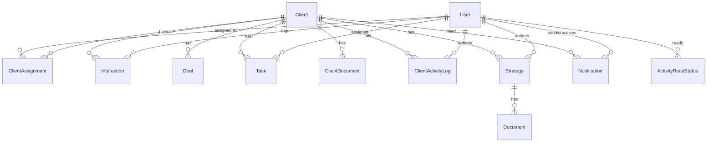

# Profit Pulse Ally CRM — Database & UI Reference

**Last updated:** June 15, 2026  
**Repository:** [CRM_PPA](https://github.com/prisken/CRM_PPA)  
**Deployment branch:** `deploy`  
**Production URL:** `https://crm-ppa-nine.vercel.app`

This document describes the PostgreSQL database schema, API surface, and frontend UI structure for handoff to developers, designers, and stakeholders.

### Shipped features (as of June 15, 2026)

| Area | Status |
|------|--------|
| Standard & super admin dashboards | ✅ KPIs, funnel, revenue, leaderboards, master pipeline |
| Recent Activity feed (grouped, unread, mark-read) | ✅ Standard + super admin dashboards |
| Branding (logo, favicon) | ✅ Login, signup, dashboards, Client 360 |
| Client 360 workspace | ✅ Strategy, tasks, notes, documents, deal info, team |
| Client details expansion | ✅ Role in company, employee count, expectations, important dates |
| Company hierarchy | ✅ Colleagues by company, add employee as lead |
| Role-based pipeline advances | ✅ Standard users; super admin full control |
| Standard user lead creation | ✅ Add Lead on dashboard with auto-assignment |
| Auth UX | ✅ Stale-session sign-out before login redirect |
| Vercel deploy | ✅ `prisma generate` + `migrate deploy` on build |

---

## Table of Contents

1. [Technology Stack](#1-technology-stack)
2. [Authentication & Authorization](#2-authentication--authorization)
3. [Database Overview](#3-database-overview)
4. [Enums](#4-enums)
5. [Tables & Models](#5-tables--models)
6. [Entity Relationship Diagram](#6-entity-relationship-diagram)
7. [Migration History](#7-migration-history)
8. [Business Rules](#8-business-rules)
9. [API Reference](#9-api-reference)
10. [UI Structure](#10-ui-structure)
11. [Component Inventory](#11-component-inventory)
12. [Key User Flows](#12-key-user-flows)
13. [Environment Variables](#13-environment-variables)
14. [Local Development](#14-local-development)

---

## 1. Technology Stack

| Layer | Technology |
|-------|------------|
| Framework | Next.js 16 (App Router) |
| Language | TypeScript |
| Styling | Tailwind CSS 4 |
| ORM | Prisma 6 |
| Database | PostgreSQL (Supabase) |
| Auth | Supabase Auth + JWT (`jose`) for API Bearer tokens |
| UI primitives | Headless UI, Lucide icons, Recharts, TanStack Table |
| File storage | Supabase Storage (client documents) |
| Hosting | Vercel |

**Project layout (high level):**

```
prisma/           # Schema + migrations
lib/              # Server helpers (auth, dashboards, client360, activity feed)
src/app/          # Next.js routes (pages + API)
src/components/   # React UI components
public/assets/    # Logo, favicon
docs/             # Documentation (this file)
```

---

## 2. Authentication & Authorization

### Auth flow

1. **Sign up** — `POST /api/auth/register` creates a Supabase Auth user + `User` row in Postgres (`STANDARD_USER` by default). Returns a JWT stored in `localStorage` as `token`.
2. **Sign in** — Supabase `signInWithPassword` sets session cookies.
3. **API access** — Session cookies (server) or `Authorization: Bearer <token>` (client fetch).
4. **Middleware** (`src/middleware.ts`) protects routes at the edge.

### Route protection (middleware)

| Path | Unauthenticated | Authenticated |
|------|-----------------|---------------|
| `/` | → `/login` | → `/dashboard` |
| `/dashboard`, `/admin`, `/clients/*` | → `/login` | Allowed |
| `/login`, `/signup` | Allowed | → `/dashboard` |

### User roles

| Role | Enum value | Access |
|------|------------|--------|
| Super Admin | `SUPER_ADMIN` | Full system: admin dashboard, all clients, assignments, unrestricted pipeline stage changes |
| Standard User | `STANDARD_USER` | Own dashboard, assigned clients, create leads (auto-assigned as Relationship), role-based pipeline advances |

### Assignment roles (per client)

| Role | Enum value | Typical permissions |
|------|------------|---------------------|
| Relationship | `RELATIONSHIP` | Strategy, tasks, deal info, notes |
| Doctor | `DOCTOR` | Strategy, tasks, deal info, notes |
| Account Service | `ACCOUNT_SERVICE` | Strategy, tasks, deal info, notes |

Super Admins bypass assignment checks on Client 360 APIs.

### Pipeline stage change authorization (`PATCH /api/clients/[id]`)

| User | Can update |
|------|------------|
| `SUPER_ADMIN` | Any field including `status` (full dropdown in UI) |
| `STANDARD_USER` | **`status` only**, and only when assignment role matches **current** stage |

| Assignment role | Allowed current statuses before advancing |
|-----------------|------------------------------------------|
| `RELATIONSHIP` | `NEW_LEAD`, `CONTACTED`, `NURTURING` |
| `DOCTOR` | `STRATEGY_SESSION` |
| `ACCOUNT_SERVICE` | `ACTIVE_CLIENT` |

Standard users advance one stage at a time via **Move to Next Stage** + confirmation modal. Logic is shared between API (`lib/authHelpers.ts` → `authorizePipelineStatusChange`) and UI (`lib/pipelinePermissions.ts`).

### Lead creation auto-assignment (`POST /api/clients`)

| User | Behavior |
|------|----------|
| `SUPER_ADMIN` | Creates client only |
| `STANDARD_USER` | Creates client **and** a `ClientAssignment` linking themselves with `RELATIONSHIP` role |

---

## 3. Database Overview

- **Provider:** PostgreSQL via Supabase connection pooler (`DATABASE_URL`) + direct URL for migrations (`DIRECT_URL`).
- **IDs:** CUID strings (`@default(cuid())`).
- **Naming:** Prisma models use PascalCase; several tables map to snake_case via `@@map`.

### Core domain areas

1. **Users & access** — `User`, `ClientAssignment`
2. **Clients & pipeline** — `Client`, `Deal`
3. **Client 360 workspace** — `Task`, `ClientDocument`, `Strategy`, `Interaction`, `ClientActivityLog`
4. **Activity & notifications** — `ActivityReadStatus`, `Notification`
5. **Legacy strategy docs** — `Strategy`, `Document` (strategy-linked; Client 360 also uses `Client.strategyText`)

---

## 4. Enums

| Enum | Values | Used by |
|------|--------|---------|
| `UserRole` | `SUPER_ADMIN`, `STANDARD_USER` | `User.role` |
| `AssignmentRole` | `RELATIONSHIP`, `DOCTOR`, `ACCOUNT_SERVICE` | `ClientAssignment.role` |
| `ClientStatus` | `NEW_LEAD`, `CONTACTED`, `NURTURING`, `STRATEGY_SESSION`, `ACTIVE_CLIENT`, `ARCHIVED` | `Client.status` (pipeline stages) |
| `InteractionType` | `CALL`, `EMAIL`, `MEETING`, `NOTE` | `Interaction.type` |
| `DealStatus` | `PROPOSED`, `WON`, `LOST`, `ON_HOLD` | `Deal.status` |
| `StrategyStatus` | `DRAFT`, `READY_FOR_REVIEW`, `APPROVED`, `NEEDS_REVISION` | `Strategy.status` |
| `TaskStatus` | `PENDING`, `IN_PROGRESS`, `COMPLETED`, `CANCELLED` | `Task.status` |
| `ActivityLogType` | `NOTE`, `CALL`, `EMAIL`, `MEETING`, `SYSTEM` | `ClientActivityLog.type` |

### Pipeline stage labels (UI)

| DB value | Display label |
|----------|---------------|
| `NEW_LEAD` | New Lead |
| `CONTACTED` | Contacted |
| `NURTURING` | Nurturing |
| `STRATEGY_SESSION` | Strategy Session |
| `ACTIVE_CLIENT` | Active Client |
| `ARCHIVED` | Archived |

---

## 5. Tables & Models

### `User` (table: `User`)

| Column | Type | Notes |
|--------|------|-------|
| `id` | TEXT PK | Matches Supabase Auth user ID |
| `name` | TEXT | Optional display name |
| `email` | TEXT UNIQUE | Login email |
| `password_hash` | TEXT | Bcrypt hash (registration backup; Supabase holds primary credentials) |
| `role` | UserRole | `SUPER_ADMIN` or `STANDARD_USER` |
| `createdAt`, `updatedAt` | TIMESTAMP | Audit |

**Relations:** assignments, interactions, tasks (assignee), activity logs, read statuses, notifications (sent/received), strategies (author).

---

### `Client` (table: `Client`)

| Column | Type | Notes |
|--------|------|-------|
| `id` | TEXT PK | |
| `name` | TEXT | Primary display name |
| `company` | TEXT | Optional |
| `contactInfo` | TEXT | Legacy / general contact |
| `email`, `phone` | TEXT | Contact fields |
| `lead_source` | TEXT | e.g. referral, website |
| `deal_value` | DECIMAL(12,2) | Client-level deal value (overrides sum of deals when set) |
| `equity` | DECIMAL(12,2) | Equity stake |
| `strategy_text` | TEXT | Free-form strategy on Client 360 |
| `role_in_company` | TEXT | Contact's role/title at their company |
| `employee_count` | INTEGER | Reported company headcount |
| `expectations` | TEXT | Client expectations for the engagement |
| `important_dates` | JSONB | Array of `{ label, date }` objects; default `[]` |
| `status` | ClientStatus | Pipeline stage |
| `pendingNotifications` | BOOLEAN | Flag for notification workflows |
| `createdAt`, `lastModified` | TIMESTAMP | |

**Relations:** assignments, interactions, deals, strategies, documents, tasks, activity logs, notifications.

---

### `client_assignments`

Join table: which users work on which clients, and in what role.

| Column | Type | Notes |
|--------|------|-------|
| `assignment_id` | TEXT PK | |
| `client_id` | TEXT FK → Client | CASCADE delete |
| `user_id` | TEXT FK → User | CASCADE delete |
| `role` | AssignmentRole | RELATIONSHIP / DOCTOR / ACCOUNT_SERVICE |

A user may have multiple assignments across clients; a client may have multiple assigned users.

---

### `Interaction`

Manual activity logged by users (notes, calls, emails, meetings).

| Column | Type | Notes |
|--------|------|-------|
| `id` | TEXT PK | Also used as `activityId` in activity feed |
| `type` | InteractionType | |
| `content` | TEXT | Body / description |
| `date` | TIMESTAMP | When the interaction occurred |
| `clientId` | TEXT FK → Client | |
| `userId` | TEXT FK → User | Who logged it |

---

### `Deal`

Financial deal records linked to a client.

| Column | Type | Notes |
|--------|------|-------|
| `id` | TEXT PK | |
| `name` | TEXT | Deal name |
| `dealValue` | DECIMAL(12,2) | |
| `grossProfit` | DECIMAL(12,2) | Used for commission calculations |
| `status` | DealStatus | |
| `clientId` | TEXT FK → Client | |
| `createdAt`, `updatedAt` | TIMESTAMP | |

---

### `Strategy` + `Document`

Legacy/alternate strategy model (separate from `Client.strategyText`).

- **Strategy** — named strategy with description, status, optional `client_id`, required `authorId`.
- **Document** — file URL attached to a strategy.

Client 360 primarily uses `Client.strategyText`; strategies table remains for historical/reporting data.

---

### `client_documents`

Files uploaded for a client (Supabase Storage URLs).

| Column | Type | Notes |
|--------|------|-------|
| `id` | TEXT PK | |
| `file_name` | TEXT | |
| `url` | TEXT | Download URL |
| `uploaded_at` | TIMESTAMP | |
| `client_id` | TEXT FK → Client | |

---

### `tasks`

| Column | Type | Notes |
|--------|------|-------|
| `id` | TEXT PK | |
| `title` | TEXT | |
| `description` | TEXT | Optional |
| `status` | TaskStatus | Default `PENDING` |
| `due_date` | TIMESTAMP | Optional |
| `client_id` | TEXT FK → Client | |
| `assignee_id` | TEXT FK → User | Optional; SET NULL on user delete |
| `created_at`, `updated_at` | TIMESTAMP | |

---

### `client_activity_logs`

System-generated events (status changes, assignments, etc.) and structured log entries.

| Column | Type | Notes |
|--------|------|-------|
| `id` | TEXT PK | Also used as `activityId` in activity feed |
| `type` | ActivityLogType | Often `SYSTEM` for automated events |
| `content` | TEXT | Human-readable message |
| `created_at` | TIMESTAMP | |
| `client_id` | TEXT FK → Client | |
| `user_id` | TEXT FK → User | Optional (actor) |

---

### `activity_read_status`

Per-user read tracking for dashboard activity feed. **Not a foreign key** to a single activity table — `activity_log_id` stores IDs from either `Interaction` or `ClientActivityLog`.

| Column | Type | Notes |
|--------|------|-------|
| `activity_log_id` | TEXT | Part of composite PK |
| `user_id` | TEXT FK → User | Part of composite PK; CASCADE delete |
| `created_at` | TIMESTAMP | When marked read |

---

### `notifications`

| Column | Type | Notes |
|--------|------|-------|
| `notification_id` | TEXT PK | |
| `recipient_user_id` | TEXT FK → User | |
| `sender_user_id` | TEXT FK → User | |
| `message` | TEXT | |
| `linked_client_id` | TEXT FK → Client | Optional |
| `is_read` | BOOLEAN | Default false |
| `timestamp` | TIMESTAMP | |

---

## 6. Entity Relationship Diagram



---

## 7. Migration History

| Migration | Description |
|-----------|-------------|
| `20260614181212_initial_setup` | Core tables: User, Client, Interaction, Deal, Strategy, Document |
| `20260615030000_refactor_client_assignments` | Replaced per-role FK columns on Client with `client_assignments` join table; updated UserRole enum |
| `20260615040000_add_notifications` | `notifications` table |
| `20260615050000_client_360_fields` | Client contact/deal fields, `tasks`, `client_documents`, `client_activity_logs`, `strategyText` |
| `20260615060000_add_user_password_hash` | `password_hash` on User |
| `20260615070000_add_activity_read_status` | `activity_read_status` for dashboard unread tracking |
| `20260615024217_add_client_360_fields` | `role_in_company`, `employee_count`, `expectations`, `important_dates` on Client |

**Deploy note:** `package.json` runs `prisma generate` on `postinstall` and `prisma generate && prisma migrate deploy && next build` on production build so Vercel applies migrations and has an up-to-date Prisma client.

---

## 8. Business Rules

### Commission rates (standard user dashboard)

Applied to **gross profit** by assignment role:

| Assignment role | Rate |
|-----------------|------|
| Relationship (`RELATIONSHIP`) | 15% |
| Doctor (`DOCTOR`) | 10% |
| Account Service (`ACCOUNT_SERVICE`) | 10% |

`myPotentialCommission` on the standard dashboard = sum of `(grossProfit × rate)` per assigned client.

### Deal value resolution

1. If `Client.deal_value` is set → use it.
2. Else → sum of related `Deal.dealValue`.

### Gross profit resolution

Uses the **first deal** (by `createdAt`) gross profit, or `0` if none.

### Activity feed

Merges two sources, sorted by date descending:

- **Manual:** `Interaction` rows
- **System:** `ClientActivityLog` rows

Grouped by client for dashboard widgets. `isUnread` = no row in `activity_read_status` for `(activityId, userId)`.

### Activity ID note

`activity_log_id` in `activity_read_status` is polymorphic — it may reference either an `Interaction.id` or `ClientActivityLog.id`.

### Company hierarchy

Clients sharing the same `company` name are treated as colleagues. The **Company Hierarchy** widget (`CompanyHierarchyWidget`) displays:

- Current client's `employeeCount`
- Other clients with matching `company` (excluding self)
- A form to add an **employee as a new lead** via `POST /api/clients/[id]/employees`

The employees endpoint copies the employer's `company`, sets `status` to `NEW_LEAD`, and auto-assigns the creator as `RELATIONSHIP`.

### Important dates format

Stored as JSONB array on `Client.important_dates`:

```json
[
  { "label": "Contract renewal", "date": "2026-12-01" },
  { "label": "Onboarding", "date": "2026-06-17" }
]
```

Edited via `PUT /api/clients/[id]/details`; displayed read-only on `ClientDetailsWidget`.

---

## 9. API Reference

### Auth

| Method | Path | Auth | Description |
|--------|------|------|-------------|
| POST | `/api/auth/register` | Public | Create user (name, email, password) |
| * | `/api/auth/[...nextauth]` | — | NextAuth route (legacy/auxiliary) |

### Dashboards

| Method | Path | Auth | Description |
|--------|------|------|-------------|
| GET | `/api/dashboard/standard` | Standard user | Assigned clients, open tasks, grouped recent activity, performance metrics |
| GET | `/api/dashboard/superadmin` | Super admin | System-wide grouped recent activity (last ~100 items) |
| POST | `/api/activity/mark-read` | Any authenticated | Body: `{ activityLogIds: string[] }` — upsert read status |

### Tasks

| Method | Path | Auth | Description |
|--------|------|------|-------------|
| PUT | `/api/tasks/[taskId]/complete` | Assignee or super admin | Mark task completed |

### Clients (Client 360 & leads)

| Method | Path | Auth | Description |
|--------|------|------|-------------|
| POST | `/api/clients` | Super admin or standard user | Create lead/client. Standard users are auto-assigned `RELATIONSHIP`. Body: `name`, `company`, `email`, `phone`, `contactInfo`, `status` |
| GET | `/api/clients/[id]` | Authenticated | Full Client 360 payload |
| PATCH | `/api/clients/[id]` | Super admin (any fields) or standard user (`status` only, role-based) | Update client; pipeline stage changes log a system activity |
| PUT | `/api/clients/[id]/details` | Super admin | Update name, company, email, phone, lead source, `roleInCompany`, `employeeCount`, `expectations`, `importantDates`. Uses `requireSuperAdminFromRequest` (session cookie or Bearer token) |
| PUT | `/api/clients/[id]/deal` | Super admin or assignment role | Deal value, gross profit, equity |
| PUT | `/api/clients/[id]/strategy` | Super admin or assignment role | `strategyText` |
| POST | `/api/clients/[id]/tasks` | Super admin or assignment role | Create task |
| POST | `/api/clients/[id]/notes` | Super admin or client access | Add interaction (note) |
| GET | `/api/clients/[id]/employees` | Authenticated | Company hierarchy: `employeeCount`, colleagues with same `company` |
| POST | `/api/clients/[id]/employees` | Authenticated | Create employee as new lead from employer client. Body: `fullName`, `roleInCompany` |
| POST | `/api/clients/[id]/assignments` | Super admin | Assign user to client |
| DELETE | `/api/clients/[id]/assignments/[assignmentId]` | Super admin | Remove assignment |
| POST | `/api/clients/[id]/documents` | Super admin or client access | Upload document |
| DELETE | `/api/clients/[id]/documents/[documentId]` | Super admin | Delete document |

### Admin analytics

| Method | Path | Auth | Description |
|--------|------|------|-------------|
| GET | `/api/admin/dashboard-kpis` | Super admin | KPI summary |
| GET | `/api/admin/funnel-data` | Super admin | Conversion funnel chart data |
| GET | `/api/admin/revenue-tracker` | Super admin | Revenue over time |
| GET | `/api/admin/leaderboards` | Super admin | Commission & deals leaderboards |
| GET | `/api/admin/pipeline` | Super admin | All clients for master pipeline |
| GET | `/api/admin/users` | Super admin | User list |

### Reports (alternate endpoints)

| Method | Path | Description |
|--------|------|-------------|
| GET | `/api/reports/funnel` | Funnel data |
| GET | `/api/reports/revenue` | Revenue data |
| GET | `/api/reports/leaderboards` | Leaderboard data |

### Notifications

| Method | Path | Description |
|--------|------|-------------|
| GET | `/api/notifications` | List for current user |
| POST | `/api/notifications` | Create notification |
| PUT | `/api/notifications/[id]/read` | Mark read |

### Legacy

| Method | Path | Description |
|--------|------|-------------|
| GET | `/api/get-dashboard-data` | Older aggregated dashboard endpoint |

---

### Standard dashboard response shape

```json
{
  "assignedClients": [
    {
      "clientId": "...",
      "clientName": "...",
      "myRole": "Relationship",
      "clientStatus": "Active Client",
      "dealValue": 50000
    }
  ],
  "openTasks": [
    {
      "taskId": "...",
      "clientId": "...",
      "description": "...",
      "clientName": "...",
      "dueDate": "2026-06-15T00:00:00.000Z"
    }
  ],
  "recentActivity": [
    {
      "clientId": "...",
      "clientName": "Acme Inc.",
      "activities": [
        {
          "activityId": "...",
          "log": "Jane added a note to Acme.",
          "timestamp": "2026-06-15T12:00:00.000Z",
          "isUnread": true
        }
      ]
    }
  ],
  "performanceMetrics": {
    "totalActiveClients": 3,
    "totalPipelineValue": 150000,
    "myPotentialCommission": 12000
  }
}
```

### Client 360 response (abbreviated)

```json
{
  "client_id": "...",
  "name": "...",
  "company": "...",
  "email": "...",
  "phone": "...",
  "lead_source": "...",
  "roleInCompany": "CEO",
  "employeeCount": 120,
  "expectations": "Quarterly strategy reviews",
  "importantDates": [
    { "label": "Contract renewal", "date": "2026-12-01" }
  ],
  "deal_value": 50000,
  "gross_profit": 20000,
  "equity": 0,
  "status": "ACTIVE_CLIENT",
  "strategyText": "...",
  "assignedUsers": [{ "assignment_id": "...", "user_id": "...", "name": "...", "role": "RELATIONSHIP" }],
  "documents": [{ "id": "...", "fileName": "...", "downloadUrl": "...", "uploadedAt": "..." }],
  "tasks": [{ "id": "...", "title": "...", "status": "PENDING", "dueDate": null, "assignee": null }],
  "activityLog": [{ "id": "...", "type": "NOTE", "content": "...", "date": "...", "source": "manual", "userName": "..." }]
}
```

### Company hierarchy response (`GET /api/clients/[id]/employees`)

```json
{
  "client_id": "...",
  "company": "Acme Inc.",
  "employeeCount": 120,
  "colleagues": [
    {
      "client_id": "...",
      "name": "Jane Smith",
      "roleInCompany": "Operations Manager",
      "status": "NEW_LEAD"
    }
  ]
}
```

### Employee lead creation response (`POST /api/clients/[id]/employees`)

```json
{
  "client_id": "...",
  "name": "Jane Smith",
  "company": "Acme Inc.",
  "roleInCompany": "Operations Manager",
  "status": "NEW_LEAD",
  "employer_client_id": "...",
  "assignment_id": "...",
  "createdAt": "..."
}
```

---

## 10. UI Structure

### Site map

```
/                     → redirect to /login or /dashboard
/login                → Sign in
/signup               → Register
/dashboard            → Standard User Dashboard (SUPER_ADMIN redirected to /admin)
/admin                → Super Admin Dashboard
/clients/[id]         → Client 360 page
```

### Role-based landing

| Role | Primary home |
|------|--------------|
| `STANDARD_USER` | `/dashboard` |
| `SUPER_ADMIN` | `/admin` (auto-redirect from `/dashboard`) |

### Branding

- **Logo component:** `src/components/Logo.tsx` → `/assets/logo-full.png`
- **Favicon:** `/assets/favicon.ico` (configured in `src/app/layout.tsx` metadata)
- Logo appears in: dashboard headers, Client 360 header, login, signup

---

### Page: Login (`/login`)

**File:** `src/app/login/page.tsx`

- Profit Pulse Ally logo (centered)
- Email + password form → Supabase sign-in → `/dashboard`
- Link to `/signup`

---

### Page: Sign Up (`/signup`)

**File:** `src/app/signup/page.tsx` → `src/components/auth/SignUpPage.tsx`

- Logo, full name, email, password, confirm password
- Registers via API, stores JWT, signs in, → `/dashboard`

---

### Page: Standard User Dashboard (`/dashboard`)

**File:** `src/components/dashboard/StandardUserDashboardPage.tsx`

**Header:** Logo (links home), welcome message, **Add Lead**, Sign Out

**Modals:** `AddLeadModal` — simplified lead form (name, company, email, phone) → `POST /api/clients`

**Widgets (2-column grid):**

| Widget | Component | Data source |
|--------|-----------|-------------|
| My Assigned Clients | `MyClientsWidget` | `assignedClients` — searchable table, links to Client 360 |
| My Open Tasks | `MyTasksWidget` | `openTasks` — checkbox to complete via API |
| Recent Activity | `CollapsibleActivityWidget` | `recentActivity` — grouped by client, unread badges, mark-read on expand |
| Performance Snapshot | `PerformanceSnapshotWidget` | `performanceMetrics` — active clients, pipeline value, commission |

**Unauthenticated state:** `AuthRequiredMessage` with “Back to Sign In” (signs out stale session, then → `/login`)

---

### Page: Super Admin Dashboard (`/admin`)

**File:** `src/components/admin/SuperAdminDashboardPage.tsx`

**Header:** Logo, title, Add Lead/Client, User Dashboard link, Sign Out

**Sections (top to bottom):**

| Section | Component | API |
|---------|-----------|-----|
| KPI bar | `KpiBar` | `/api/admin/dashboard-kpis` |
| Conversion funnel | `ConversionFunnelChart` | `/api/admin/funnel-data` |
| Revenue tracker | `RevenueTrackerChart` | `/api/admin/revenue-tracker` |
| Leaderboards | `Leaderboards` | `/api/admin/leaderboards` |
| Recent Activity (all clients) | `CollapsibleActivityWidget` | `/api/dashboard/superadmin` |
| Master pipeline | `MasterPipelineView` | `/api/admin/pipeline` |

**Modals:** `AddClientModal` — create new client

---

### Page: Client 360 (`/clients/[id]`)

**File:** `src/components/clients/Client360Page.tsx`

**Header:** Logo, back to pipeline link, client name, pipeline stage control:

| Role | UI control |
|------|------------|
| Super Admin | Dropdown — any stage, immediate `PATCH` |
| Standard User | Read-only badge + **Move to Next Stage** button (when role permits) |

**Pipeline advance modal:** `PipelineStageAdvanceModal` — confirmation message + non-interactive checklist reminders; **Confirm** calls `PATCH /api/clients/[id]`.

**Layout:** Two columns

**Left — Workspace (`WorkspacePanel`):**

| Tab | Component | Features |
|-----|-----------|----------|
| Strategy & Tasks | `StrategyAndTasks` | Edit strategy text, create tasks |
| Activity & Notes | `ActivityLog` | View merged activity, add notes |

Deep link: `#activity-notes` opens Activity tab and scrolls into view.

**Right column — At-a-glance widgets:**

| Widget | Component | Who can edit |
|--------|-----------|--------------|
| Client Details | `ClientDetailsWidget` + `ClientDetailsEditModal` | Super admin — includes role, employee count, expectations, important dates |
| Deal Info | `DealInfoWidget` | Super admin / relationship role |
| Assigned Team | `AssignedTeamWidget` | Super admin manages assignments |
| Company Hierarchy | `CompanyHierarchyWidget` | All authenticated — view colleagues, add employee leads |

---

## 11. Component Inventory

### Shared

| Component | Path | Purpose |
|-----------|------|---------|
| `Logo` | `src/components/Logo.tsx` | Branded logo image |
| `AuthRequiredMessage` | `src/components/auth/AuthRequiredMessage.tsx` | Unauthenticated fallback with sign-in CTA |
| `Providers` | `src/components/Providers.tsx` | App-level providers wrapper |

### Dashboard (standard user)

| Component | Path |
|-----------|------|
| `StandardUserDashboardPage` | `src/components/dashboard/StandardUserDashboardPage.tsx` |
| `MyClientsWidget` | `src/components/dashboard/MyClientsWidget.tsx` |
| `MyTasksWidget` | `src/components/dashboard/MyTasksWidget.tsx` |
| `CollapsibleActivityWidget` | `src/components/dashboard/CollapsibleActivityWidget.tsx` |
| `PerformanceSnapshotWidget` | `src/components/dashboard/PerformanceSnapshotWidget.tsx` |
| `AddLeadModal` | `src/components/dashboard/AddLeadModal.tsx` |

### Admin

| Component | Path |
|-----------|------|
| `SuperAdminDashboardPage` | `src/components/admin/SuperAdminDashboardPage.tsx` |
| `KpiBar` | `src/components/admin/KpiBar.tsx` |
| `ConversionFunnelChart` | `src/components/admin/ConversionFunnelChart.tsx` |
| `RevenueTrackerChart` | `src/components/admin/RevenueTrackerChart.tsx` |
| `Leaderboards` | `src/components/admin/Leaderboards.tsx` |
| `MasterPipelineView` | `src/components/admin/MasterPipelineView.tsx` |
| `AddClientModal` | `src/components/admin/AddClientModal.tsx` |
| `WidgetDownloadMenu` | `src/components/admin/WidgetDownloadMenu.tsx` |

### Client 360

| Component | Path |
|-----------|------|
| `Client360Page` | `src/components/clients/Client360Page.tsx` |
| `WorkspacePanel` | `src/components/clients/WorkspacePanel.tsx` |
| `StrategyAndTasks` | `src/components/clients/StrategyAndTasks.tsx` |
| `ActivityLog` | `src/components/clients/ActivityLog.tsx` |
| `ClientDetailsWidget` | `src/components/clients/ClientDetailsWidget.tsx` |
| `ClientDetailsEditModal` | `src/components/clients/ClientDetailsEditModal.tsx` |
| `DealInfoWidget` | `src/components/clients/DealInfoWidget.tsx` |
| `AssignedTeamWidget` | `src/components/clients/AssignedTeamWidget.tsx` |
| `CompanyHierarchyWidget` | `src/components/clients/CompanyHierarchyWidget.tsx` |
| `PipelineStageAdvanceModal` | `src/components/clients/PipelineStageAdvanceModal.tsx` |

### Server-side libraries (`lib/`)

| Module | Purpose |
|--------|---------|
| `prisma.ts` | Prisma client singleton |
| `authHelpers.ts` | Auth guards, pipeline authorization, client access checks, system event logging |
| `client360.ts` | Client 360 query includes + response builder |
| `pipelinePermissions.ts` | Pipeline stage advance rules (shared by API + UI) |
| `standardDashboard.ts` | Standard user dashboard data |
| `superAdminDashboard.ts` | Super admin activity feed data |
| `activityFeed.ts` | Grouped activity + mark-as-read |
| `dashboardTypes.ts` | TypeScript types for dashboard payloads |
| `clientStages.ts` | Pipeline stage labels and badge styles |
| `commissionRates.ts` | Role-based commission constants |
| `jwt.ts` | JWT sign/verify for Bearer auth |
| `supabaseClient.ts` / `supabaseServer.ts` / `supabaseAdmin.ts` | Supabase clients |

---

## 12. Key User Flows

### New user registration

```
/signup → POST /api/auth/register → Supabase user + User row
       → JWT in localStorage → Supabase sign-in → /dashboard
```

### Standard user daily workflow

```
/dashboard → view assigned clients, tasks, activity
          → Add Lead → POST /api/clients (auto-assigned RELATIONSHIP)
          → click client → /clients/[id]
          → add note / update strategy / complete tasks
          → Move to Next Stage (if role permits) → confirmation modal → PATCH status
          → expand activity group → POST /api/activity/mark-read
```

### Standard user — company hierarchy

```
/clients/[id] → Company Hierarchy widget
             → view colleagues at same company
             → Add Employee Lead → POST /api/clients/[id]/employees
             → new lead created with shared company + RELATIONSHIP assignment
```

### Super admin workflow

```
/admin → review KPIs, funnel, revenue, leaderboards
      → scan system-wide activity feed
      → master pipeline → filter by status/user → open Client 360
      → change pipeline stage, edit details, manage team assignments
```

### Stale session recovery

```
/dashboard (no profile) → AuthRequiredMessage
                       → "Back to Sign In" → signOut + clear token → /login
```

---

## 13. Environment Variables

| Variable | Purpose |
|----------|---------|
| `DATABASE_URL` | Postgres connection (pooler) |
| `DIRECT_URL` | Direct Postgres URL for migrations |
| `NEXT_PUBLIC_SUPABASE_URL` | Supabase project URL |
| `NEXT_PUBLIC_SUPABASE_ANON_KEY` | Supabase anon key (client + middleware) |
| `SUPABASE_SECRET_KEY` | Service role (registration, uploads) |
| `NEXTAUTH_SECRET` | JWT signing secret |

---

## 14. Local Development

```bash
npm install          # runs prisma generate via postinstall
npx prisma migrate deploy
npm run dev          # http://localhost:3000
```

**Integration test (activity APIs):**

```bash
npx tsx scripts/test-activity-apis.ts
```

**Build (matches Vercel):**

```bash
npm run build        # prisma generate && prisma migrate deploy && next build
```

---

## Appendix: UI Wireframe Overview

```
┌─────────────────────────────────────────────────────────────┐
│  [Logo]  Welcome back, {name}        [Add Lead] [Sign Out]  │  Standard Dashboard
├──────────────────────────┬──────────────────────────────────┤
│  My Assigned Clients     │  My Open Tasks                     │
├──────────────────────────┼──────────────────────────────────┤
│  Recent Activity         │  Performance Snapshot              │
│  ▼ Client A  [!]         │  Active clients / Pipeline / $     │
│  ▼ Client B              │                                    │
└──────────────────────────┴──────────────────────────────────┘

┌─────────────────────────────────────────────────────────────┐
│  [Logo]  Super Admin Dashboard    [+Add] [User Dash] [Out]  │
├─────────────────────────────────────────────────────────────┤
│  KPI Bar                                                    │
├──────────────────────────┬──────────────────────────────────┤
│  Conversion Funnel         │  Revenue Tracker                 │
├──────────────────────────┴──────────────────────────────────┤
│  Leaderboards                                               │
├─────────────────────────────────────────────────────────────┤
│  Recent Activity (All Clients) — CollapsibleActivityWidget  │
├─────────────────────────────────────────────────────────────┤
│  Master Pipeline (kanban-style columns by stage)            │
└─────────────────────────────────────────────────────────────┘

┌─────────────────────────────────────────────────────────────┐
│  [Logo]                              ← Back to list         │  Client 360
│  {Client Name}  [Stage badge ▼ or Move to Next Stage]       │
├──────────────────────────────┬──────────────────────────────┤
│  WORKSPACE                   │  Client Details              │
│  [Strategy & Tasks] [Activity]│  Deal Info                  │
│  ...                         │  Assigned Team               │
│                              │  Company Hierarchy           │
└──────────────────────────────┴──────────────────────────────┘
```

---

*For schema changes, always add a Prisma migration under `prisma/migrations/` and run `prisma migrate deploy` in each environment.*

### Known limitations (future work)

| Item | Notes |
|------|-------|
| Client details editing | Super admin only via `PUT /api/clients/[id]/details`; assigned standard users are read-only |
| Client 360 access | `GET /api/clients/[id]` allows any authenticated user (not restricted to assignees) |
| Pipeline checklist in modal | Display-only reminders; not persisted or validated server-side |
