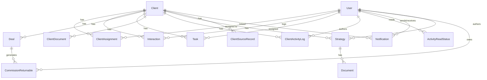

# Profit Pulse Ally CRM — Database & UI Reference

**Last updated:** June 24, 2026 (unified lead ingestion, source records, Client 360 widget)  
**Repository:** [CRM_PPA](https://github.com/prisken/CRM_PPA)  
**Deployment branch:** `deploy`  
**Last deployed commit:** `a81fff3` (unified lead ingestion, source records, Client 360 widget)  
**Production URL:** `https://crm-ppa-nine.vercel.app`  
**Local dev server:** `http://localhost:3000` (run `npm run dev`; add `PERF_LOGGING_ENABLED=true` for route timing logs)

This document describes the PostgreSQL database schema, API surface, and frontend UI structure for handoff to developers, designers, and stakeholders.

### Shipped features (current)

| Area | Status |
|------|--------|
| Standard & super admin dashboards | ✅ KPIs, funnel, revenue, leaderboards, master pipeline |
| Recent Activity feed (grouped, unread, mark-read) | ✅ Standard + super admin dashboards |
| Branding (logo, favicon) | ✅ Login, signup, dashboards, Client 360 |
| Client 360 workspace | ✅ Strategy, tasks, interactions, documents, multi-deal, team |
| Client details expansion | ✅ Role in company, employee count, expectations, important dates |
| Company hierarchy | ✅ Colleagues by company, add employee as lead |
| Role-based pipeline advances | ✅ Standard users; super admin full control |
| Standard user lead creation | ✅ Add Lead on dashboard with auto-assignment |
| RELATIONSHIP client details edit | ✅ API + Edit button on Client 360 |
| Mobile-responsive UI | ✅ Dashboards, Client 360, pipeline, modals, workspace tabs |
| Auth UX | ✅ Stale-session sign-out; deactivated-account block on login + API |
| Commission engine | ✅ Shared-role pools, `totalCommission`, secured commission |
| Team occupancy limits | ✅ Max 2 Doctors, 1 Relationship, 1 Account Service per client |
| Multi-deal system | ✅ CRUD per client; committed/potential value aggregation |
| Commission returnables | ✅ Doctor liabilities on WON deals; multi-role credit sum; statements + reconciliation |
| Assignment-triggered returnable recalculation | ✅ Fire-and-forget via `POST /api/tasks/recalculate-returnables` on assignment add/remove |
| Role-based dashboard widgets | ✅ Secured commission + returnables by assignment role (all users) |
| Performance — standard dashboard | ✅ Per-widget API endpoints; shared `loadStandardDashboardContext` for legacy monolith; SQL deal aggregates; skeleton loaders |
| Performance — dashboard pass 2 | ✅ `lib/standardDashboardContext.ts` + `lib/dashboardDealAggregates.ts`; fewer duplicate DB round-trips; open tasks `clientId IN` filter |
| Performance — Client 360 | ✅ Server `Promise.all` for core + deals + hierarchy; lazy workspace tabs only |
| Performance — admin analytics cache | ✅ `unstable_cache` (600s) for org-wide aggregates after `requireSuperAdminFromRequest`; routes `force-dynamic` |
| Performance — frontend render | ✅ `memo`/`useMemo`/`useCallback`; `next/dynamic` for charts, pipeline, modals |
| Performance — route timing logs | ✅ Opt-in `[perf]` logs via `PERF_LOGGING_ENABLED=true` (`lib/performance.ts`) |
| DB performance indexes (phase 2) | ✅ `20260624084311_add_performance_indexes_phase_2` — assignments, tasks, deals, returnables |
| Query optimizations | ✅ Activity feed SQL `UNION ALL`; conditional deal aggregation SQL; narrower Prisma selects |
| DB performance indexes (phase 1) | ✅ `20260617003208_add_performance_indexes` — deals, interactions, activity logs, read status |
| Unified lead ingestion | ✅ `lib/leadIngestion.ts` — shared `ingestExternalLead()` for webhooks; match by source+externalId → email → phone; safe merge on update |
| Client source records | ✅ `client_source_records` table — raw webhook payloads per ingest; `@@unique([source, externalId])` dedupes repeat submissions |
| Google Forms lead webhook | ✅ `POST /api/integrations/google-forms/leads` — uses `ingestExternalLead`; `201` created / `200` updated; optional RELATIONSHIP assign on create only |
| Profit Pulse Ally member webhook | ✅ `POST /api/integrations/profit-pulse-ally/members` — uses `ingestExternalLead`; upsert by email or `memberId` as externalId |
| Client 360 source records widget | ✅ `ClientSourceRecordsWidget` — collapsible payload history; `GET /api/clients/[id]/source-records` |
| Duplicate client scan | ✅ `npm run find:duplicate-clients` — `scripts/find-duplicate-clients.ts` |
| Lead ingestion integration test | ✅ `npx tsx scripts/test-lead-ingestion.ts` — direct `ingestExternalLead` tests (no webhooks/secrets) |
| Client lifecycle management | ✅ Super admin archive (soft) + permanent delete with password confirmation |
| User management | ✅ Super admin deactivate + permanent delete; `/admin/users` UI |
| Enhanced lead creation | ✅ Full client-detail fields at create time (`AddLeadModal`, `AddClientModal`) |
| Account settings | ✅ `/dashboard/settings` — edit display name; link in dashboard headers |
| Safari/iPad autofill fix | ✅ Global `-webkit-autofill` override in `globals.css` |
| Vercel deploy | ✅ `prisma generate` + `migrate deploy` on build |

---

## Table of Contents

1. [Technology Stack](#1-technology-stack)
2. [Authentication & Authorization](#2-authentication--authorization)
3. [Database Overview](#3-database-overview)
4. [Enums](#4-enums)
5. [Tables & Models](#5-tables--models)
6. [Entity Relationship Diagram](#6-entity-relationship-diagram)
7. [Migration History](#7-migration-history)
8. [Business Rules](#8-business-rules)
9. [API Reference](#9-api-reference)
10. [UI Structure](#10-ui-structure)
11. [Component Inventory](#11-component-inventory)
12. [Key User Flows](#12-key-user-flows)
13. [Environment Variables](#13-environment-variables)
14. [Local Development](#14-local-development)
15. [Mobile & Responsive Design](#15-mobile--responsive-design)
16. [Auth Helper Reference](#16-auth-helper-reference)

---

## 1. Technology Stack

| Layer | Technology |
|-------|------------|
| Framework | Next.js 16 (App Router) |
| Language | TypeScript |
| Styling | Tailwind CSS 4 |
| ORM | Prisma 6 |
| Database | PostgreSQL (Supabase) |
| Auth | Supabase Auth + JWT (`jose`) for API Bearer tokens |
| UI primitives | Headless UI, Lucide icons, Recharts, TanStack Table |
| File storage | Supabase Storage (client documents) |
| Hosting | Vercel |

**Project layout (high level):**

```
prisma/           # Schema + migrations
lib/              # Server helpers (auth, dashboards, client360, activity feed, integrations)
src/app/          # Next.js routes (pages + API, incl. api/integrations/* webhooks)
src/components/   # React UI components
public/assets/    # Logo, favicon
docs/             # Documentation (this file, google-forms-integration.md)
```

**Performance architecture:**

- **Standard dashboard** — each widget has its own API route; the page fetches in parallel and shows dimension-matched skeleton loaders. The **legacy** `GET /api/dashboard/standard` loads shared context once (`loadStandardDashboardContext`) then builds all widgets in parallel (no duplicate assignment/deal queries per widget).
- **Client 360** — server component loads core client data, deals, and company hierarchy in parallel via `loadClient360PageData()`; workspace tabs still lazy-load on demand. Mutations call `router.refresh()` to re-fetch server data.
- **Admin analytics** — super-admin org-wide aggregates (funnel, KPIs, revenue tracker, leaderboards) use `unstable_cache` with 600s revalidation in `lib/adminAnalyticsCache.ts`. Auth (`requireSuperAdminFromRequest`) runs on every request before cache lookup. Routes export `dynamic = 'force-dynamic'` so session-scoped responses are not globally cached. User-specific dashboard, Client 360, and `/api/me/*` routes are also `force-dynamic`.
- **Activity feed** — single PostgreSQL query via `UNION ALL` (Interactions + activity logs), sorted and limited in the database.
- **Route timing** — set `PERF_LOGGING_ENABLED=true` to emit `[perf]` lines in the dev server terminal. See [Route performance timings](#route-performance-timings) below.

### Route performance timings

Measured locally (June 24, 2026) against Supabase PostgreSQL with `PERF_LOGGING_ENABLED=true`. Times are **server handler** durations from `[perf]` logs unless noted. Cold starts and pool warmup can add latency on first request.

**How to reproduce:**

```bash
PERF_LOGGING_ENABLED=true npm run dev
npx tsx scripts/profile-api-routes.ts   # client round-trip summary
```

**Typical server timings (after performance pass 2, warm runs):**

| Route / operation | Server time | Notes |
|-------------------|------------|-------|
| `GET /api/dashboard/standard` | **~540–880 ms** | Legacy monolith; shared context + parallel widgets. Live UI uses per-widget routes instead. |
| `widget:buildPerformanceMetricsWidget` | **~1 ms** (with context) / **~250–670 ms** (standalone) | Secured commission via shared deal aggregates + role occupancy |
| `widget:buildAssignedClientsWidget` | **~1 ms** (with context) / **~500–600 ms** (standalone) | Single SQL aggregate per client deal values |
| `GET /api/admin/pipeline` | **~410–450 ms** | All clients + assignments (live; not cached) |
| `widget:buildActivityFeedWidget` | **~246–470 ms** | Includes `activityFeed:fetchRawActivities` ~207–260 ms |
| `widget:buildOpenTasksWidget` | **~222–515 ms** | `assigneeId` + `clientId IN` assigned clients |
| `GET /api/dashboard/superadmin` | **~234–297 ms** | All-client activity feed (`limit=100`) |
| `GET /api/admin/all-commission-returnable` | **~220–250 ms** | Full reconciliation list |
| `GET /api/admin/users` | **~220–253 ms** | All users |

**Admin analytics cache (org-wide, 600s TTL):**

| Route | Cache miss (DB) | Cache hit (handler) |
|-------|-----------------|---------------------|
| `GET /api/admin/dashboard-kpis` | ~241 ms | **~0 ms** |
| `GET /api/admin/funnel-data` | ~233 ms | **~0 ms** |
| `GET /api/admin/revenue-tracker` | ~226 ms | **~0 ms** |
| `GET /api/admin/leaderboards` | ~240 ms | **~0 ms** |

Client round-trip on cache hit is still ~220 ms (auth + network); server DB work is skipped.

**Instrumented `[perf]` prefixes:**

| Prefix | Location |
|--------|----------|
| `route:GET /api/...` | API route handlers (`timeRouteHandler`) |
| `cache:admin-*` | Admin analytics cache loaders on miss |
| `widget:build*` | Standard dashboard widget builders |
| `dashboard:loadContext` / `dashboard:buildStandard` | Shared dashboard context + legacy monolith compose |
| `activityFeed:*` | Activity feed SQL + grouping |
| `builder:buildSuperAdminDashboard` | Super admin activity feed builder |
| `client360:*` | Client 360 server loaders |

**Not instrumented (still dynamic):** Client 360 page server render (RSC), static assets, auth middleware edge time.

---

## 2. Authentication & Authorization

### Auth flow

1. **Sign up** — `POST /api/auth/register` creates a Supabase Auth user + `User` row in Postgres (`STANDARD_USER`, `status: ACTIVE` by default). Returns a JWT stored in `localStorage` as `token`.
2. **Sign in** — Supabase `signInWithPassword` sets session cookies. After sign-in, the app queries `User.status` from Supabase; **`DEACTIVATED` users are signed out immediately** with an error message.
3. **API access** — Session cookies (server) or `Authorization: Bearer <token>` (client fetch). All authenticated API helpers reject users with `status !== ACTIVE` (`403 Account deactivated`).
4. **Middleware** (`src/middleware.ts`) protects routes at the edge (session check only; **no role check** on `/admin` — role enforced client-side and via API 403s).

### Route protection (middleware)

| Path | Unauthenticated | Authenticated |
|------|-----------------|---------------|
| `/` | → `/login` | → `/dashboard` |
| `/dashboard`, `/dashboard/*`, `/my-statements`, `/admin/*`, `/clients/*` | → `/login` | Allowed |
| `/login`, `/signup` | Allowed | → `/dashboard` |

### User roles

| Role | Enum value | Access |
|------|------------|--------|
| Super Admin | `SUPER_ADMIN` | Full system: admin dashboard, user management, all clients, assignments, unrestricted pipeline stage changes |
| Standard User | `STANDARD_USER` | Own dashboard, assigned clients, create leads (auto-assigned as Relationship), role-based pipeline advances |

### User account status

| Status | Enum value | Behavior |
|--------|------------|----------|
| Active | `ACTIVE` | Default; can sign in and use all APIs |
| Deactivated | `DEACTIVATED` | Cannot sign in; existing sessions rejected by API; data retained in database |

Super Admins manage user lifecycle at `/admin/users` (deactivate or permanently delete). Self-deactivation/deletion is blocked.

### Assignment roles (per client)

| Role | Enum value | Primary responsibilities |
|------|------------|--------------------------|
| Relationship | `RELATIONSHIP` | Client details, interactions, early pipeline stages, lead creation |
| Doctor | `DOCTOR` | Strategy text, tasks, deals, interactions, strategy-session pipeline stage |
| Account Service | `ACCOUNT_SERVICE` | Interactions, active-client pipeline stage |

Super Admins bypass assignment checks on most Client 360 APIs.

### Per-role Client 360 permissions

| Action | Super Admin | RELATIONSHIP | DOCTOR | ACCOUNT_SERVICE |
|--------|-------------|--------------|--------|-----------------|
| Edit client details (`PUT .../details`) | ✅ | ✅ | ❌ | ❌ |
| Manage deals (`/deals` CRUD) | ✅ | ❌ | ✅ | ❌ |
| Edit strategy / create tasks | ✅ | ❌ | ✅ | ❌ |
| Post interactions (notes, calls, etc.) | ✅ | ✅ (if assigned) | ✅ | ✅ |
| Edit/delete own interactions | ✅ | ✅ (author) | ✅ (author) | ✅ (author) |
| Upload documents | ✅ | ✅ (if assigned) | ✅ | ✅ |
| Delete documents | ✅ | ❌ | ❌ | ❌ |
| Advance pipeline stage | ✅ (any stage) | Early stages | Strategy session | Active client |
| Manage team assignments | ✅ | ❌ | ❌ | ❌ |
| View company hierarchy | ✅ | ✅ | ✅ | ✅ |
| Add employee lead | ✅ | ✅ | ✅ | ✅ |

### Client details edit authorization (`PUT /api/clients/[id]/details`)

Handled by `authorizeClientDetailsEdit(request, clientId)` in `lib/authHelpers.ts`:

1. Authenticate via session cookie or `Authorization: Bearer <token>`
2. **`SUPER_ADMIN`** → allowed
3. **`STANDARD_USER`** with `RELATIONSHIP` assignment on the client → allowed
4. All other cases → `403 Forbidden`

UI: `ClientDetailsWidget` shows **Edit** when `isSuperAdmin || isRelationshipSpecialist`.

### Pipeline stage change authorization (`PATCH /api/clients/[id]`)

| User | Can update |
|------|------------|
| `SUPER_ADMIN` | Any field including `status` (full dropdown in UI) |
| `STANDARD_USER` | **`status` only**, and only when assignment role matches **current** stage |

| Assignment role | Allowed current statuses before advancing |
|-----------------|------------------------------------------|
| `RELATIONSHIP` | `NEW_LEAD`, `CONTACTED`, `NURTURING` |
| `DOCTOR` | `STRATEGY_SESSION` |
| `ACCOUNT_SERVICE` | `ACTIVE_CLIENT` |

Standard users advance one stage at a time via **Move to Next Stage** + confirmation modal. Logic is shared between API (`lib/authHelpers.ts` → `authorizePipelineStatusChange`) and UI (`lib/pipelinePermissions.ts`).

### Lead creation auto-assignment (`POST /api/clients`)

| User | Behavior |
|------|----------|
| `SUPER_ADMIN` | Creates client only |
| `STANDARD_USER` | Creates client **and** a `ClientAssignment` linking themselves with `RELATIONSHIP` role |

### API authentication modes

| Mode | How it works | Used by |
|------|--------------|---------|
| Session cookie | Supabase session via `getAuthenticatedUser()` | Most Client 360 sub-routes (interactions, strategy, tasks, deals, assignments) |
| Bearer or session | JWT in `Authorization` header **or** session via `getAuthenticatedUserFromRequest()` | Dashboard APIs, `PATCH /api/user/profile`, `PUT .../details`, employees endpoints, `POST /api/clients`, commission returnable APIs |

**Note:** Client-side fetches that only send Bearer tokens will fail on session-only routes unless cookies are also sent (`credentials: 'same-origin'`).

---

## 3. Database Overview

- **Provider:** PostgreSQL via Supabase connection pooler (`DATABASE_URL`) + direct URL for migrations (`DIRECT_URL`).
- **IDs:** CUID strings (`@default(cuid())`).
- **Naming:** Prisma models use PascalCase; several tables map to snake_case via `@@map`.

### Core domain areas

1. **Users & access** — `User`, `ClientAssignment`
2. **Clients & pipeline** — `Client`, `Deal`
3. **Lead ingestion** — `ClientSourceRecord`, `LeadMergeAudit` (audit table reserved for future merge UI)
4. **Client 360 workspace** — `Task`, `ClientDocument`, `Strategy`, `Interaction`, `ClientActivityLog`
5. **Activity & notifications** — `ActivityReadStatus`, `Notification`
6. **Commission & liabilities** — `CommissionReturnable`
7. **Legacy strategy docs** — `Strategy`, `Document` (strategy-linked; Client 360 also uses `Client.strategyText`)

---

## 4. Enums

| Enum | Values | Used by |
|------|--------|---------|
| `UserRole` | `SUPER_ADMIN`, `STANDARD_USER` | `User.role` |
| `UserStatus` | `ACTIVE`, `DEACTIVATED` | `User.status` (account lifecycle) |
| `AssignmentRole` | `RELATIONSHIP`, `DOCTOR`, `ACCOUNT_SERVICE` | `ClientAssignment.role` |
| `ClientStatus` | `NEW_LEAD`, `CONTACTED`, `NURTURING`, `STRATEGY_SESSION`, `ACTIVE_CLIENT`, `ARCHIVED` | `Client.status` (pipeline stages) |
| `InteractionType` | `CALL`, `EMAIL`, `MEETING`, `NOTE` | `Interaction.type` |
| `DealStatus` | `PROPOSED`, `WON`, `LOST`, `ON_HOLD` | `Deal.status` |
| `StrategyStatus` | `DRAFT`, `READY_FOR_REVIEW`, `APPROVED`, `NEEDS_REVISION` | `Strategy.status` |
| `TaskStatus` | `PENDING`, `IN_PROGRESS`, `COMPLETED`, `CANCELLED` | `Task.status` |
| `ActivityLogType` | `NOTE`, `CALL`, `EMAIL`, `MEETING`, `SYSTEM` | `ClientActivityLog.type` |
| `LeadSourceType` | `GOOGLE_FORMS`, `PROFIT_PULSE_ALLY`, `MANUAL`, `OTHER` | `ClientSourceRecord.source` |

### Pipeline stage labels (UI)

| DB value | Display label |
|----------|---------------|
| `NEW_LEAD` | New Lead |
| `CONTACTED` | Contacted |
| `NURTURING` | Nurturing |
| `STRATEGY_SESSION` | Strategy Session |
| `ACTIVE_CLIENT` | Active Client |
| `ARCHIVED` | Archived |

---

## 5. Tables & Models

### `User` (table: `User`)

| Column | Type | Notes |
|--------|------|-------|
| `id` | TEXT PK | Matches Supabase Auth user ID |
| `name` | TEXT | Optional display name |
| `email` | TEXT UNIQUE | Login email |
| `password_hash` | TEXT | Bcrypt hash (registration backup; Supabase holds primary credentials) |
| `role` | UserRole | `SUPER_ADMIN` or `STANDARD_USER` |
| `status` | UserStatus | `ACTIVE` (default) or `DEACTIVATED` |
| `createdAt`, `updatedAt` | TIMESTAMP | Audit |

**Relations:** assignments, interactions, tasks (assignee), activity logs, read statuses, notifications (sent/received), strategies (author), **commission returnables**.

---

### `CommissionReturnable` (table: `CommissionReturnable`)

Doctor liability records generated when a deal transitions to `WON`.

| Column | Type | Notes |
|--------|------|-------|
| `id` | TEXT PK | |
| `amount` | DECIMAL(10,2) | Returnable amount owed by the doctor |
| `status` | TEXT | `"UNPAID"` (default) or `"PAID"` |
| `period` | TIMESTAMP | First day of the month the liability was generated |
| `userId` | TEXT FK → User | Doctor who owes the returnable |
| `dealId` | TEXT FK → Deal | Source WON deal |
| `createdAt`, `updatedAt` | TIMESTAMP | |

**Generation trigger:** When a deal's status changes to `WON` (via `PUT .../deals/[dealId]`) or is created as `WON` (via `POST .../deals`), one record is created per `DOCTOR` assignment on the client. Idempotent — skips if records already exist for that deal.

**Amount formula:** See [Commission returnables](#commission-returnables) below. Uses `calculateDoctorCommissionReturnableAmount()` — sums all RELATIONSHIP and ACCOUNT_SERVICE credits for the doctor via `calculateIndividualRoleShare()`.

---

### `Client` (table: `Client`)

| Column | Type | Notes |
|--------|------|-------|
| `id` | TEXT PK | |
| `name` | TEXT | Primary display name |
| `company` | TEXT | Optional |
| `contactInfo` | TEXT | Legacy / general contact |
| `email`, `phone` | TEXT | Contact fields; **email is not unique** at DB level — dedupe is app-level via `ingestExternalLead` |
| `lead_source` | TEXT | e.g. referral, website |
| `deal_value` | DECIMAL(12,2) | Legacy client-level deal value (Client 360 uses aggregated deals) |
| `equity` | DECIMAL(12,2) | Equity stake |
| `strategy_text` | TEXT | Free-form strategy on Client 360 |
| `role_in_company` | TEXT | Contact's role/title at their company |
| `employee_count` | INTEGER | Reported company headcount |
| `expectations` | TEXT | Client expectations for the engagement |
| `important_dates` | JSONB | Array of `{ label, date }` objects; default `[]` |
| `status` | ClientStatus | Pipeline stage |
| `pendingNotifications` | BOOLEAN | Flag for notification workflows |
| `createdAt`, `lastModified` | TIMESTAMP | |

**Relations:** assignments, interactions, deals, strategies, documents, tasks, activity logs, notifications, **source records**.

---

### `client_source_records` (`ClientSourceRecord`)

Immutable audit of each external lead ingest. One row per unique `(source, externalId)` when `externalId` is set; multiple rows with `NULL` externalId are allowed (Postgres unique constraint).

| Column | Type | Notes |
|--------|------|-------|
| `id` | TEXT PK | |
| `client_id` | TEXT FK → Client | CASCADE delete |
| `source` | LeadSourceType | `GOOGLE_FORMS`, `PROFIT_PULSE_ALLY`, etc. |
| `external_id` | TEXT | Optional — e.g. Google `submissionId`, PPA `memberId` |
| `normalized_email` | TEXT | Lowercased trimmed email at ingest time |
| `normalized_phone` | TEXT | Normalized phone at ingest time |
| `payload` | JSONB | Raw webhook body |
| `received_at` | TIMESTAMP | When the ingest occurred |
| `created_at` | TIMESTAMP | Row creation |

**Unique:** `@@unique([source, externalId])` — repeat ingests with the same source + externalId skip creating a duplicate row (`skipSourceRecordCreate` in `ingestExternalLead`).

---

### `lead_merge_audits` (`LeadMergeAudit`)

Reserved for future manual merge UI. Not yet written by ingestion code.

| Column | Type | Notes |
|--------|------|-------|
| `id` | TEXT PK | |
| `canonical_client_id` | TEXT | Surviving client |
| `merged_client_id` | TEXT | Optional merged-away client |
| `merged_by_user_id` | TEXT | Optional actor |
| `merge_type` | TEXT | e.g. manual, auto |
| `reason` | TEXT | Optional |
| `field_changes` | JSONB | Optional diff |
| `conflicts` | JSONB | Optional unresolved fields |
| `created_at` | TIMESTAMP | |

---

### `client_assignments`

Join table: which users work on which clients, and in what role.

| Column | Type | Notes |
|--------|------|-------|
| `assignment_id` | TEXT PK | |
| `client_id` | TEXT FK → Client | CASCADE delete |
| `user_id` | TEXT FK → User | CASCADE delete |
| `role` | AssignmentRole | RELATIONSHIP / DOCTOR / ACCOUNT_SERVICE |

A user may have multiple assignments across clients; a client may have multiple assigned users.

---

### `Interaction`

Manual activity logged by users (notes, calls, emails, meetings).

| Column | Type | Notes |
|--------|------|-------|
| `id` | TEXT PK | Also used as `activityId` in activity feed |
| `type` | InteractionType | |
| `content` | TEXT | Body / description |
| `date` | TIMESTAMP | When the interaction occurred |
| `clientId` | TEXT FK → Client | |
| `userId` | TEXT FK → User | Who logged it |

---

### `Deal`

Financial deal records linked to a client.

| Column | Type | Notes |
|--------|------|-------|
| `id` | TEXT PK | |
| `name` | TEXT | Deal name |
| `dealValue` | DECIMAL(12,2) | |
| `totalCommission` | DECIMAL(12,2) | Used for commission calculations |
| `status` | DealStatus | |
| `clientId` | TEXT FK → Client | |
| `createdAt`, `updatedAt` | TIMESTAMP | |

**Relations:** client, **commission returnables**.

---

### `Strategy` + `Document`

Legacy/alternate strategy model (separate from `Client.strategyText`).

- **Strategy** — named strategy with description, status, optional `client_id`, required `authorId`.
- **Document** — file URL attached to a strategy.

Client 360 primarily uses `Client.strategyText`; strategies table remains for historical/reporting data.

---

### `client_documents`

Files uploaded for a client (Supabase Storage URLs).

| Column | Type | Notes |
|--------|------|-------|
| `id` | TEXT PK | |
| `file_name` | TEXT | |
| `url` | TEXT | Download URL |
| `uploaded_at` | TIMESTAMP | |
| `client_id` | TEXT FK → Client | |

---

### `tasks`

| Column | Type | Notes |
|--------|------|-------|
| `id` | TEXT PK | |
| `title` | TEXT | |
| `description` | TEXT | Optional |
| `status` | TaskStatus | Default `PENDING` |
| `due_date` | TIMESTAMP | Optional |
| `client_id` | TEXT FK → Client | |
| `assignee_id` | TEXT FK → User | Optional; SET NULL on user delete |
| `created_at`, `updated_at` | TIMESTAMP | |

---

### `client_activity_logs`

System-generated events (status changes, assignments, etc.) and structured log entries.

| Column | Type | Notes |
|--------|------|-------|
| `id` | TEXT PK | Also used as `activityId` in activity feed |
| `type` | ActivityLogType | Often `SYSTEM` for automated events |
| `content` | TEXT | Human-readable message |
| `created_at` | TIMESTAMP | |
| `client_id` | TEXT FK → Client | |
| `user_id` | TEXT FK → User | Optional (actor) |

---

### `activity_read_status`

Per-user read tracking for dashboard activity feed. **Not a foreign key** to a single activity table — `activity_log_id` stores IDs from either `Interaction` or `ClientActivityLog`.

| Column | Type | Notes |
|--------|------|-------|
| `activity_log_id` | TEXT | Part of composite PK |
| `user_id` | TEXT FK → User | Part of composite PK; CASCADE delete |
| `created_at` | TIMESTAMP | When marked read |

---

### `notifications`

| Column | Type | Notes |
|--------|------|-------|
| `notification_id` | TEXT PK | |
| `recipient_user_id` | TEXT FK → User | |
| `sender_user_id` | TEXT FK → User | |
| `message` | TEXT | |
| `linked_client_id` | TEXT FK → Client | Optional |
| `is_read` | BOOLEAN | Default false |
| `timestamp` | TIMESTAMP | |

---

## 6. Entity Relationship Diagram



---

## 7. Migration History

| Migration | Description |
|-----------|-------------|
| `20260614181212_initial_setup` | Core tables: User, Client, Interaction, Deal, Strategy, Document |
| `20260615030000_refactor_client_assignments` | Replaced per-role FK columns on Client with `client_assignments` join table; updated UserRole enum |
| `20260615040000_add_notifications` | `notifications` table |
| `20260615050000_client_360_fields` | Client contact/deal fields, `tasks`, `client_documents`, `client_activity_logs`, `strategyText` |
| `20260615060000_add_user_password_hash` | `password_hash` on User |
| `20260615070000_add_activity_read_status` | `activity_read_status` for dashboard unread tracking |
| `20260615024217_add_client_360_fields` | `role_in_company`, `employee_count`, `expectations`, `important_dates` on Client |
| `20260615120000_rename_gross_profit_to_total_commission` | Renamed `Deal.grossProfit` → `Deal.totalCommission` |
| `20260616004617_add_commission_returnable_model` | `CommissionReturnable` table + relations on User and Deal |
| `20260617003208_add_performance_indexes` | Composite indexes: `Deal(clientId, status)`, `Interaction(clientId, date)`, `client_activity_logs(client_id, created_at)`, `activity_read_status(user_id)` |
| `20260617120000_add_user_status` | `UserStatus` enum + `status` column on `User` (default `ACTIVE`) |
| `20260624084311_add_performance_indexes_phase_2` | Non-destructive indexes: `client_assignments(userId)`, `tasks(assigneeId, status, dueDate)`, `Deal(status, updatedAt)`, `CommissionReturnable(userId, status, period)` |
| `20260624184022_add_lead_source_records` | `LeadSourceType` enum; `client_source_records` (payload JSONB, unique `source+externalId`); `lead_merge_audits` (future merge UI) |

**Deploy note:** `package.json` runs `prisma generate` on `postinstall` and `prisma generate && prisma migrate deploy && next build` on production build so Vercel applies migrations and has an up-to-date Prisma client.

---

## 8. Business Rules

### Commission pools (`lib/constants.ts`)

Total commission on each deal is split across role pools and company overhead:

| Assignment role | Pool rate (`COMMISSION_RATE_POOLS`) |
|-----------------|-------------------------------------|
| Doctor (`DOCTOR`) | 60% |
| Relationship (`RELATIONSHIP`) | 10% |
| Account Service (`ACCOUNT_SERVICE`) | 10% |

Company overhead: 20% (`COMPANY_OVERHEAD_RATE`).

Pools + overhead = 100%.

### Shared-role commission calculation (`lib/commissionCalculations.ts`)

When multiple users share a role on a client, the pool is divided evenly:

```
individualShare = COMMISSION_RATE_POOLS[role] / roleOccupancy
```

**Secured commission** (dashboard metric `mySecuredCommission`):

```
For each ClientAssignment the user holds:
  For each WON deal on that client:
    earnings += deal.totalCommission × individualShare
```

**Client 360 personal share** (displayed on `DealInfoWidget`):

```
For each role the user holds on the client:
  share += COMMISSION_RATE_POOLS[role] / roleOccupancy
```

Example: sole Doctor on a client → 60% share. Two Doctors → 30% each.

### Team occupancy limits (`ROLE_OCCUPANCY_LIMITS`)

| Role | Max per client |
|------|----------------|
| `DOCTOR` | 2 |
| `RELATIONSHIP` | 1 |
| `ACCOUNT_SERVICE` | 1 |

Enforced in `AssignedTeamWidget` (UI) and `POST /api/clients/[id]/assignments` (API). Error message format: *"Error: A client can have a maximum of N {role label}."*

### Commission returnables

When a deal becomes `WON`, each assigned Doctor receives a liability:

```
baseLiability = (deal.totalCommission / doctorCount) × (1 - COMMISSION_RATE_POOLS.DOCTOR)
userCredit    = Σ (deal.totalCommission × calculateIndividualRoleShare(role, occupancy))
                for each RELATIONSHIP / ACCOUNT_SERVICE assignment held by the same doctor on this client
returnableAmount = max(0, baseLiability - userCredit)
```

- Doctors who also hold `RELATIONSHIP` or `ACCOUNT_SERVICE` on the client receive a **credit** against their returnable (multi-role occupancy)
- **Implementation:** `calculateDoctorCommissionReturnableAmount()` in `lib/commissionReturnables.ts` filters the doctor's non-doctor assignments and **sums** credits via `.reduce()` — a doctor with both Relationship and Account Service gets credit for **both** pools
- `period` = first day of the current month at generation time
- `status` starts as `UNPAID`; doctors mark as `PAID` via statements page
- Creation is idempotent (no duplicates per deal)

**Worked examples** (sole doctor on client, `totalCommission = $100`):

| Doctor also holds | userCredit | returnableAmount |
|-------------------|------------|------------------|
| Relationship only | $10 (10% pool) | $30 (40% base − 10%) |
| Relationship + Account Service | $20 (10% + 10%) | $20 (40% base − 20%) |
| Neither | $0 | $40 (40% base) |

**Recalculate (bulk):** Run `npx tsx scripts/recalculate-commission-returnables.ts` to correct all historical amounts via `backfillCommissionReturnablesForWonDeals()`.

**Recalculate (per user/client):** `recalculateReturnablesForUserOnClient(userId, clientId)` updates existing `CommissionReturnable` rows for all WON deals on that client. Triggered in the background when assignments change:

1. `POST` / `DELETE` `/api/clients/[id]/assignments` call `scheduleReturnableRecalculation(userId, clientId, request)` (fire-and-forget, no `await`)
2. That helper `fetch`es `POST /api/tasks/recalculate-returnables` with forwarded session cookies
3. The task endpoint runs `recalculateReturnablesForUserOnClient` and returns when complete

If the user is no longer a doctor on the client, existing returnables for that user are set to **0** (record retained for audit). Assignment APIs respond immediately without waiting for recalculation.

### Deal value aggregation (`lib/dealCalculations.ts`)

| Metric | Calculation |
|--------|-------------|
| **Committed Value** | Sum of `dealValue` where `status = WON` |
| **Potential Value** | Sum of `dealValue` where `status = PROPOSED` |

Client 360 displays `committedValue` and `potentialValue` on `DealInfoWidget`.

### Company overhead earnings (admin KPI)

```
companyOverheadEarnings = Σ (deal.totalCommission × COMPANY_OVERHEAD_RATE) for all WON deals
```

Returned by `GET /api/admin/dashboard-kpis` and displayed in `CompanyEarningsWidget`.

### Activity feed

Merges two sources via a **single raw SQL query** (`prisma.$queryRaw`) using `UNION ALL` on `Interaction` and `client_activity_logs`, with `ORDER BY` date and `LIMIT` applied in PostgreSQL (`lib/activityFeed.ts`).

- **Manual:** `Interaction` rows — formatted as user actions (notes, calls, etc.)
- **System:** `ClientActivityLog` rows — displayed as-is

Grouped by client for dashboard widgets. `isUnread` = no row in `activity_read_status` for `(activityId, userId)`.

**Feed limits:** Standard dashboard widget — 15 recent items; super admin dashboard — ~100 items.

### Activity ID note

`activity_log_id` in `activity_read_status` is polymorphic — it may reference either an `Interaction.id` or `ClientActivityLog.id`.

### Company hierarchy

Clients sharing the same `company` name are treated as colleagues. The **Company Hierarchy** widget (`CompanyHierarchyWidget`) displays:

- Current client's `employeeCount`
- Other clients with matching `company` (excluding self)
- A form to add an **employee as a new lead** via `POST /api/clients/[id]/employees`

The employees endpoint copies the employer's `company`, sets `status` to `NEW_LEAD`, and auto-assigns the creator as `RELATIONSHIP`.

### Important dates format

Stored as JSONB array on `Client.important_dates`:

```json
[
  { "label": "Contract renewal", "date": "2026-12-01" },
  { "label": "Onboarding", "date": "2026-06-17" }
]
```

Edited via `PUT /api/clients/[id]/details` by super admins or `RELATIONSHIP` assignees; displayed on `ClientDetailsWidget`.

### External lead ingestion (`lib/leadIngestion.ts`)

Shared by Google Forms and Profit Pulse Ally webhooks. Entry point: `ingestExternalLead(input)`.

**Match order** (first hit wins):

1. Existing `ClientSourceRecord` with same `source` + `externalId` (when `externalId` provided)
2. Client with matching normalized **email** (case-insensitive)
3. Client with matching normalized **phone**

**On create:** New `Client` with `status: NEW_LEAD`, one `ClientSourceRecord`, and a SYSTEM activity log (*"Lead created from …"*).

**On update (safe merge):**

- Does **not** downgrade `status` (e.g. will not move `ACTIVE_CLIENT` → `NEW_LEAD`)
- Does **not** overwrite non-empty fields with differing values (empty fields may be filled)
- Creates a new `ClientSourceRecord` unless the same `source+externalId` already exists
- Writes SYSTEM activity log (*"Lead information received from … matched by …"*)

**Webhook response shape** (both integration routes):

```json
{ "ok": true, "action": "created" | "updated", "clientId": "...", "matchedBy": "none" | "email" | "phone" | "source_external_id" }
```

Google Forms returns `201` on create, `200` on update. Optional `GOOGLE_FORMS_DEFAULT_RELATIONSHIP_USER_ID` auto-assigns RELATIONSHIP **only when action is `created`**.

**Normalization** (`lib/leadNormalization.ts`): `normalizeEmail`, `normalizePhone`, `normalizeName`, `normalizeCompany`, `compactString`.

---

## 9. API Reference

### Auth

| Method | Path | Auth | Description |
|--------|------|------|-------------|
| POST | `/api/auth/register` | Public | Create user (name, email, password) |
| PATCH | `/api/user/profile` | Bearer or session | Update authenticated user's `name`. Body: `{ name }`. Returns `id`, `name`, `email`, `role`, `status`, timestamps |
| * | `/api/auth/[...nextauth]` | — | Legacy/auxiliary; **not used** by live app (Supabase is primary auth) |

### Dashboards

| Method | Path | Auth | Description |
|--------|------|------|-------------|
| GET | `/api/dashboard/standard` | Any authenticated user (Bearer or session) | **Legacy** monolithic payload — loads shared context once, then all widget builders in parallel (tests/backward compatibility). Live UI uses per-widget routes |
| GET | `/api/dashboard/widgets/assigned-clients` | Bearer or session | Assigned clients table data |
| GET | `/api/dashboard/widgets/open-tasks` | Bearer or session | Open tasks for current user on assigned clients |
| GET | `/api/dashboard/widgets/activity-feed` | Bearer or session | Grouped recent activity (~15 items) on assigned clients |
| GET | `/api/dashboard/widgets/performance-metrics` | Bearer or session | `hasAnyAssignment`, `performanceMetrics` (incl. `mySecuredCommission` with role-pool splits) |
| GET | `/api/dashboard/superadmin` | Super admin (Bearer or session) | System-wide grouped recent activity (last ~100 items) |
| GET | `/api/me/assignments` | Any authenticated user (Bearer or session) | User's client assignments; returns `roles`, `hasAnyAssignment`, `hasDoctorRole` |
| POST | `/api/activity/mark-read` | Bearer or session | Body: `{ activityLogIds: string[] }` — upsert read status |

### Commission returnables

| Method | Path | Auth | Description |
|--------|------|------|-------------|
| GET | `/api/me/commission-returnable` | Any authenticated user (Bearer or session) | User's returnables. Query: `?status=UNPAID\|PAID`, `?period=YYYY-MM` |
| PATCH | `/api/commission-returnable/[id]` | Owner only (Bearer or session) | Mark returnable as `PAID` |
| GET | `/api/admin/all-commission-returnable` | Super admin (session or Bearer) | All returnables with user + deal + client data. Same query filters |

### Tasks

| Method | Path | Auth | Description |
|--------|------|------|-------------|
| PUT | `/api/tasks/[taskId]/complete` | Session | Mark task completed; assignee, super admin, or **any** client assignment |

### Clients (Client 360 & leads)

| Method | Path | Auth | Description |
|--------|------|------|-------------|
| POST | `/api/clients` | Bearer or session | Create lead/client. Standard users auto-assigned `RELATIONSHIP`. Body: `name` (required), `company`, `email`, `phone`, `lead_source`, `role_in_company`, `employee_count`, `expectations`, `status`, `contactInfo` (legacy). Returns created client including new detail fields |
| GET | `/api/clients/[id]` | Session | **Core** Client 360 payload — client details, team, documents, strategy text. **No** deals, tasks, or activity log |
| GET | `/api/clients/[id]/workspace` | Super admin or any client assignment (session) | Lazy tab data. Query: `?tab=strategy-tasks` or `?tab=activity-notes` (alias: `activity`) |
| PATCH | `/api/clients/[id]` | Session | Super admin: any field; standard user: `status` only (role-based). Returns core payload. Stage changes log system activity |
| PUT | `/api/clients/[id]/details` | Super admin or `RELATIONSHIP` assignee (Bearer or session) | Name, company, email, phone, lead source, `roleInCompany`, `employeeCount`, `expectations`, `importantDates` |
| GET | `/api/clients/[id]/deals` | Super admin or `DOCTOR` assignment (session) | List all deals for client |
| POST | `/api/clients/[id]/deals` | Super admin or `DOCTOR` assignment (session) | Create deal. Body: `name`, `dealValue`, `totalCommission`, `status`. Creates returnables if status is `WON` |
| PUT | `/api/clients/[id]/deals/[dealId]` | Super admin or `DOCTOR` assignment (session) | Update deal. Triggers returnable generation on transition to `WON` |
| DELETE | `/api/clients/[id]/deals/[dealId]` | Super admin or `DOCTOR` assignment (session) | Delete deal |
| PUT | `/api/clients/[id]/strategy` | Super admin or `DOCTOR` assignment (session) | `strategyText` |
| POST | `/api/clients/[id]/tasks` | Super admin or `DOCTOR` assignment (session) | Create task |
| PUT | `/api/clients/[id]/tasks/[taskId]` | Super admin or `DOCTOR` assignment (session) | Update task |
| DELETE | `/api/clients/[id]/tasks/[taskId]` | Super admin or `DOCTOR` assignment (session) | Delete task |
| POST | `/api/clients/[id]/interactions` | Super admin or any assignment (session) | Add interaction (note, call, email, meeting). Body: `content`, `type` |
| PUT | `/api/clients/[id]/interactions/[interactionId]` | Author or super admin (session) | Edit interaction |
| DELETE | `/api/clients/[id]/interactions/[interactionId]` | Author or super admin (session) | Delete interaction |
| GET | `/api/clients/[id]/employees` | Bearer or session | Company hierarchy: `employeeCount`, colleagues with same `company` |
| GET | `/api/clients/[id]/source-records` | Super admin or any client assignment (session) | Lead source history — newest `receivedAt` first; includes raw `payload` JSON |
| POST | `/api/clients/[id]/employees` | Bearer or session | Create employee as new lead. Body: `fullName`, `roleInCompany`. Auto-assigns creator as `RELATIONSHIP` |
| POST | `/api/clients/[id]/assignments` | Super admin (session) | Assign user to client. Enforces `ROLE_OCCUPANCY_LIMITS`. Schedules background returnable recalculation via `scheduleReturnableRecalculation()` |
| DELETE | `/api/clients/[id]/assignments/[assignmentId]` | Super admin (session) | Remove assignment. Schedules background returnable recalculation via `scheduleReturnableRecalculation()` |
| POST | `/api/clients/[id]/documents` | Super admin or any assignment (session) | Upload document (Supabase Storage, 10MB, MIME whitelist) |
| DELETE | `/api/clients/[id]/documents/[documentId]` | Super admin (session) | Delete document |
| POST | `/api/clients/[id]/archive` | Super admin (Bearer or session) | Soft delete: sets `status` to `ARCHIVED`. Body: `{ confirmName }` (must match client name) |
| DELETE | `/api/clients/[id]` | Super admin (Bearer or session) | Permanent delete. Body: `{ confirmName, password }` — verifies admin password via Supabase Auth, deletes commission returnables for client's deals, then `prisma.client.delete()` |

### User management

| Method | Path | Auth | Description |
|--------|------|------|-------------|
| GET | `/api/admin/users` | Super admin (Bearer or session) | All users: `user_id`, `userName`, `email`, `role`, `status`, `createdAt` |
| POST | `/api/users/[id]/deactivate` | Super admin (Bearer or session) | Sets `status` to `DEACTIVATED`. Body: `{ confirmName }` (must match user's display name). Cannot deactivate self |
| DELETE | `/api/users/[id]` | Super admin (Bearer or session) | Permanent delete. Body: `{ confirmName, password }` — verifies admin password, deletes Supabase Auth user, removes commission returnables + authored strategies, then `prisma.user.delete()`. Cannot delete self |

**Display name for confirmation:** `user.name` if set, otherwise `user.email`.

### Admin analytics

| Method | Path | Auth | Description |
|--------|------|------|-------------|
| GET | `/api/admin/dashboard-kpis` | Super admin (Bearer or session) | KPI summary incl. `companyOverheadEarnings`. **Cached:** org-wide `unstable_cache` 600s |
| GET | `/api/admin/all-commission-returnable` | Super admin (Bearer or session) | All commission returnables (see above) |
| GET | `/api/admin/funnel-data` | Super admin (Bearer or session) | Conversion funnel chart data. **Cached:** org-wide `unstable_cache` 600s (auth every request) |
| GET | `/api/admin/revenue-tracker` | Super admin (Bearer or session) | Revenue over time; requires `?groupBy=month\|quarter\|year`. **Cached:** org-wide `unstable_cache` 600s |
| GET | `/api/admin/leaderboards` | Super admin (Bearer or session) | Commission & deals leaderboards. **Cached:** org-wide `unstable_cache` 600s |
| GET | `/api/admin/pipeline` | Super admin (Bearer or session) | All clients for master pipeline |

### External integrations (webhooks)

No CRM login required. All webhook routes validate header `x-webhook-secret` against a dedicated env var (timing-safe compare). Missing server env → `500`; missing/invalid secret → `401`.

| Method | Path | Secret env var | Description |
|--------|------|----------------|-------------|
| POST | `/api/integrations/google-forms/leads` | `GOOGLE_FORMS_WEBHOOK_SECRET` | Ingest via `ingestExternalLead`. `name` required. Default `lead_source`: `"Google Form"`. `externalId` from `submissionId` / `responseId` / `rowId` / `timestamp`. Optional auto-assign via `GOOGLE_FORMS_DEFAULT_RELATIONSHIP_USER_ID` (create only). Returns `{ ok, action, clientId, matchedBy }` — `201` created / `200` updated. See `docs/google-forms-integration.md` |
| GET | `/api/integrations/google-forms/health` | — | `{ ok: true, route: "google-forms-health" }` — deployment check |
| POST | `/api/integrations/profit-pulse-ally/members` | `PROFIT_PULSE_ALLY_WEBHOOK_SECRET` | Ingest via `ingestExternalLead`. `email` required. `externalId` = `memberId`. Default source: `"Profit Pulse Ally Member Signup"`. Extra fields (`memberId`, `signedUpAt`, `provider`) in payload and `contactInfo`. Returns `{ ok, action, clientId, matchedBy }` — `201` created / `200` updated |
| GET | `/api/integrations/profit-pulse-ally/members` | — | `{ ok: true, route: "profit-pulse-ally-members" }` — deployment check |

**Note:** `GOOGLE_FORMS_WEBHOOK_SECRET` and `PROFIT_PULSE_ALLY_WEBHOOK_SECRET` are independent — setting one does not configure the other.

### Background tasks

| Method | Path | Auth | Description |
|--------|------|------|-------------|
| POST | `/api/tasks/recalculate-returnables` | Super admin (session or Bearer) | Body: `{ userId, clientId }`. Runs `recalculateReturnablesForUserOnClient`. Called fire-and-forget from assignment APIs |

### Reports (alternate endpoints — require `?format=pdf|csv`)

| Method | Path | Auth | Description |
|--------|------|------|-------------|
| GET | `/api/reports/funnel` | Super admin | Funnel export (`format` required) |
| GET | `/api/reports/revenue` | Super admin | Revenue export (`format` + optional `groupBy`) |
| GET | `/api/reports/leaderboards` | Super admin | Leaderboard export (`format` required) |

### Notifications

| Method | Path | Auth | Description |
|--------|------|------|-------------|
| GET | `/api/notifications` | Session | List for current user |
| POST | `/api/notifications` | Super admin | Bulk create (`recipient_ids`, `message`, optional `client_id`) |
| PUT | `/api/notifications/[id]/read` | Session (recipient only) | Mark read |

### Legacy

| Method | Path | Description |
|--------|------|-------------|
| GET | `/api/get-dashboard-data` | Older aggregated dashboard endpoint |

---

### Standard dashboard response shape

**Legacy monolithic endpoint** (`GET /api/dashboard/standard`) — still returns the full shape below. The **live UI** uses per-widget endpoints instead.

```json
{
  "assignedClients": [
    {
      "clientId": "...",
      "clientName": "...",
      "myRole": "Relationship",
      "clientStatus": "Active Client",
      "dealValue": 50000
    }
  ],
  "openTasks": [
    {
      "taskId": "...",
      "clientId": "...",
      "description": "...",
      "clientName": "...",
      "dueDate": "2026-06-15T00:00:00.000Z"
    }
  ],
  "recentActivity": [
    {
      "clientId": "...",
      "clientName": "Acme Inc.",
      "activities": [
        {
          "activityId": "...",
          "log": "Jane added a note to Acme.",
          "timestamp": "2026-06-15T12:00:00.000Z",
          "isUnread": true
        }
      ]
    }
  ],
  "performanceMetrics": {
    "totalActiveClients": 3,
    "totalPipelineValue": 150000,
    "mySecuredCommission": 12000
  }
}
```

### Per-widget endpoint responses

| Endpoint | Top-level keys |
|----------|----------------|
| `GET .../widgets/assigned-clients` | `{ assignedClients: [...] }` |
| `GET .../widgets/open-tasks` | `{ openTasks: [...] }` |
| `GET .../widgets/activity-feed` | `{ recentActivity: [...] }` |
| `GET .../widgets/performance-metrics` | `{ hasAnyAssignment: boolean, performanceMetrics: { totalActiveClients, totalPipelineValue, mySecuredCommission } }` |

**Secured commission query optimization:** `buildPerformanceMetricsWidget` uses `fetchDealAggregatesByClientIds` (single parameterized SQL: WON `totalCommission` + deal values, PROPOSED pipeline value per client) plus `loadStandardDashboardContext` role occupancy map — then applies role-pool / occupancy splits in memory. Legacy monolith passes shared context so assigned/performance widgets avoid duplicate DB work.

### Client 360 core response (`GET /api/clients/[id]`)

```json
{
  "client_id": "...",
  "name": "...",
  "company": "...",
  "email": "...",
  "phone": "...",
  "lead_source": "...",
  "roleInCompany": "CEO",
  "employeeCount": 120,
  "expectations": "Quarterly strategy reviews",
  "importantDates": [
    { "label": "Contract renewal", "date": "2026-12-01" }
  ],
  "equity": 0,
  "status": "ACTIVE_CLIENT",
  "strategyText": "...",
  "assignedUsers": [{ "assignment_id": "...", "user_id": "...", "name": "...", "role": "DOCTOR" }],
  "documents": [{ "id": "...", "fileName": "...", "downloadUrl": "...", "uploadedAt": "..." }]
}
```

### Client 360 workspace response (`GET /api/clients/[id]/workspace?tab=...`)

**Tab `strategy-tasks`:**

```json
{
  "tab": "strategy-tasks",
  "strategyText": "...",
  "tasks": [{ "id": "...", "title": "...", "status": "PENDING", "dueDate": null, "assignee": null }]
}
```

**Tab `activity-notes`:**

```json
{
  "tab": "activity-notes",
  "activityLog": [{ "id": "...", "type": "NOTE", "content": "...", "date": "...", "source": "manual", "userId": "...", "userName": "..." }]
}
```

### Client 360 full response (legacy)

The monolithic payload (deals + tasks + activity in one response) is **no longer returned** by `GET /api/clients/[id]`. Use the split endpoints above: core `GET /api/clients/[id]`, `GET /api/clients/[id]/workspace?tab=...`, and `GET /api/clients/[id]/deals`.

### Commission returnable response shape

```json
{
  "returnables": [
    {
      "id": "...",
      "amount": 11200,
      "status": "UNPAID",
      "period": "2026-06-01T00:00:00.000Z",
      "userId": "...",
      "dealId": "...",
      "deal": {
        "id": "...",
        "name": "TMP",
        "clientId": "...",
        "dealValue": 1000000,
        "totalCommission": 28000,
        "client": { "id": "...", "name": "ccc", "company": null }
      }
    }
  ]
}
```

### Company hierarchy response (`GET /api/clients/[id]/employees`)

```json
{
  "client_id": "...",
  "company": "Acme Inc.",
  "employeeCount": 120,
  "colleagues": [
    {
      "client_id": "...",
      "name": "Jane Smith",
      "roleInCompany": "Operations Manager",
      "status": "NEW_LEAD"
    }
  ]
}
```

### Employee lead creation response (`POST /api/clients/[id]/employees`)

```json
{
  "client_id": "...",
  "name": "Jane Smith",
  "company": "Acme Inc.",
  "roleInCompany": "Operations Manager",
  "status": "NEW_LEAD",
  "employer_client_id": "...",
  "assignment_id": "...",
  "createdAt": "..."
}
```

---

## 10. UI Structure

### Site map

```
/                     → redirect to /login or /dashboard
/login                → Sign in
/signup               → Register
/dashboard            → User Dashboard (all authenticated users; role-based commission widgets)
/dashboard/settings   → Account Settings (view/edit display name)
/admin                → Super Admin Dashboard
/admin/reconciliation → Global Reconciliation Dashboard (commission returnables audit)
/admin/users          → User Management (deactivate / permanently delete users)
/my-statements        → Returnable Statements (doctors mark liabilities as paid)
/clients/[id]         → Client 360 page
```

### Role-based landing

| Role | Primary home | Notes |
|------|--------------|-------|
| `STANDARD_USER` | `/dashboard` | Commission widgets shown based on assignment roles |
| `SUPER_ADMIN` | `/admin` (typical) | Can also use `/dashboard` for personal commission widgets if assigned to clients |

### Branding

- **Logo component:** `src/components/Logo.tsx` → `/assets/logo-full.png`
- **Favicon:** `/assets/favicon.ico` (configured in `src/app/layout.tsx` metadata)
- **Viewport:** `<meta name="viewport" content="width=device-width, initial-scale=1" />` in root layout `<head>`
- Logo appears in: dashboard headers, Client 360 header, login, signup

---

### Page: Login (`/login`)

**File:** `src/app/login/page.tsx`

- Profit Pulse Ally logo (centered)
- Email + password form → Supabase sign-in → checks `User.status` → `/dashboard`
- Deactivated accounts: signed out with *"Your account has been deactivated. Contact an administrator."*
- Link to `/signup`

---

### Page: Sign Up (`/signup`)

**File:** `src/app/signup/page.tsx` → `src/components/auth/SignUpPage.tsx`

- Logo, full name, email, password, confirm password
- Registers via API, stores JWT, signs in, → `/dashboard`

---

### Page: User Dashboard (`/dashboard`)

**File:** `src/components/dashboard/StandardUserDashboardPage.tsx`

**Header:** Logo (links home), welcome message, **Add Lead** (standard users only), **Returnable Statements** (if `DOCTOR` role), **Admin Dashboard** (super admin), **Account Settings**, Sign Out

**Data loading:** Page shell (header + widget grid) renders immediately once profile is ready. Each widget fetches its own endpoint **in parallel**; dimension-matched **skeleton loaders** display until data arrives. Also fetches `/api/me/assignments` for doctor-role visibility (non-blocking).

**Refresh:** `AddLeadModal` `onCreated` increments a shared `widgetRefreshKey` to re-fetch all widget endpoints.

**Modals:** `AddLeadModal` — full lead form (name, company, email, phone, lead source, role in company, employee count, expectations) → `POST /api/clients`

**Widgets (responsive grid: `grid-cols-1 md:grid-cols-2`):**

| Widget | Component | Skeleton | Visibility | Data source |
|--------|-----------|----------|------------|-------------|
| My Assigned Clients | `MyClientsWidget` | `MyClientsWidgetSkeleton` | Always | `GET /api/dashboard/widgets/assigned-clients` |
| My Open Tasks | `MyTasksWidget` | `MyTasksWidgetSkeleton` | Always | `GET /api/dashboard/widgets/open-tasks` |
| Recent Activity | `CollapsibleActivityWidget` | `CollapsibleActivityWidgetSkeleton` | Always | `GET /api/dashboard/widgets/activity-feed` |
| My Secured Commission | `MySecuredCommissionWidget` | `MySecuredCommissionWidgetSkeleton` | If `hasAnyAssignment` from performance-metrics | `GET /api/dashboard/widgets/performance-metrics` |
| Current Month Commission Returnable | `MyCommissionReturnableWidget` | *(inline pulse)* | If `hasDoctorRole` from `/api/me/assignments` | `GET /api/me/commission-returnable?status=UNPAID&period=YYYY-MM` |

**Skeleton design:** Each skeleton mirrors its widget's exact section padding, heading, and content structure to prevent layout shift (CLS).

**Unauthenticated state:** `AuthRequiredMessage` with “Back to Sign In” (signs out stale session, then → `/login`)

---

### Page: Account Settings (`/dashboard/settings`)

**File:** `src/app/dashboard/settings/page.tsx` → `src/components/dashboard/UserProfileSettingsPage.tsx`

**Auth:** Any authenticated active user (middleware protects `/dashboard/*`).

**Data:** `useUserProfile` for initial load; `PATCH /api/user/profile` to save name changes.

**Features:**
- View display name and email (email read-only)
- **Edit** toggles inline name input with **Save** / **Cancel**
- Loading, saving, and error states
- Header: logo, **Account Settings** (via dashboard headers), Back to Dashboard, Sign Out

---

### Page: Super Admin Dashboard (`/admin`)

**File:** `src/components/admin/SuperAdminDashboardPage.tsx`

**Header:** Logo, title, Add Lead/Client, User Dashboard, **Reconciliation**, **User Management**, **Account Settings**, Sign Out

Responsive header — stacks on mobile (`flex-col`), horizontal from `sm` up; action buttons wrap.

**Sections (vertical stack, `flex flex-col gap-6`):**

| Section | Component | API | Cache |
|---------|-----------|-----|-------|
| KPI bar + Company earnings | `KpiBar` + `CompanyEarningsWidget` | `/api/admin/dashboard-kpis` | — |
| Conversion funnel | `ConversionFunnelChart` | `/api/admin/funnel-data` | 10 min |
| Revenue tracker | `RevenueTrackerChart` | `/api/admin/revenue-tracker` (`groupBy` param) | 10 min |
| Leaderboards | `Leaderboards` | `/api/admin/leaderboards` | 10 min |
| Recent Activity (all clients) | `CollapsibleActivityWidget` | `/api/dashboard/superadmin` | — |
| Master pipeline | `MasterPipelineView` | `/api/admin/pipeline` — Kanban on `lg+`, grouped list on mobile | — |

**Modals:** `AddClientModal` — same fields as `AddLeadModal` plus pipeline stage selector; scroll-safe overlay (`max-h-[90vh]`)

---

### Page: User Management (`/admin/users`)

**File:** `src/app/admin/users/page.tsx` → `src/components/admin/UserManagementPage.tsx`

**Auth:** Super admin only (non-admins redirected to `/dashboard`).

**Data:** `GET /api/admin/users`

**Features:**
- Table: Name, Email, Role, Status (Active / Deactivated badge), Joined date
- Per-row **actions menu** (`UserActionsMenu`): Deactivate, Permanently Delete
- Cannot manage your own account (menu disabled)
- **`UserManagementModal`** — two tabs (same pattern as client deletion):
  - **Deactivate** — type user's display name to confirm → `POST /api/users/[id]/deactivate`
  - **Permanently Delete** — severe warning, name confirmation + admin password → `DELETE /api/users/[id]`

**Navigation:** Link back to Admin Dashboard in header.

---

### Page: Global Reconciliation Dashboard (`/admin/reconciliation`)

**File:** `src/components/admin/ReconciliationPage.tsx`

**Auth:** Super admin only (non-admins redirected to `/dashboard`).

**Data:** `GET /api/admin/all-commission-returnable`

**Features:**
- TanStack Table with columns: User Name, Period, Client Name, Deal Value, Returnable Amount, Status
- Filters: User Name (text search), Status (UNPAID/PAID), Period (dropdown)
- Link back to `/admin`

---

### Page: Returnable Statements (`/my-statements`)

**File:** `src/components/dashboard/MyStatementsPage.tsx`

**Auth:** Any authenticated user (typically doctors).

**Data:** `GET /api/me/commission-returnable` (all records)

**Features:**
- Grouped by period with monthly headings (e.g. "June 2026")
- Table per month: Client Name, Deal Value, Returnable Amount, Status
- **Mark as Paid** checkbox on UNPAID rows → `PATCH /api/commission-returnable/[id]`
- Link back to `/dashboard`

---

### Page: Client 360 (`/clients/[id]`)

**Route:** `src/app/clients/[id]/page.tsx` → `Client360Page` (server) → `Client360PageClient` (client)  
**Route config:** `dynamic = 'force-dynamic'`

**Initial load (server):** `loadClient360PageData(clientId)` runs `Promise.all` for:
- `getClient360CoreData()` — client details, team, documents, strategy text
- `getClient360DealsData()` — all deals (passed to UI only for super admin or `DOCTOR` assignee)
- `getClient360CompanyHierarchyData()` — company, employee count, colleagues

Unauthenticated users are redirected to `/login`. Missing client → `notFound()`.

**Refresh after mutations:** `router.refresh()` re-runs server fetches; workspace tabs also use `refreshKey` for lazy tab reload.

**Header:** Logo, back to pipeline link, **Archive Client** button (super admin only), client name, pipeline stage control:

| Role | UI control |
|------|------------|
| Super Admin | Dropdown — any stage, immediate `PATCH` |
| Standard User | Read-only badge + **Move to Next Stage** button (when role permits) |

**Pipeline advance modal:** `PipelineStageAdvanceModal` — confirmation message + non-interactive checklist reminders; **Confirm** calls `PATCH /api/clients/[id]`.

**Archive / delete modal:** `ClientDeletionModal` — super admin only. Two tabs:
- **Archive** — type client name → `POST /api/clients/[id]/archive` (sets `ARCHIVED`, refreshes page)
- **Permanently Delete** — warning, client name + admin password → `DELETE /api/clients/[id]` (redirects to `/admin#master-pipeline`)

**Refresh coordination:** `triggerDataRefresh()` calls `router.refresh()` plus increments `refreshKey` for workspace tab reloads.

**Layout:** Responsive — stacks on mobile (`flex-col`), side-by-side from `md` up (`md:flex-row`, 2:1 ratio)

**Left — Workspace (`WorkspacePanel`):**

Lazy-loads tab content via `GET /api/clients/[id]/workspace?tab=...` when a tab is selected (default: Strategy & Tasks on first visit). Shows inline pulse placeholder while tab data loads. Refreshes active tab after note posted or strategy/tasks updated.

| Tab | Query param | Component | Features |
|-----|-------------|-----------|----------|
| Strategy & Tasks | `strategy-tasks` | `StrategyAndTasks` | Edit strategy text, create/edit/complete/delete tasks (super admin or `DOCTOR`) |
| Activity & Notes | `activity-notes` | `ActivityLog` | View merged activity, add/edit/delete interactions, filter by type |

**Tab navigation:** Horizontal tabs on `md+` (`hidden md:flex`); Headless UI dropdown on mobile (`block md:hidden`).

Deep link: `#activity-notes` opens Activity tab and scrolls into view.

**Right column — At-a-glance widgets:**

| Widget | Component | Who can edit |
|--------|-----------|--------------|
| Client Details | `ClientDetailsWidget` + `ClientDetailsEditModal` | Super admin **or** `RELATIONSHIP` assignee |
| Deal Info | `DealInfoWidget` + `DealEditModal` | Visible to super admin **or** `DOCTOR` assignee — receives `deals` prop from server; multi-deal CRUD via API, committed/potential values, personal commission share % |
| Assigned Team | `AssignedTeamWidget` | Super admin manages assignments (occupancy limits enforced) |
| Company Hierarchy | `CompanyHierarchyWidget` | Receives `hierarchy` prop from server; add employee leads via `POST /api/clients/[id]/employees` |
| Lead Source Records | `ClientSourceRecordsWidget` | Fetches `GET /api/clients/[id]/source-records` on mount; collapsible raw payload per ingest |

---

## 11. Component Inventory

### Shared

| Component | Path | Purpose |
|-----------|------|---------|
| `Logo` | `src/components/Logo.tsx` | Branded logo image |
| `AuthRequiredMessage` | `src/components/auth/AuthRequiredMessage.tsx` | Unauthenticated fallback with sign-in CTA |
| `SignUpPage` | `src/components/auth/SignUpPage.tsx` | Registration form |
| `Providers` | `src/components/Providers.tsx` | App-level providers wrapper (legacy NextAuth `SessionProvider`; live auth is Supabase) |

**Hook:** `useUserProfile` (`src/hooks/useUserProfile.ts`) — loads current user from Supabase `User` table; signs out users with `status === DEACTIVATED`.

### Dashboard (standard user)

| Component | Path |
|-----------|------|
| `StandardUserDashboardPage` | `src/components/dashboard/StandardUserDashboardPage.tsx` |
| `MyClientsWidget` | `src/components/dashboard/MyClientsWidget.tsx` |
| `MyTasksWidget` | `src/components/dashboard/MyTasksWidget.tsx` |
| `CollapsibleActivityWidget` | `src/components/dashboard/CollapsibleActivityWidget.tsx` |
| `MySecuredCommissionWidget` | `src/components/dashboard/MySecuredCommissionWidget.tsx` |
| `MyCommissionReturnableWidget` | `src/components/dashboard/MyCommissionReturnableWidget.tsx` |
| `MyStatementsPage` | `src/components/dashboard/MyStatementsPage.tsx` |
| `AddLeadModal` | `src/components/dashboard/AddLeadModal.tsx` |
| `UserProfileSettingsPage` | `src/components/dashboard/UserProfileSettingsPage.tsx` |
| `MyClientsWidgetSkeleton` | `src/components/dashboard/skeletons/MyClientsWidgetSkeleton.tsx` |
| `MyTasksWidgetSkeleton` | `src/components/dashboard/skeletons/MyTasksWidgetSkeleton.tsx` |
| `CollapsibleActivityWidgetSkeleton` | `src/components/dashboard/skeletons/CollapsibleActivityWidgetSkeleton.tsx` |
| `MySecuredCommissionWidgetSkeleton` | `src/components/dashboard/skeletons/MySecuredCommissionWidgetSkeleton.tsx` |
| `skeletonUtils` | `src/components/dashboard/skeletons/skeletonUtils.tsx` — shared `SkeletonPulse`, section classes |

### Admin

| Component | Path |
|-----------|------|
| `SuperAdminDashboardPage` | `src/components/admin/SuperAdminDashboardPage.tsx` |
| `KpiBar` | `src/components/admin/KpiBar.tsx` |
| `CompanyEarningsWidget` | `src/components/admin/CompanyEarningsWidget.tsx` |
| `ReconciliationPage` | `src/components/admin/ReconciliationPage.tsx` |
| `ConversionFunnelChart` | `src/components/admin/ConversionFunnelChart.tsx` |
| `RevenueTrackerChart` | `src/components/admin/RevenueTrackerChart.tsx` |
| `Leaderboards` | `src/components/admin/Leaderboards.tsx` |
| `MasterPipelineView` | `src/components/admin/MasterPipelineView.tsx` |
| `AddClientModal` | `src/components/admin/AddClientModal.tsx` |
| `UserManagementPage` | `src/components/admin/UserManagementPage.tsx` |
| `UserManagementModal` | `src/components/admin/UserManagementModal.tsx` |
| `UserActionsMenu` | `src/components/admin/UserActionsMenu.tsx` |
| `WidgetDownloadMenu` | `src/components/admin/WidgetDownloadMenu.tsx` |

### Client 360

| Component | Path |
|-----------|------|
| `Client360Page` | `src/components/clients/Client360Page.tsx` | Server component — auth, parallel data load, passes props to client |
| `Client360PageClient` | `src/components/clients/Client360PageClient.tsx` | Client shell — header, workspace, widgets, modals |
| `WorkspacePanel` | `src/components/clients/WorkspacePanel.tsx` |
| `StrategyAndTasks` | `src/components/clients/StrategyAndTasks.tsx` |
| `ActivityLog` | `src/components/clients/ActivityLog.tsx` |
| `ClientDetailsWidget` | `src/components/clients/ClientDetailsWidget.tsx` |
| `ClientDetailsEditModal` | `src/components/clients/ClientDetailsEditModal.tsx` |
| `DealInfoWidget` | `src/components/clients/DealInfoWidget.tsx` |
| `DealEditModal` | `src/components/clients/DealEditModal.tsx` |
| `TaskEditModal` | `src/components/clients/TaskEditModal.tsx` |
| `AssignedTeamWidget` | `src/components/clients/AssignedTeamWidget.tsx` |
| `CompanyHierarchyWidget` | `src/components/clients/CompanyHierarchyWidget.tsx` |
| `ClientSourceRecordsWidget` | `src/components/clients/ClientSourceRecordsWidget.tsx` |
| `PipelineStageAdvanceModal` | `src/components/clients/PipelineStageAdvanceModal.tsx` |
| `ClientDeletionModal` | `src/components/clients/ClientDeletionModal.tsx` |

### Server-side libraries (`lib/`)

| Module | Purpose |
|--------|---------|
| `prisma.ts` | Prisma client singleton |
| `authHelpers.ts` | Auth guards, `verifyAdminPassword()` (Supabase re-auth for destructive actions), `ACTIVE` status checks, client access checks, system event logging |
| `client360.ts` | Client 360 includes, response builders, server loaders (`getClient360CoreData`, `getClient360DealsData`, `getClient360CompanyHierarchyData`, `loadClient360PageData`) |
| `pipelinePermissions.ts` | Pipeline stage advance rules + advance checklists (shared by API + UI) |
| `standardDashboard.ts` | Composes legacy monolithic dashboard from widget builders (shared context) |
| `standardDashboardWidgets.ts` | Per-widget data builders (assigned clients, tasks, activity, performance metrics) |
| `standardDashboardContext.ts` | One-shot assignment + deal aggregate + occupancy load for dashboard widgets |
| `dashboardDealAggregates.ts` | Parameterized SQL: per-client WON commission/value + PROPOSED pipeline value |
| `superAdminDashboard.ts` | Super admin activity feed data (~100 items) |
| `activityFeed.ts` | SQL `UNION ALL` activity fetch, grouped activity + mark-as-read |
| `adminAnalyticsCache.ts` | `unstable_cache` loaders for admin funnel, KPIs, revenue, leaderboards |
| `performance.ts` | Opt-in `timeRouteHandler` / `timeAsync` route timing (`PERF_LOGGING_ENABLED`) |
| `authenticatedFetch.ts` | Client-side fetch helper with Bearer token + `credentials: 'same-origin'` |
| `dashboardTypes.ts` | TypeScript types for dashboard payloads |
| `clientStages.ts` | Pipeline stage labels and badge styles |
| `constants.ts` | Commission pools, company overhead, role occupancy limits |
| `commissionCalculations.ts` | Shared-role commission share + secured commission math |
| `commissionRates.ts` | Role label formatting (`formatAssignmentRole`) |
| `commissionReturnables.ts` | Returnable generation, `recalculateReturnablesForUserOnClient`, `scheduleReturnableRecalculation`, `backfillCommissionReturnablesForWonDeals`, formatting, period filters |
| `clientDeals.ts` | Deal CRUD helpers for Client 360 |
| `dealCalculations.ts` | Committed/potential value, deal response formatting, money parsing |
| `leadSources.ts` | Lead source combobox suggestions (`ClientDetailsEditModal`) |
| `leadNormalization.ts` | Email/phone/name/company normalization for ingestion |
| `leadIngestion.ts` | `ingestExternalLead()` — shared webhook ingest, dedupe, safe merge, source records |
| `reports.ts` | CSV/PDF export helpers for admin widgets |
| `jwt.ts` | JWT sign/verify for Bearer auth (7-day expiry) |
| `supabaseClient.ts` / `supabaseServer.ts` / `supabaseAdmin.ts` | Supabase clients; storage bucket via `SUPABASE_CLIENT_DOCUMENTS_BUCKET` |

---

## 12. Key User Flows

### New user registration

```
/signup → POST /api/auth/register → Supabase user + User row
       → JWT in localStorage → Supabase sign-in → /dashboard
```

### Standard user — edit display name

```
/dashboard → Account Settings (header link)
/dashboard/settings → view name + email → Edit → Save → PATCH /api/user/profile { name }
```

### Standard user daily workflow

```
/dashboard → view assigned clients, tasks, activity
          → My Secured Commission (if assigned to any client)
          → Current Month Commission Returnable (if DOCTOR role)
          → Add Lead → POST /api/clients (auto-assigned RELATIONSHIP)
          → click client → /clients/[id]
          → add interaction / update strategy / manage deals / complete tasks
          → Edit Client Details (if RELATIONSHIP) → PUT /api/clients/[id]/details
          → Move to Next Stage (if role permits) → confirmation modal → PATCH status
          → expand activity group → POST /api/activity/mark-read
```

### Doctor — commission returnables

```
/dashboard → Current Month Commission Returnable widget shows unpaid total
          → Returnable Statements → /my-statements
          → review monthly liabilities grouped by period
          → check "Mark as Paid" → PATCH /api/commission-returnable/[id]
```

**Multi-role credit:** If the doctor also holds Relationship and/or Account Service on the same client, those pool shares reduce the returnable (e.g. all three roles → 20% of commission, not 30%).

**Live updates:** When a super admin adds or removes team assignments on Client 360, returnables are recalculated in the background (assignment API returns immediately).

### Super admin — reconciliation

```
/admin/reconciliation → audit all commission returnables
                     → filter by user, status, period
                     → verify doctor payments against WON deals
```

### Standard user — edit client details (RELATIONSHIP)

```
/clients/[id] → Client Details widget → Edit (if RELATIONSHIP assignee)
             → ClientDetailsEditModal → PUT /api/clients/[id]/details
             → authorizeClientDetailsEdit allows super admin or RELATIONSHIP
```

### Standard user — company hierarchy

```
/clients/[id] → Company Hierarchy widget
             → view colleagues at same company
             → Add Employee Lead → POST /api/clients/[id]/employees
             → new lead created with shared company + RELATIONSHIP assignment
```

### Super admin — team assignment & returnables

```
/clients/[id] → Assigned Team widget → add or remove assignment
             → POST /api/clients/[id]/assignments or DELETE .../assignments/[assignmentId]
             → scheduleReturnableRecalculation() → POST /api/tasks/recalculate-returnables
             → returnables updated asynchronously (e.g. Doctor+Relationship 30% → add Account Service → 20%)
```

### Super admin workflow

```
/admin → review KPIs, funnel, revenue, leaderboards
      → scan system-wide activity feed
      → master pipeline → filter by status/user → open Client 360
      → change pipeline stage, edit details, manage team assignments
      → archive or permanently delete client (Client 360 → Archive Client modal)
/admin/users → deactivate or permanently delete user accounts
```

### Super admin — client lifecycle

```
/clients/[id] → Archive Client (header button)
             → ClientDeletionModal
                Archive tab: confirm client name → POST /api/clients/[id]/archive
                Delete tab: confirm name + admin password → DELETE /api/clients/[id]
             → archive: page refreshes in place
             → delete: redirect to /admin#master-pipeline
```

### Super admin — user lifecycle

```
/admin/users → view all users (name, email, role, status)
            → actions menu → Deactivate or Permanently Delete
            → UserManagementModal (name confirm; password required for delete)
            → deactivate: POST /api/users/[id]/deactivate
            → delete: DELETE /api/users/[id] (Supabase Auth + Prisma)
```

### Stale session recovery

```
/dashboard (no profile) → AuthRequiredMessage
                       → "Back to Sign In" → signOut + clear token → /login
```

### External lead capture (webhooks)

```
Google Form submit → Apps Script onFormSubmit
                  → POST /api/integrations/google-forms/leads
                  → x-webhook-secret header
                  → ingestExternalLead (GOOGLE_FORMS)
                  → Client + ClientSourceRecord (+ optional RELATIONSHIP on create)

Profit Pulse Ally member signup → website backend
                               → POST /api/integrations/profit-pulse-ally/members
                               → x-webhook-secret header
                               → ingestExternalLead (PROFIT_PULSE_ALLY)
                               → match by memberId or email; merge into existing Client when matched
                               → ClientSourceRecord per unique source+memberId
```

Setup details: `docs/google-forms-integration.md` (Google Forms). Profit Pulse Ally uses `PROFIT_PULSE_ALLY_WEBHOOK_SECRET` (independent from Google Forms secret).

**Verify ingestion without webhooks:**

```bash
npx tsx scripts/test-lead-ingestion.ts
```

**Scan for duplicate clients (email/phone):**

```bash
npm run find:duplicate-clients
```

---

## 13. Environment Variables

| Variable | Purpose |
|----------|---------|
| `DATABASE_URL` | Postgres connection (pooler) |
| `DIRECT_URL` | Direct Postgres URL for migrations |
| `NEXT_PUBLIC_SUPABASE_URL` | Supabase project URL |
| `NEXT_PUBLIC_SUPABASE_ANON_KEY` | Supabase anon key (client + middleware) |
| `SUPABASE_SECRET_KEY` | Service role (registration, uploads) |
| `NEXTAUTH_SECRET` | JWT signing secret (`lib/jwt.ts`) |
| `SUPABASE_CLIENT_DOCUMENTS_BUCKET` | Supabase Storage bucket for client uploads (default: `client-documents`) |
| `TEST_BASE_URL` | Optional override for integration test scripts (default: `http://localhost:3000`) |
| `PERF_LOGGING_ENABLED` | Set to `true` to log `[perf]` route/builder timings to the server console (dev/staging only) |
| `GOOGLE_FORMS_WEBHOOK_SECRET` | Shared secret for `POST /api/integrations/google-forms/leads` (`x-webhook-secret` header). **Required** for Google Forms webhook |
| `GOOGLE_FORMS_DEFAULT_RELATIONSHIP_USER_ID` | Optional CRM user `id` — auto-assign new Google Form leads as `RELATIONSHIP` |
| `PROFIT_PULSE_ALLY_WEBHOOK_SECRET` | Shared secret for `POST /api/integrations/profit-pulse-ally/members` (`x-webhook-secret` header). **Required** for PPA member webhook |

---

## 14. Local Development

```bash
npm install          # runs prisma generate via postinstall
npx prisma migrate deploy
PERF_LOGGING_ENABLED=true npm run dev   # http://localhost:3000
```

**Integration tests:**

```bash
npx tsx scripts/test-activity-apis.ts       # Activity feed + dashboard APIs
npx tsx scripts/test-commission-system.ts   # Commission engine + returnables (incl. multi-role credit unit tests)
npx tsx scripts/test-user-management.ts     # User deactivate/delete + auth status checks
npx tsx scripts/test-lead-ingestion.ts      # ingestExternalLead integration (no webhooks/secrets)
npx tsx scripts/find-duplicate-clients.ts   # Report duplicate email/phone client groups
npx tsx scripts/profile-api-routes.ts       # Client round-trip timings; pair with PERF_LOGGING for server `[perf]` logs
npx tsx scripts/recalculate-commission-returnables.ts  # Backfill/correct returnable amounts after formula changes
```

**Build (matches Vercel):**

```bash
npm run build        # prisma generate && prisma migrate deploy && next build
```

---

## 15. Mobile & Responsive Design

Tailwind breakpoints used throughout the app (`sm` 640px, `md` 768px, `lg` 1024px).

| Area | Mobile behavior | Desktop behavior |
|------|-----------------|------------------|
| **Root layout** | Viewport meta tag in `<head>` | Same |
| **Standard dashboard** | Single-column widget grid; header stacks vertically; per-widget skeleton loaders until data streams in | `md:grid-cols-2`; header horizontal |
| **Super admin dashboard** | Sections stack vertically; charts single column | Charts `lg:grid-cols-2`; header horizontal |
| **Master pipeline** | Grouped list by status (`block lg:hidden`) | Horizontal Kanban columns (`hidden lg:block`) |
| **Client 360 layout** | Workspace above widgets (`flex-col`) | Side-by-side `md:flex-row` (2:1 ratio) |
| **Workspace tabs** | Headless UI dropdown (`block md:hidden`) | Horizontal tab bar (`hidden md:flex`) |
| **Modals** | Full width within `p-4` padding; stacked action buttons | `max-w-md` / `max-w-lg`; buttons row-aligned |

**Modal pattern:**

```
fixed inset-0 overflow-y-auto p-4
  └─ flex min-h-full items-center justify-center
       └─ w-full max-w-{md|lg} rounded-xl (max-h-[90vh] overflow-y-auto on tall forms)
```

Affected modals: `AddLeadModal`, `AddClientModal`, `ClientDetailsEditModal`, `PipelineStageAdvanceModal`, `ClientDeletionModal`, `UserManagementModal`.

### Safari / iPadOS autofill

`src/app/globals.css` includes a global override for `input:-webkit-autofill` to prevent white-on-white invisible text when Safari autofill is active on iPadOS:

- `-webkit-text-fill-color: #1f2937` — forces dark text
- `-webkit-box-shadow` inset trick — forces white background
- Long `transition` on `background-color` — prevents Safari from reverting the override

---

## 16. Auth Helper Reference

All exported functions in `lib/authHelpers.ts`:

| Function | Purpose |
|----------|---------|
| `requireSuperAdmin()` | Session → must be `SUPER_ADMIN` and `ACTIVE` |
| `getAuthenticatedUser()` | Session → returns user profile; rejects `DEACTIVATED` |
| `getAuthenticatedUserFromRequest(request)` | Bearer JWT **or** session fallback; rejects `DEACTIVATED` |
| `requireSuperAdminFromRequest(request?)` | Bearer or session → must be `SUPER_ADMIN` and `ACTIVE` |
| `verifyAdminPassword(email, password)` | Ephemeral Supabase `signInWithPassword` to confirm admin identity before permanent deletes |
| `authorizeClientDetailsEdit(request, clientId)` | Super admin **or** `RELATIONSHIP` assignee |
| `requireStandardUser(request?)` | Bearer or session → must be `STANDARD_USER` |
| `getClientOr404(clientId)` | Client existence check (no auth) |
| `hasClientAssignment(userId, clientId, roles?)` | Lookup assignment; optional role filter |
| `requireSuperAdminOrClientRole(clientId, roles[])` | Session → super admin or matching assignment role |
| `requireSuperAdminOrClientAccess(clientId)` | Session → super admin or any assignment |
| `logClientSystemEvent(clientId, content, userId?)` | Write `ClientActivityLog` with `type: SYSTEM` |
| `authorizePipelineStatusChange(...)` | Role-based pipeline stage advance check |
| `canAssignmentRoleChangePipelineStatus` | Re-export from `lib/pipelinePermissions.ts` |

Related: `lib/pipelinePermissions.ts` exports `getNextPipelineStage`, `canUserAdvancePipelineStage`, `getPipelineAdvanceChecklist`, and `PIPELINE_ADVANCE_CHECKLIST`.

---

## Appendix: UI Wireframe Overview

```
┌─────────────────────────────────────────────────────────────┐
│  [Logo]  Welcome back, {name}   [Add Lead] [Settings] [Out] │  Standard Dashboard
├──────────────────────────┬──────────────────────────────────┤
│  My Assigned Clients     │  My Open Tasks                     │  skeletons → data
├──────────────────────────┼──────────────────────────────────┤
│  Recent Activity         │  My Secured Commission (*)       │
│  ▼ Client A  [!]         │                                    │
│  ▼ Client B              │  Current Month Returnable (**)   │
└──────────────────────────┴──────────────────────────────────┘
  (*)  if any assignment   (**) if DOCTOR role

┌─────────────────────────────────────────────────────────────┐
│  [Logo]  Super Admin Dashboard  [+Add] [Users] [Settings]   │
├─────────────────────────────────────────────────────────────┤
│  KPI Bar + Company Overhead Earnings                        │
├──────────────────────────┬──────────────────────────────────┤
│  Conversion Funnel         │  Revenue Tracker                 │
├──────────────────────────┴──────────────────────────────────┤
│  Leaderboards                                               │
├─────────────────────────────────────────────────────────────┤
│  Recent Activity (All Clients) — CollapsibleActivityWidget  │
├─────────────────────────────────────────────────────────────┤
│  Master Pipeline (desktop: kanban / mobile: grouped list)   │
└─────────────────────────────────────────────────────────────┘

┌─────────────────────────────────────────────────────────────┐
│  Account Settings                    [Back to Dashboard]    │
├─────────────────────────────────────────────────────────────┤
│  Name: {display name}                          [Edit]       │
│  Email: {email} (read-only)                                  │
└─────────────────────────────────────────────────────────────┘

┌─────────────────────────────────────────────────────────────┐
│  Global Reconciliation Dashboard          [Back to Admin]   │
├─────────────────────────────────────────────────────────────┤
│  Filters: [User Name] [Status ▼] [Period ▼]                 │
├─────────────────────────────────────────────────────────────┤
│  User │ Period │ Client │ Deal Value │ Returnable │ Status  │
│  ...  │  ...   │  ...   │    ...     │    ...     │  ...    │
└─────────────────────────────────────────────────────────────┘

┌─────────────────────────────────────────────────────────────┐
│  [Logo]                              ← Back to list         │  Client 360 (desktop)
│  {Client Name}  [Stage badge ▼ or Move to Next Stage]       │
├──────────────────────────────┬──────────────────────────────┤
│  WORKSPACE (lazy tabs)       │  Client Details              │
│  [Strategy & Tasks] [Activity]│  Deal Info (server-loaded deals) │
│  ...                         │  Assigned Team               │
│                              │  Company Hierarchy           │
└──────────────────────────────┴──────────────────────────────┘

┌─────────────────────────────┐
│  [Logo]          ← Back     │  Client 360 (mobile — stacked)
│  {Client Name}  [Stage]     │
├─────────────────────────────┤
│  WORKSPACE [tab dropdown ▼] │
│  ...                        │
├─────────────────────────────┤
│  Client Details  [Edit]     │
│  Deal Info (committed/potential + commission share %)       │
│  Assigned Team              │
│  Company Hierarchy          │
└─────────────────────────────┘
```

---

*For schema changes, always add a Prisma migration under `prisma/migrations/` and run `prisma migrate deploy` in each environment.*

### Known limitations (future work)

| Item | Notes |
|------|-------|
| Client 360 read access | `GET /api/clients/[id]` allows any authenticated user (not restricted to assignees) |
| User reactivation | No UI/API to restore `DEACTIVATED` → `ACTIVE`; requires direct DB update |
| Client restore from ARCHIVED | No dedicated un-archive API; super admin can change stage via `PATCH` |
| Company hierarchy APIs | `GET/POST .../employees` — any authenticated user, no assignment check |
| Bearer vs session split | Dashboard/returnable/details/employees accept Bearer+session; interactions, strategy, tasks, deals use session-only helpers |
| Returnable backfill | Historical WON deals may need `npx tsx scripts/recalculate-commission-returnables.ts` |
| Background returnable tasks | Fire-and-forget `fetch` to `/api/tasks/recalculate-returnables`; no retry queue yet — suitable for future Inngest/Vercel Cron migration |
| Admin analytics cache | Funnel, revenue, leaderboards cached 10 min — new data may lag briefly after pipeline/deal changes |
| Pipeline checklist in modal | Display-only reminders in `PipelineStageAdvanceModal`; not persisted or server-validated |
| Admin route protection | `/admin/*` middleware checks session only; role enforced client-side + API 403 |
| Lead merge audit UI | `LeadMergeAudit` table exists; ingestion does not write merge audits yet |
| Duplicate client prevention | App-level only via `ingestExternalLead`; manual `POST /api/clients` can still create duplicate emails |
| NextAuth legacy route | `/api/auth/[...nextauth]` exists with placeholder credentials; primary auth is Supabase |
| Activity read IDs | Polymorphic: `activity_read_status.activity_log_id` may reference `Interaction.id` or `ClientActivityLog.id` |
| ARCHIVED pipeline stage | In enum but excluded from funnel charts and advance logic |
| Legacy models | `Strategy` + `Document` coexist with `Client.strategyText`; Client 360 uses `strategyText` |
| Legacy endpoints | `GET /api/get-dashboard-data` and `GET /api/dashboard/standard` — tests/backward compat only; live UI uses per-widget routes |
| Skeleton loaders | Standard dashboard only; super admin and Client 360 use inline pulse placeholders |
